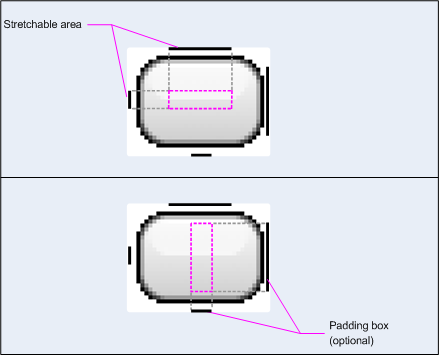
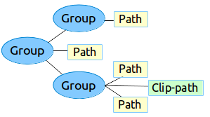
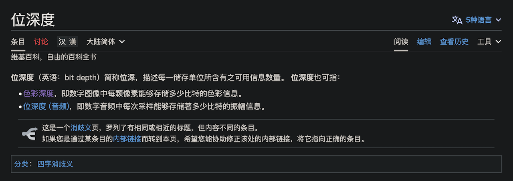
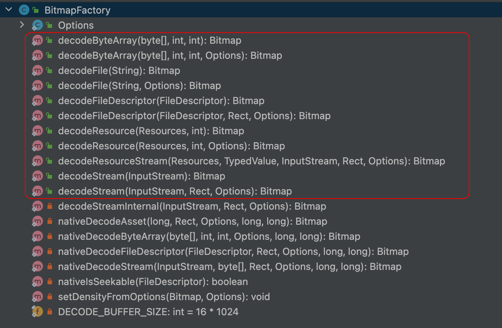
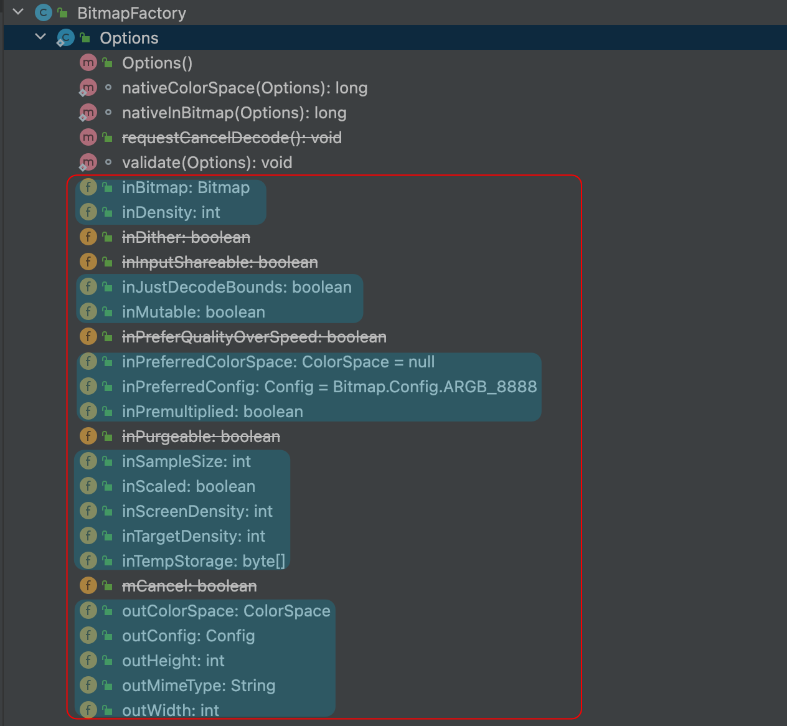
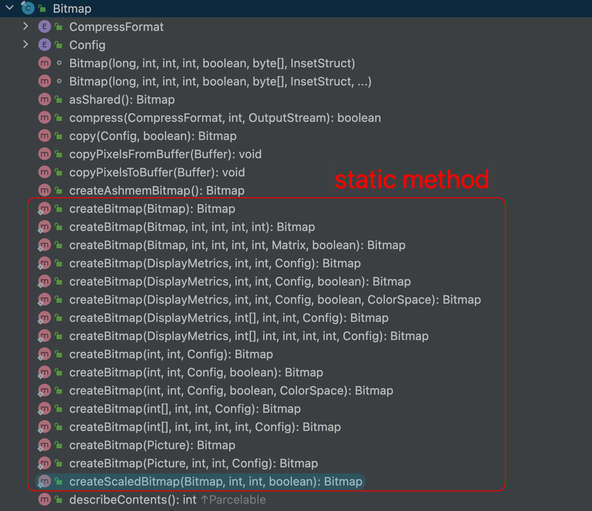

## Drawable 是什么？

`Drawable` 并不是图

`Drawable` 是一个抽象类，用于表示可绘制对象。本身是一个绘制工具，更像一个只专注于绘制的 View，所以一个 Drawable 显示什么，取决于它绘制什么

```java
package android.graphics.drawable

public abstract class Drawable {
    ...
    public abstract void draw(@NonNull Canvas canvas);
    ...
}
```

- `Drawable`
  提供了一种通用的方式来处理不同类型的可绘制资源，无论是静态图像、矢量图形、渐变或其他形式的绘制内容。它使开发人员可以轻松地切换和管理不同类型的可绘制资源，以便用于`UI`
  设计。
- `Android`提供了许多不同类型的`Drawable`子类，如`BitmapDrawable`（用于显示位图图像）、`ShapeDrawable`
  （用于绘制基本形状）、`VectorDrawable`（用于显示矢量图形）等

## Bitmap 是什么？

`bitmap` 又叫位图，在 `Android` 里，它代表一个像素矩阵，含有一个图片 完整的、未压缩的 像素数据。

既然，`Bitmap` 是一个包含所有像素信息的矩阵，而每个像素所占空间是你固定的，所以————只要不改变 Bitmap 的尺寸，或者说只要不改变分辨率，那么 Bitmap 的占的内存就不会变，也就是说，Bitmap 的内存占用只和图片的尺寸（分辨率）有关

```java
package android.graphics;

public final class Bitmap implements Parcelable {
    ...
}
```

## Mipmap 是什么？

`Mipmap（多级纹理映射）` 是一种用于优化计算机图形中纹理映射的技术。

纹理映射是一种在三维图形渲染中将二维图像（称为纹理）映射到三维模型表面的方法。

Mipmap 是为了提高图形性能和视觉质量而设计的。

## Drawable Bitmap 互转？？？

了解了 Drawable 和 Bitmap 是什么，那么就回到这个老生常谈的问题了，Drawable 和 Bitmap 如何互转？？？

其实根本没有什么互转，Bitmap 是一个包含像素信息的矩阵，而 Drawable 根本没有像素信息，那么我们如果想让 Bitmap “转为” Drawable 呢？

只能用 Drawable 将Bitmap 画出来了，而 BitmapDrawable 就是这个工具

```kotlin
val bitmapDrawable = BitmapDrawable(resource, bitmap)
```

反之，如何将 Drawable “转成” Bitmap 呢？

Drawable 并没有像素信息，但是需要用像素信息将 Bitmap 填满，该怎么办呢？

只能将 Drawable 的信息用 canvas 绘制出来了

```kotlin
fun drawableToBitmap(drawable: Drawable): Bitmap {
  val bitmap: Bitmap
  if (drawable is BitmapDrawable) {
    return drawable.bitmap
  }

  bitmap = if (drawable.intrinsicWidth <= 0 || drawable.intrinsicHeight <= 0) {
    Bitmap.createBitmap(1, 1, Bitmap.Config.ARGB_8888)
  } else {
    Bitmap.createBitmap(
      drawable.intrinsicWidth,
      drawable.intrinsicHeight,
      Bitmap.Config.ARGB_8888
    )
  }

  val canvas = Canvas(bitmap)
  drawable.setBounds(0, 0, canvas.width, canvas.height)
  drawable.draw(canvas)
  return bitmap
}
```

## 使用 Drawable

### 通过资源图片创建 Drawable

您可以通过引用项目资源中的图片文件向应用添加图形。支持的文件类型包括 PNG（首选）、JPG（可接受）和 GIF（不建议）

将文件添加到项目的 `res/drawable/` 目录。进入项目后，您可以从代码或 XML 布局中引用图片资源。

注意

在构建过程中，`aapt` 工具可能会使用无损图片压缩功能自动优化位于 `res/drawable/` 目录中的图片资源。

例如，可以通过调色板将不需要超过 256 种颜色的真彩色 PNG 转换为 8 位 PNG。这样做会生成质量相同但内存占用量更小的图片。

因此，此目录中的映像二进制文件可能会在构建时发生变化。如果您打算以比特流的形式读取图片，进而将其转换为位图，请改为将图片放在 `res/raw/`
文件夹中，`aapt` 工具不会修改这些图片。

下面 `kotlin` 代码展示两种在代码里直接用 resId 引用资源的方式

```kotlin
val i = ImageView(this).apply {
    setImageResource(R.drawable.my_image)
}

val myImage: Drawable = ResourcesCompat.getDrawable(context.resources, R.drawable.my_image, null)
```

警告

项目中的每个唯一资源只能保留一种状态，无论您为其实例化多少个不同的对象都是如此。

例如，如果您实例化同一图片资源中的两个 Drawable 对象，并更改一个对象的属性（例如 alpha），那么另一个对象也会受到影响。

在处理某个图片资源的多个实例时，应执行[补间动画](https://developer.android.com/guide/topics/graphics/view-animation?hl=zh-cn#tween-animation)
，而不是直接转换 Drawable 对象。

下面 `xml` 代码段展示了如何在 `XML` 布局中向 `ImageView` 添加可绘制资源：

```kotlin
<ImageView
        android:layout_width="wrap_content"
        android:layout_height="wrap_content"
        android:src="@drawable/my_image"
        android:contentDescription="@string/my_image_desc" />
```

如需详细了解如何使用项目资源，请参阅[应用资源指南](https://developer.android.com/guide/topics/resources?hl=zh-cn)

注意

使用图片资源作为可绘制对象的来源时，请确保图片尺寸适合各种像素密度。

如果图片不正确，系统会将其放大以匹配图片，这可能会导致可绘制对象出现伪影。

如需了解详情，请参阅[支持不同的像素密度](https://developer.android.com/training/multiscreen/screendensities?hl=zh-cn)。

### 通过 XML 资源创建可绘制对象

通过 XML 创建可绘制对象最大的好处就是，你可以设置一些可变化的属性来控制它，这样会更加灵活，也更加方便

使用 XML 定义 `Drawable` 后，将文件保存在项目的 `res/drawable/` 目录中。

以下示例展示了定义从 `Drawable`
继承的 [`TransitionDrawable`](https://developer.android.com/reference/android/graphics/drawable/TransitionDrawable) 资源的
XML：

```xml
<!-- res/drawable/expand_collapse.xml -->
<transition xmlns:android="http://schemas.android.com/apk/res/android">
    <item android:drawable="@drawable/image_expand"/>
    <item android:drawable="@drawable/image_collapse"/>
</transition>
```

然后，通过调用 `Resources#getDrawable()` 并传递 XML 文件的资源 ID 来检索并实例化该对象。

所有有 `inflate()` 的 [`Drawable`](https://developer.android.com/reference/android/graphics/drawable/Drawable) 子类，都可以在
XML 中定义并由您的应用实例化。



继承 Drawable 子类的自定义类，必须重写 [`getConstantState()方法`](https://developer.android.com/reference/android/graphics/drawable/Drawable?hl=zh-cn#getConstantState())。

请参阅下面的[自定义可绘制对象](https://developer.android.com/develop/ui/views/graphics/drawables?hl=zh-cn#Custom)中的要点。



以下代码会实例化 [`TransitionDrawable`](https://developer.android.com/reference/android/graphics/drawable/TransitionDrawable)
并将其设置为 `ImageView` 对象的内容：

```kotlin
val transition= ResourcesCompat.getDrawable(
        context.resources,
        R.drawable.expand_collapse,
        null
) as TransitionDrawable

val image: ImageView = findViewById(R.id.toggle_image)
image.setImageDrawable(transition)

// 对图片初始状态的内容描述
image.contentDescription = resources.getString(R.string.collapsed)

// 调用 transition 的方法
transition.startTransition(1000)

// 转换完成后，更改图片的内容描述
// 反映新状态。
```



[`TransitionDrawable`](https://developer.android.com/reference/android/graphics/drawable/TransitionDrawable)  继承自 [`LayerDrawables`](https://developer.android.com/reference/android/graphics/drawable/LayerDrawable)，可以让我们在两层图像中设置淡入淡出效果



### Shape drawables

[`Shape Drawable`](%5BShapeDrawable%5D(https://developer.android.com/reference/android/graphics/drawable/ShapeDrawable))  继承自 [`Drawable`](https://developer.android.com/reference/android/graphics/drawable/Drawable) 可以让你通过写代码的方式绘制一个图形



Shape Drawable 并不算是矢量图，因为它可以设置具体的像素大小



由于具有自己的 `draw()` 方法，因此你可以在自定义 `View` 的 `onDraw()` 事件期间调用 `ShapeDrawable` 的 `draw()` 方法。

如下面的代码示例所示：

```kotlin
class CustomDrawableView(context: Context) : View(context) {
    private val drawable: ShapeDrawable = run {
        val x = 10
        val y = 10
        val width = 300
        val height = 50
        contentDescription = context.resources.getString(R.string.my_view_desc)

        ShapeDrawable(OvalShape()).apply {
            // If the color isn't set, the shape uses black as the default.
            paint.color = 0xff74AC23.toInt()
            // If the bounds aren't set, the shape can't be drawn.
            setBounds(x, y, x + width, y + height)
        }
    }

    override fun onDraw(canvas: Canvas) {
        drawable.draw(canvas)
    }
}
```

然后就像使用任何其他自定义 `View` 一样

```kotlin
private lateinit var customDrawableView: CustomDrawableView

override fun onCreate(savedInstanceState: Bundle?) {
    super.onCreate(savedInstanceState)
    customDrawableView = CustomDrawableView(this)

    setContentView(customDrawableView)
}
```

```xml

<com.example.shapedrawable.CustomDrawableView
        android:layout_width="wrap_parent"
        android:layout_height="wrap_content"/>
```

### NinePatch drawables(.9图片)

[`NinePatchDrawable`](https://developer.android.com/reference/android/graphics/drawable/NinePatchDrawable)
图形是可拉伸的位图图像，可用作视图的背景。

`Android` 会自动调整图形大小以适应视图的内容。

NinePatch 图像的一个示例是标准 Android 按钮使用的背景，按钮必须拉伸以容纳各种长度的字符串。

NinePatch 图形是标准的 PNG 图像，其中包含额外的 1 像素边框。

它必须与 `9.png` 扩展名一起保存在项目 `res/drawable/` 目录中，并且还需要删除原图像，否则会报重复错误。

绘制方法

- 通过在边框的左侧和顶部绘制一条（或多条）1 像素宽的黑线来指示可拉伸部分（其他边框像素应为完全透明或白色）
- 在右侧绘制一条线，在底部绘制一条线来定义图像的可绘制部分（实际上是填充线）。也就是你设置 `text` 填充的地方



### Custom drawables（自定义 Drawable）

自定义 `Drawable` 类似于 自定义 `View`

下面的代码显示了绘制圆圈的简单自定义 `Drawable`

```kotlin
class MyDrawable : Drawable() {
    private val redPaint: Paint = Paint().apply { setARGB(255, 255, 0, 0) }

    override fun draw(canvas: Canvas) {
        // Get the drawable's bounds
        val width: Int = bounds.width()
        val height: Int = bounds.height()
        val radius: Float = Math.min(width, height).toFloat() / 2f

        // Draw a red circle in the center
        canvas.drawCircle((width / 2).toFloat(), (height / 2).toFloat(), radius, redPaint)
    }

    override fun setAlpha(alpha: Int) {
        
    }

    override fun setColorFilter(colorFilter: ColorFilter?) {
        
    }

    // PixelFormat.UNKNOWN, TRANSLUCENT, TRANSPARENT, 或者 OPAQUE
    override fun getOpacity(): Int = PixelFormat.OPAQUE
}
```

### Add tint to drawables（为可绘制对象添加色调）

对于 Android 5.0（API 级别 21）及更高版本，您可为位图和定义为 Alpha 蒙版的位图和九宫格着色。

您可以使用颜色资源或解析为颜色资源（例如 `?android:attr/colorPrimary`）的主题属性为其着色。通常，您只需创建一次这些资源，然后自动为其着色以与您的主题相符。

您可以使用 `setTint()` 方法对 `BitmapDrawable`、`NinePatchDrawable` 或 `VectorDrawable` 对象着色。

您还可以使用 `android:tint` 和 `android:tintMode` 属性在布局中设置色调颜色和模式。

详细信息请看[样式和主题背景](https://developer.android.com/develop/ui/views/theming/themes?hl=zh-cn)

### 从图片中萃取突出颜色

Android 支持库包含 `Palette` 类，可让您从图片中提取突出颜色。

您可以将可绘制对象作为 `Bitmap` 加载，并将其传递给 `Palette`
以获取其颜色。如需了解详情，请参阅[使用 Palette API 选择颜色](https://developer.android.com/training/material/palette-colors?hl=zh-cn)。

### Vector drawables（矢量图）

- Vector drawable 是一种矢量图形，在 XML 文件中定义为一组点、线条和曲线及其关联的颜色信息。
- Vector drawable 可缩放，这意味着，可在不降低显示质量的情况下调整大小。因此，它们是 Android 应用的理想选择，有助于缩减 APK
  文件的大小并提升性能。
- 您可以在 Android Studio 中创建矢量可绘制对象，方法是右键点击项目中的可绘制对象文件夹，然后依次选择“New”>“Vector
  Asset”。您还可以将 SVG 文件作为矢量可绘制对象导入 Android Studio。

### 关于 VectorDrawable 类

`VectorDrawable` 定义静态可绘制对象。与 SVG 格式类似，每个矢量图形被定义为一个树层次结构，由 `path` 和 `group`
对象组成。每个 `path` 都包含对象轮廓的几何图形，`group` 包含转换的详细信息。所有路径的绘制顺序均与它们在 XML 文件中显示的顺序相同。



[Vector Asset Studio](https://developer.android.com/studio/write/vector-asset-studio?hl=zh-cn) 工具提供了一种将矢量图形作为
XML 文件添加到项目中的简单方法。

#### 示例

以下 `VectorDrawable` XML 文件示例会渲染充电模式下电池的图片。

```xml
<!-- res/drawable/battery_charging.xml -->
<vector xmlns:android="http://schemas.android.com/apk/res/android"
        android:height="24dp"
        android:width="24dp"
        android:viewportWidth="24.0"
        android:viewportHeight="24.0">
    <group
            android:name="rotationGroup"
            android:pivotX="10.0"
            android:pivotY="10.0"
            android:rotation="15.0">
        <path
                android:name="vect"
                android:fillColor="#FF000000"
                android:pathData="M15.67,4H14V2h-4v2H8.33C7.6,4 7,4.6 7,5.33V9h4.93L13,7v2h4V5.33C17,4.6 16.4,4 15.67,4z"
                android:fillAlpha=".3"/>
        <path
                android:name="draw"
                android:fillColor="#FF000000"
                android:pathData="M13,12.5h2L11,20v-5.5H9L11.93,9H7v11.67C7,21.4 7.6,22 8.33,22h7.33c0.74,0 1.34,-0.6 1.34,-1.33V9h-4v3.5z"/>
    </group>
</vector>
```

此 XML 会渲染以下图片：


### 关于 AnimatedVectorDrawable 类

`AnimatedVectorDrawable` 用于为矢量图形的属性添加动画。您可以将动画矢量图形定义为三个单独的资源文件或定义整个可绘制对象的单个
XML 文件。

为了更好地理解，我们来看看这两种方法：[多个 XML 文件](https://developer.android.com/develop/ui/views/graphics/vector-drawable-resources?hl=zh-cn#multiple-files)
和[单个 XML 文件](https://developer.android.com/develop/ui/views/graphics/vector-drawable-resources?hl=zh-cn#single-file)。

#### 多个 XML 文件

使用此方法，您可以定义三个单独的 XML 文件：

- 一个 `VectorDrawable` XML 文件。
- `AnimatedVectorDrawable` XML 文件，用于定义目标 `VectorDrawable`
  、要添加动画效果的目标路径和组、属性，以及定义为 `ObjectAnimator` 对象或 `AnimatorSet` 对象的动画。
- 一个 Animator XML 文件。



The following XML files demonstrate the animation of a vector graphic.
以下 XML 文件演示矢量图形的动画。

- VectorDrawable 的 XML 文件： `vd.xml`

  ```xml
  <vector xmlns:android="http://schemas.android.com/apk/res/android"
     android:height="64dp"
     android:width="64dp"
     android:viewportHeight="600"
     android:viewportWidth="600" >
     <group
        android:name="rotationGroup"
        android:pivotX="300.0"
        android:pivotY="300.0"
        android:rotation="45.0" >
        <path
           android:name="vectorPath"
           android:fillColor="#000000"
           android:pathData="M300,70 l 0,-70 70,70 0,0 -70,70z" />
     </group>
  </vector>
  ```

- AnimatedVectorDrawable 的 XML 文件： `avd.xml`

  ```xml
  <animated-vector xmlns:android="http://schemas.android.com/apk/res/android"
     android:drawable="@drawable/vd" >
       <target
           android:name="rotationGroup"
           android:animation="@anim/rotation" />
       <target
           android:name="vectorPath"
           android:animation="@anim/path_morph" />
  </animated-vector>
  ```

- AnimatedVectorDrawable 的 XML 文件中使用的 Animator XML 文件： `rotation.xml` 以及 `path_morph.xml`

  ```xml
  <objectAnimator
     android:duration="6000"
     android:propertyName="rotation"
     android:valueFrom="0"
     android:valueTo="360" />
  ```

  ```xml
  <set xmlns:android="http://schemas.android.com/apk/res/android">
     <objectAnimator
        android:duration="3000"
        android:propertyName="pathData"
        android:valueFrom="M300,70 l 0,-70 70,70 0,0   -70,70z"
        android:valueTo="M300,70 l 0,-70 70,0  0,140 -70,0 z"
        android:valueType="pathType"/>
  </set>
  ```



#### 单个 XML 文件

通过使用此方法，可以通过 XML 捆绑格式将相关的 XML 文件合并到单个 XML 文件中。

在构建应用时， `aapt` 标记会创建单独的资源，并在动画矢量中引用它们。

此方法需要生成工具 24 或更高版本，并且输出向后兼容。



```xml
<animated-vector
        xmlns:android="http://schemas.android.com/apk/res/android"
        xmlns:aapt="http://schemas.android.com/aapt">
    <aapt:attr name="android:drawable">
        <vector
                android:width="24dp"
                android:height="24dp"
                android:viewportWidth="24"
                android:viewportHeight="24">
            <path
                    android:name="root"
                    android:strokeWidth="2"
                    android:strokeLineCap="square"
                    android:strokeColor="?android:colorControlNormal"
                    android:pathData="M4.8,13.4 L9,17.6 M10.4,16.2 L19.6,7"/>
        </vector>
    </aapt:attr>
    <target android:name="root">
        <aapt:attr name="android:animation">
            <objectAnimator
                    android:propertyName="pathData"
                    android:valueFrom="M4.8,13.4 L9,17.6 M10.4,16.2 L19.6,7"
                    android:valueTo="M6.4,6.4 L17.6,17.6 M6.4,17.6 L17.6,6.4"
                    android:duration="300"
                    android:interpolator="@android:interpolator/fast_out_slow_in"
                    android:valueType="pathType"/>
        </aapt:attr>
    </target>
</animated-vector>
```



### 矢量可绘制对象向后兼容解决方案

为了在运行平台版本低于 Android 5.0（API 级别 21）的设备上支持矢量可绘制对象和添加动画效果的矢量可绘制对象，或使用低于
Android 7.0（API 级别 24）的 `fillColor`、`fillType` 和 `strokeColor` 功能，`VectorDrawableCompat`
和 `AnimatedVectorDrawableCompat` 可通过两个支持库分别通过 `support-vector-drawable` 和 `animated-vector-drawable` 获得。

Android Studio 1.4 通过在构建时生成 PNG 文件引入了对矢量可绘制对象的有限兼容性支持。不过，矢量可绘制对象和动画矢量可绘制对象支持库既灵活又具有广泛的兼容性，它是一个支持库，因此您可以在低至
Android 2.1（API 级别 7 及更高级别）的所有 Android 平台版本中使用它。如需将应用配置为使用矢量支持库，请将 `vectorDrawables`
元素添加到应用模块的 `build.gradle` 文件中。

使用以下代码段配置 `vectorDrawables` 元素：

```kotlin
// For Gradle Plugin 2.0+
android {
    defaultConfig {
        vectorDrawables.useSupportLibrary = true
    }
}
```

```kotlin
// For Gradle Plugin 1.5 or below
android {
    defaultConfig {
        // Stops the Gradle plugin’s automatic rasterization of vectors
        generatedDensities()
    }
    // Flag notifies aapt to keep the attribute IDs around
    aaptOptions {
        additionalParameters("--no-version-vectors")
    }
}
```

您可以在搭载 Android 4.0（API 级别 14）及更高版本的所有设备上使用 `VectorDrawableCompat`
和 `AnimatedVectorDrawableCompat`。

Android 加载可绘制对象的方式（而不是每个接受可绘制对象 ID 的地点（例如 XML 文件中）都支持加载矢量可绘制对象。

`android.support.v7.appcompat` 软件包添加了许多功能，以便轻松使用矢量可绘制对象。

首先，当您将 `android.support.v7.appcompat` 软件包与 `ImageView` 或 `ImageButton` 和 `FloatingActionButton`
等子类一起使用时，可以使用新的 `app:srcCompat` 属性来引用矢量可绘制对象以及 `android:src` 可用的任何其他可绘制对象：

```xml

<ImageView
        android:layout_width="wrap_content"
        android:layout_height="wrap_content"
        app:srcCompat="@drawable/ic_add"/>
```

- 要在运行时更改可绘制对象，您可以像以前一样使用 `setImageResource()`
  方法。要将矢量可绘制对象集成到应用中，使用 `AppCompat` 和 `app:srcCompat` 是最万无一失的方法。

  支持库 25.4.0 及更高版本支持以下功能：

  - **路径变形（PathType 评估器）**：用于将一条路径变形为另一个路径。
  - **路径插值**：用于定义灵活的插值器（表示为路径），而不是系统定义的插值器（如 LinearInterpolator）。
      支持库 26.0.0-beta1 及更高版本支持以下功能：
  - **沿路径移动**：几何图形对象可以在动画中沿着任意路径四处移动。

- 使用支持库的多个 XML 文件的示例

以下 XML 文件演示了使用多个 XML 文件为矢量图形添加动画效果的方法。

- VectorDrawable 的 XML 文件：`vd.xml`

  ```xml
  <vector xmlns:android="http://schemas.android.com/apk/res/android"
     android:height="64dp"
     android:width="64dp"
     android:viewportHeight="600"
     android:viewportWidth="600" >
     <group
        android:name="rotationGroup"
        android:pivotX="300.0"
        android:pivotY="300.0"
        android:rotation="45.0" >
        <path
           android:name="vectorPath"
           android:fillColor="#000000"
           android:pathData="M300,70 l 0,-70 70,70 0,0 -70,70z" />
     </group>
  </vector>
  ```

- AnimatedVectorDrawable 的 XML 文件： `avd.xml`

  ```xml
  <animated-vector xmlns:android="http://schemas.android.com/apk/res/android"
     android:drawable="@drawable/vd" >
       <target
           android:name="rotationGroup"
           android:animation="@anim/rotation" />
  </animated-vector>
  ```

- Animator XML file that is used in the AnimatedVectorDrawable's XML file: `rotation.xml`

  ```xml
  <objectAnimator
     android:duration="6000"
     android:propertyName="rotation"
     android:valueFrom="0"
     android:valueTo="360" />
  ```

以下 XML 文件演示了使用单个 XML 文件为矢量图形添加动画效果的方法。构建应用时，`aapt` 标记会创建单独的资源，并在动画矢量中引用这些资源。此方法需要
Build Tools 24 或更高版本，并且输出可向后兼容。

- 单个 XML 文件的示例

```xml
<animated-vector
        xmlns:android="http://schemas.android.com/apk/res/android"
        xmlns:aapt="http://schemas.android.com/aapt">
    <aapt:attr name="android:drawable">
        <vector xmlns:android="http://schemas.android.com/apk/res/android"
                android:width="64dp"
                android:height="64dp"
                android:viewportWidth="600"
                android:viewportHeight="600">
            <group
                    android:name="rotationGroup"
                    android:pivotX="300"
                    android:pivotY="300"
                    android:rotation="45.0">
                <path
                        android:name="vectorPath"
                        android:fillColor="#000000"
                        android:pathData="M300,70 l 0,-70 70,70 0,0 -70,70z"/>
            </group>
        </vector>
    </aapt:attr>
    <target android:name="rotationGroup">
        <aapt:attr name="android:animation">
            <objectAnimator
                    android:propertyName="rotation"
                    android:valueFrom="0"
                    android:valueTo="360"
                    android:duration="6000"
                    android:interpolator="@android:interpolator/fast_out_slow_in"/>
        </aapt:attr>
    </target>
</animated-vector>
```

## 使用 Bitmap

### 位深和色深

首先我们需要理解两个概念：位深和色深



可以看到其实这是一个非常有歧义的概念



通常说 8bit 图指的是每个颜色通道占 8 位，也就也是 $2^8 = 255位$（0 ~ 255）

如果是 RGB 格式，那总共就占 3×8=24 位，RGBA 格式总共就占 4×8=32 位

不用太过于纠结这两个概念，只要能清楚描述每个像素的占用就行

包括买显示器的时候也要注意，不要看话术，关键在于像素排列，每个像素占几位（也就是色彩范围）



接下来我们看看 Bitmap 的创建，处理，序列化

### 存储格式

就位图的存储格式而言，我们会想到 PNG，JPG

当然，Android 也确实给了我们这些格式

```java
// android.graphics.Bitmap

public enum CompressFormat {
    JPEG          (0),
    PNG           (1),
    @Deprecated
    WEBP          (2),
    WEBP_LOSSY    (3),
    WEBP_LOSSLESS (4);

    CompressFormat(int nativeInt) {
        this.nativeInt = nativeInt;
    }
    final int nativeInt;
}
```

| 枚举值          | Bitmap.CompressFormat                                                                                        |
| --------------- | ------------------------------------------------------------------------------------------------------------ |
| `JPEG`          | 压缩为 JPEG 格式。                                                                                           |
| `PNG`           | Compress to the PNG format.  压缩为 PNG 格式。                                                               |
| `WEBP`          | 此字段在 API 级别 30 中已弃用。赞成更明确的 `CompressFormat#WEBP_LOSSY` 和 `CompressFormat#WEBP_LOSSLESS` .* |
| `WEBP_LOSSLESS` | 压缩为 WEBP 无损格式。                                                                                       |
| `WEBP_LOSSY`    | 压缩为 WEBP 有损格式。                                                                                       |

### 色彩格式

同样，图片他肯定会有色彩格式，什么 256色，8位色，RGB，RGBA

这个 Android 肯定也给了

```java
public enum Config {
    ALPHA_8(1),
    RGB_565(3),
    @Deprecated
    ARGB_4444(4),
    ARGB_8888(5),
    RGBA_F16(6),
    HARDWARE(7),
    RGBA_1010102(8);

    @UnsupportedAppUsage
    final int nativeInt;

    private static Config sConfigs[] = {
        null, ALPHA_8, null, RGB_565, ARGB_4444, ARGB_8888, RGBA_F16, HARDWARE, RGBA_1010102
    };

    Config(int ni) {
        this.nativeInt = ni;
    }

    @UnsupportedAppUsage
    static Config nativeToConfig(int ni) {
        return sConfigs[ni];
    }
}
```

| 枚举值         | Bitmap.Config                                                                                                                      |
| :------------- | ---------------------------------------------------------------------------------------------------------------------------------- |
| `ALPHA_8`      | 每个像素都存储为单个半透明 （alpha） 通道，每个像素占一个字节。                                                                    |
| `ARGB_4444`    | RGBA 组成，每部分占 4 位，共 16 位。每个像素占 2 字节此字段在 API 级别 29 中已弃用。由于此配置的质量较差，建议改用 `ARGB_8888` 。* |
| `ARGB_8888`    | RGBA 组成，每部分占 8 位，共 32 位。每个像素占 4 字节。                                                                            |
| `HARDWARE`     | 特殊配置，当位图仅存储在图形内存中时。                                                                                             |
| `RGBA_1010102` | 每个像素占 4 字节。                                                                                                                |
| `RGBA_F16`     | 每个像素占 8 字节。                                                                                                                |
| `RGB_565`      | 每个像素占 2 字节，仅对 RGB 通道进行编码：红色 5 位，绿色 6 位，蓝色 5 位。                                                        |

一般情况下，我们不会使用 ALPHA_8,他只存储透明度，没啥用处。

对于 ARGB_4444，它的画质又太感人了。

ARGB_8888 画质高但是太占内存。

RGB_565 还行，就是不可以设置透明度。
注意以下三点即可：

- 一般情况下用 ARGB_8888 格式存储 Bitmap
- ARGB_4444 画面惨不忍睹，被弃用
- 假如对图片没有透明度要求，可以使用 RGB_565，比 ARGB_8888 节省一半的内存开销

### 创建方法

#### BitmapFactory



可见 BitmapFactory 有很多方便我们将图片加载成 Bitmap 的方法，并且还有一个 Options 类来方便我们进行一些其他的配置

接下来我们看看 bitmapFactory.Options



可以看到有很多成员变量，根据前缀可以将他们分为，in 开头和 out 开头

- in 前缀：这些成员变量是用作输入参数，在调用 decode 方法时，你可以设置这些选项来影响图像的加载方式。

  例如，inSampleSize 用于指定图像的采样率，inPreferredConfig 用于指定图像的颜色配置，inJustDecodeBounds 用于仅获取图像的尺寸信息而不加载整个图像等等。这些选项用于控制图像的加载行为和内存使用情况。

- out 前缀：这些成员变量在调用 decode 方法后会被填充和更新，用于返回有关加载图像的信息。
  
  例如，outWidth 和 outHeight 用于存储解码后图像的宽度和高度信息，outMimeType 用于存储解码后图像的 MIME 类型，outColorSpace 用于存储解码后图像的色彩空间等等。这些选项用于获取解码后图像的信息而无需加载整个图像。

#### Bitmap



这里的方法都是创建空白的 Bitmap 或者需要自己绘制的 Bitmap

### 压缩

#### 计算 Bitmap 大小


我们加载这个漂亮的（实际文件大小是 192309 字节）

根据我们的了解，如果我们加载这张图片， 应该是 1920 × 1080×4 = 8294400 byte

我们计算验证一下

```kotlin
val bitmap = BitmapFactory.decodeResource(resources, resId)
Log.i(
  "lucas",
  "bitmap=${bitmap.byteCount}\n宽度=${bitmap.width}\n高度=${bitmap.height}"
)
```

```Shell
bitmap=62726400
宽度=5280
高度=2970
```

这三个数是怎么来的呢？

首先宽度和高度，需要经过 [dp 和 px 的换算](https://darkflamemasterdev.github.io/2023/11/08/Android-%E9%87%8C%E7%9A%84-dpi-dp-px/)，获取 desity 为 2.75，而这个 density 就是 Bitmap 的密度，当然你也可以自定义密度，但默认用的是系统自己的密度

宽度 = 1920×2.75 = 5280

高度 = 1080×2.75 = 2970

bitmap 的 ByteCount = 4 × 宽度 × 高度 = 62726400（4 是因为 ARGB_8888 一个像素占 4字节）

62726400 byte ≈ 59.82 MB

可以看到，62726400 ÷ 192309 ≈ 326.175 加载这个图片会直接放大 326 倍

这个占用可以说是非常恐怖了

#### 质量压缩

对于一张图片，我们在不改变分辨率的情况下，改变它的像素的占用，或者将效果不明显的像素删除以方便压缩至更小体积，这就是质量压缩

质量压缩不会改变 Bitmap 的内存占用（因为 Bitmap 的内存占用只和尺寸有关），但会改变序列化到硬盘里的图片文件大小

```java
ByteArrayOutputStream baos = new ByteArrayOutputStream();
int quality = Integer.valueOf(editText.getText().toString());
bit.compress(CompressFormat.JPEG, quality, baos);
byte[] bytes = baos.toByteArray();
bm = BitmapFactory.decodeByteArray(bytes, 0, bytes.length);
```

#### 尺寸压缩

尺寸压缩，顾名思义，就是将尺寸缩小（或者说分辨率降低），以此来压缩图片

尺寸压缩会直接缩小 Bitmap 的内存占用，也会压缩输出到硬盘的图片文件大小

1. 改变 inSampleSize

   ```kotlin
   fun decodeSampleBitmapFromResource(
     res: Resources,
     resId: Int,
     reqWidth: Int,
     reqHeight: Int
   ): Bitmap {
   
     // 获取图片的原始宽高
     val options = BitmapFactory.Options()
     options.inJustDecodeBounds = true
     BitmapFactory.decodeResource(res, resId, options)
   
     // 计算缩放比例
     options.inSampleSize = calculateInSampleSize(options,    reqWidth, reqHeight)
   
     options.inJustDecodeBounds = false
     return BitmapFactory.decodeResource(res, resId, options)
   }
   
   private fun calculateInSampleSize(
     options: BitmapFactory.Options,
     reqWidth: Int,
     reqHeight: Int
   ): Int {
     val height = options.outHeight
     val width = options.outWidth
     var inSampleSize = 1
   
     if (height > reqHeight || width > reqWidth) {
       val halfHeight = height / 2
       val halfWidth = width / 2
       while (halfHeight / inSampleSize >= reqHeight && halfWidth /   inSampleSize >= reqWidth) {
         inSampleSize *= 2
       }
     }
     return inSampleSize
   }
   ```

2. 改变 inDensity
   这个变量就是改变 Bitmap 密度的
   如果你将
