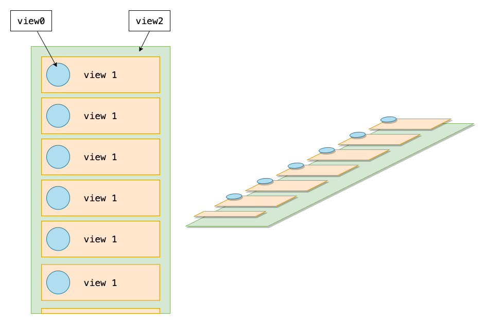
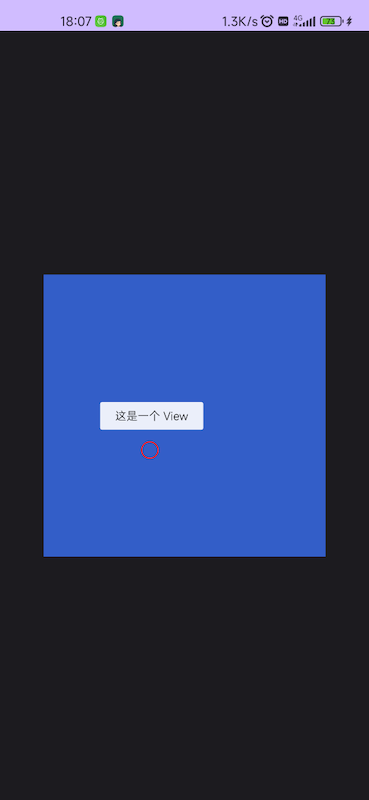
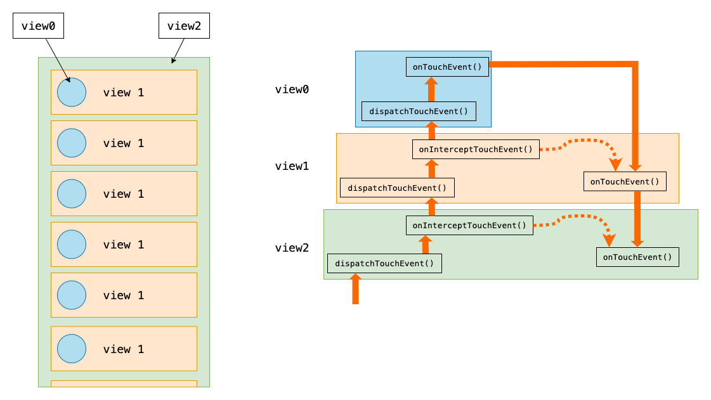



我们从写一个自定义 View 开始，了解 View 分发机制



## 事件分发



我们都知道 OnTouchEvent 和 OnTouchListener.onTouch() 都会返回 boolean 值

返回 true 表示消费此次事件

并且消费的是这个事件指的是一个事件序列，这一事件序列都是以 MotionEvent.ACTION_DOWN 开始，以 MotionEvent.ACTION_UP 或者 MotionEvent.ACTION_CANCEL 结束

所以消费这个事件的意思，是会将这个一整个事件序列消费掉，下面的 View 就不在接收到事件了

所以，只有在接收到 DOWN 事件返回 true 才会生效

```kotlin
override fun onTouchEvent(event: MotionEvent): Boolean {  // (1)
  return true
}

override fun onTouchEvent(event: MotionEvent): Boolean {  // (2)
  return if (event.actionMasked == MotionEvent.ACTION_DOWN) {
    true
  } else {
    false
  }
}

override fun onTouchEvent(event: MotionEvent): Boolean {  // (3)
  return event.actionMasked == MotionEvent.ACTION_DOWN
}
```

这三个的效果是完全一样的



### OnTouchEvent



图中，view1 是 view2 的 子View，所以在点击的 view1 的时候，onTouchEvent 应该先传给 view1，再传给 view2，这样是符合直觉的

那么它是怎么处理这些事件的呢？我们看看源码

```java
// View.onTouchEvent(MotionEvent event)
public boolean onTouchEvent(MotionEvent event) {
    final float x = event.getX();
    final float y = event.getY();
    final int viewFlags = mViewFlags;
    final int action = event.getAction();
    final boolean clickable = ((viewFlags & CLICKABLE) == CLICKABLE
            || (viewFlags & LONG_CLICKABLE) == LONG_CLICKABLE)
            || (viewFlags & CONTEXT_CLICKABLE) == CONTEXT_CLICKABLE;
    if ((viewFlags & ENABLED_MASK) == DISABLED
            && (mPrivateFlags4 & PFLAG4_ALLOW_CLICK_WHEN_DISABLED) == 0) {
        if (action == MotionEvent.ACTION_UP && (mPrivateFlags & PFLAG_PRESSED) != 0) {
            setPressed(false);
        }
        mPrivateFlags3 &= ~PFLAG3_FINGER_DOWN;
        // A disabled view that is clickable still consumes the touch
        // events, it just doesn't respond to them.
        return clickable;
    }
    if (mTouchDelegate != null) {
        if (mTouchDelegate.onTouchEvent(event)) {
            return true;
        }
    }
    if (clickable || (viewFlags & TOOLTIP) == TOOLTIP) {
        switch (action) {
            case MotionEvent.ACTION_UP:
                mPrivateFlags3 &= ~PFLAG3_FINGER_DOWN;
                if ((viewFlags & TOOLTIP) == TOOLTIP) {
                    handleTooltipUp();
                }
                if (!clickable) {
                    removeTapCallback();
                    removeLongPressCallback();
                    mInContextButtonPress = false;
                    mHasPerformedLongPress = false;
                    mIgnoreNextUpEvent = false;
                    break;
                }
                boolean prepressed = (mPrivateFlags & PFLAG_PREPRESSED) != 0;
                if ((mPrivateFlags & PFLAG_PRESSED) != 0 || prepressed) {
                    // take focus if we don't have it already and we should in
                    // touch mode.
                    boolean focusTaken = false;
                    if (isFocusable() && isFocusableInTouchMode() && !isFocused()) {
                        focusTaken = requestFocus();
                    }
                    if (prepressed) {
                        // The button is being released before we actually
                        // showed it as pressed.  Make it show the pressed
                        // state now (before scheduling the click) to ensure
                        // the user sees it.
                        setPressed(true, x, y);
                    }
                    if (!mHasPerformedLongPress && !mIgnoreNextUpEvent) {
                        // This is a tap, so remove the longpress check
                        removeLongPressCallback();
                        // Only perform take click actions if we were in the pressed state
                        if (!focusTaken) {
                            // Use a Runnable and post this rather than calling
                            // performClick directly. This lets other visual state
                            // of the view update before click actions start.
                            if (mPerformClick == null) {
                                mPerformClick = new PerformClick();
                            }
                            if (!post(mPerformClick)) {
                                performClickInternal();
                            }
                        }
                    }
                    if (mUnsetPressedState == null) {
                        mUnsetPressedState = new UnsetPressedState();
                    }
                    if (prepressed) {
                        postDelayed(mUnsetPressedState,
                                ViewConfiguration.getPressedStateDuration());
                    } else if (!post(mUnsetPressedState)) {
                        // If the post failed, unpress right now
                        mUnsetPressedState.run();
                    }
                    removeTapCallback();
                }
                mIgnoreNextUpEvent = false;
                break;
            case MotionEvent.ACTION_DOWN:
                if (event.getSource() == InputDevice.SOURCE_TOUCHSCREEN) {
                    mPrivateFlags3 |= PFLAG3_FINGER_DOWN;
                }
                mHasPerformedLongPress = false;
                if (!clickable) {
                    checkForLongClick(
                            ViewConfiguration.getLongPressTimeout(),
                            x,
                            y,
                            TOUCH_GESTURE_CLASSIFIED__CLASSIFICATION__LONG_PRESS);
                    break;
                }
                if (performButtonActionOnTouchDown(event)) {
                    break;
                }
                // Walk up the hierarchy to determine if we're inside a scrolling container.
                boolean isInScrollingContainer = isInScrollingContainer();
                // For views inside a scrolling container, delay the pressed feedback for
                // a short period in case this is a scroll.
                if (isInScrollingContainer) {
                    mPrivateFlags |= PFLAG_PREPRESSED;
                    if (mPendingCheckForTap == null) {
                        mPendingCheckForTap = new CheckForTap();
                    }
                    mPendingCheckForTap.x = event.getX();
                    mPendingCheckForTap.y = event.getY();
                    postDelayed(mPendingCheckForTap, ViewConfiguration.getTapTimeout());
                } else {
                    // Not inside a scrolling container, so show the feedback right away
                    setPressed(true, x, y);
                    checkForLongClick(
                            ViewConfiguration.getLongPressTimeout(),
                            x,
                            y,
                            TOUCH_GESTURE_CLASSIFIED__CLASSIFICATION__LONG_PRESS);
                }
                break;
            case MotionEvent.ACTION_CANCEL:
                if (clickable) {
                    setPressed(false);
                }
                removeTapCallback();
                removeLongPressCallback();
                mInContextButtonPress = false;
                mHasPerformedLongPress = false;
                mIgnoreNextUpEvent = false;
                mPrivateFlags3 &= ~PFLAG3_FINGER_DOWN;
                break;
            case MotionEvent.ACTION_MOVE:
                if (clickable) {
                    drawableHotspotChanged(x, y);
                }
                final int motionClassification = event.getClassification();
                final boolean ambiguousGesture =
                        motionClassification == MotionEvent.CLASSIFICATION_AMBIGUOUS_GESTURE;
                int touchSlop = mTouchSlop;
                if (ambiguousGesture && hasPendingLongPressCallback()) {
                    if (!pointInView(x, y, touchSlop)) {
                        // The default action here is to cancel long press. But instead, we
                        // just extend the timeout here, in case the classification
                        // stays ambiguous.
                        removeLongPressCallback();
                        long delay = (long) (ViewConfiguration.getLongPressTimeout()
                                * mAmbiguousGestureMultiplier);
                        // Subtract the time already spent
                        delay -= event.getEventTime() - event.getDownTime();
                        checkForLongClick(
                                delay,
                                x,
                                y,
                                TOUCH_GESTURE_CLASSIFIED__CLASSIFICATION__LONG_PRESS);
                    }
                    touchSlop *= mAmbiguousGestureMultiplier;
                }
                // Be lenient about moving outside of buttons
                if (!pointInView(x, y, touchSlop)) {
                    // Outside button
                    // Remove any future long press/tap checks
                    removeTapCallback();
                    removeLongPressCallback();
                    if ((mPrivateFlags & PFLAG_PRESSED) != 0) {
                        setPressed(false);
                    }
                    mPrivateFlags3 &= ~PFLAG3_FINGER_DOWN;
                }
                final boolean deepPress =
                        motionClassification == MotionEvent.CLASSIFICATION_DEEP_PRESS;
                if (deepPress && hasPendingLongPressCallback()) {
                    // process the long click action immediately
                    removeLongPressCallback();
                    checkForLongClick(
                            0 /* send immediately */,
                            x,
                            y,
                            TOUCH_GESTURE_CLASSIFIED__CLASSIFICATION__DEEP_PRESS);
                }
                break;
        }
        return true;
    }
    return false;
}
```

- 3~6 行是获取基本信息，点击事件的坐标，viewFlags 以及 action
- 7~9 行是检查是否可点击，供下面判断使用，值得一提的是这个 CONTEXT_CLICKABLE 对于是老实手机存在的一个类似右键点击的操作
- 10~19 行是在处理 本可以点击，但设置为禁用状态的处理，设置为禁用，并不会防止消耗此次事件（如果禁用就不会消耗事件，那么就跟变透明了一样，点击这里，事件却被传到了这个 view 的后面，这明显是错误的，view 事件应该是直接在这个被禁用的 view 处被阻拦这样更符合直觉）
- 20~24 行是触摸代理，这个是用来帮忙接收触摸事件的，比如扩大按钮的点击范围，但其实有很多其他扩大点击范围的方法，所以这个其实并不是很常用，单页挺简单的
- 25 行，从这里开始就是主要部分了
  - 首先进入这个大 if 作用域，要判断 clickable 以及 TOOLTIP
    TOOLTIP 就是长按按钮浮出的一段文字，目的是解释当前 view 是干什么的

    ```xml
      <View
      android:id="@+id/touch_view"
      android:layout_width="300dp"
      android:layout_height="300dp"
      android:background="#335EC8"
      android:tooltipText="这是一个 View" />
    ```

    

     红圈是点击位置

  - 接下来就是对于不同 action 进行相应
    根据事件序列的顺序，我们先看 ACTION_DOWN ，第 85 行

    1. 从第 85 行开始，他首先判断了 event.getSource() 是否是 InputDevice.SOURCE_TOUCHSCREEN

       这是为了为手指触摸屏幕做一些优化，因为你的手指按下的是一个面，不是一个点，所以他要有优化一下比如前面提到的 tooltip 的悬浮显示，会跟点击位置有一点距离

    2. 90 行在不可点击的时候，调用了 checkForLongClick（检查是否要长按，也就是等一会看看是否还是按下状态） 也是因为上面提示的 Tooltip
    3. 98 行是检测鼠标右键点击的

       没错，Android 是直接外接鼠标键盘的，90 行判断的 event.getSource() 也有可能是 InputDevice.SOURCE_MOUSE
    4. 102 行是判断是否在一个滑动控件里，这个其实挺有意思

       我们点进去看看

       ```java
       @UnsupportedAppUsage(maxTargetSdk = Build.VERSION_CODES.R, trackingBug = 170729553)
       public boolean isInScrollingContainer() {
           ViewParent p = getParent();
           while (p != null && p instanceof ViewGroup) {
               if (((ViewGroup) p).shouldDelayChildPressedState()) {
                   return true;
               }
               p = p.getParent();
           }
           return false;
       }
       ```

       这段代码是一个循环，一层层看是否需要延迟设置 pressedState ，第 5 行有一个 shouldDelayChildPressedState
       这个延迟，就是用来判断你是要滑动这个控件还是要点击这个控件

       我们继续回来看，第 105 行，如果是在滑动控件里，就会设为 PFLAG_PREPRESSED （pre press，预按下状态），并调用 postDelay ，CheckForTap 本身是一个 Runnable，他就是一个延迟的设置按下状态的事件

       如果不在滑动控件里，就直接设置按下状态

       

       如果你的自定义 View 不是可滑动的，应该重写 shouldDelayChildPressedState() 这个方法并返回 false，这是因为 ViewGroup.shouldDelayChildPressedState() 默认返回 true，也就是所有的 ViewGroup 都默认可滑动，不重写就会某人有一个等待时间

       
  - 现在看 ACTION_MOVE ，第 134 行
    1. 135~137 行 drawableHotspotChanged(x, y) 是绘制水波纹的效果的
    2. 接下来 141~170 行 都是在不同情况下，发现 pointInView(x, y, touchSlop) 返回 false ，也就是手指点击区域不在当前 view 的范围了（TouchSlop 是一个 view 边界的宽容，不至于手指稍微出去一点点，就判断出范围），就移除相应的东西，将状态设为 false
    3. 171~181 行，就是关于压力触控的设置
  - 现在看 ACTION_UP ，第 27 行
    1. 29~31 行，是判断你按压的时间是否支持显示 Tooltip
    2. 32~39 行，是在不可点击的时候，进行各种移除
    3. 40 行，这里就是前面所说的 pre press ，预按下状态
    4. 44~47 行，这里是看看能不能获取焦点，isFocusableInTouchMode 这是物理按键，或者 Android 电视所需要使用的
    5. 48~54 行，如果是预按下状态，设置为按下状态
    6. 55~70 行，这里就是点击事件
    7. 74~80 行，这里是预按下状态，设置一个延迟，防止过快显示
  - 再看 123 行的 ACTION_CANCEL，就是单纯地在意外退出的时候，各种移除，干擦屁股的工作

### onInterceptTouchEvent

```java
// ViewGroup.onInterceptTouchEvent(MotionEvent ev)
public boolean onInterceptTouchEvent(MotionEvent ev) {
    if (ev.isFromSource(InputDevice.SOURCE_MOUSE)
            && ev.getAction() == MotionEvent.ACTION_DOWN
            && ev.isButtonPressed(MotionEvent.BUTTON_PRIMARY)
            && isOnScrollbarThumb(ev.getX(), ev.getY())) {
        return true;
    }
    return false;
}
```

这个函数的作用是父 view 拦截事件，让子 view 收不到后续事件，他可以在接收到任意事件后，拦截他，随后的一整个事件序列就不会再传给子 view 了，而是传给 自己的 OnTouchEvent

并且，如果是中途拦截，需要给子 view 发送 CANCEL 事件，因为这是意外退出事件序列



这个方法使用很简单，就是直接重写，然后在你需要的时候，返回不同的值就行

比如你想在用户滑动超过 5 个像素的时候，返回 true，否则就返回 false

当然你还需要记录这些事件，以便拦截之后，供你的 OnTouchEvent 使用

复杂的代码逻辑往往是在 OnTouchEvent 里面



### dispatchTouchEvent

dispatchTouchEvent 是一个事件分发的开始，他会先判断是否需要拦截此事件，看看是否要传给子 view，如果不拦截，就传给子 view 的 dispatchTouchEvent，最后再从 OnTouchEvent 传回来；如果不拦截，就直接传给自己的 OnTouchEvent，如图所示



#### View

这个是 View 的 dispatchTouchEvent，ViewGroup 的 dispatchTouchEventde 的实现还有所不同

```java
// View.dispatchTouchEvent(MotionEvent event)
public boolean dispatchTouchEvent(MotionEvent event) {
    // If the event should be handled by accessibility focus first.
    if (event.isTargetAccessibilityFocus()) {
        // We don't have focus or no virtual descendant has it, do not handle the event.
        if (!isAccessibilityFocusedViewOrHost()) {
            return false;
        }
        // We have focus and got the event, then use normal event dispatch.
        event.setTargetAccessibilityFocus(false);
    }
    boolean result = false;

    if (mInputEventConsistencyVerifier != null) {
        mInputEventConsistencyVerifier.onTouchEvent(event, 0);
    }

    final int actionMasked = event.getActionMasked();
    if (actionMasked == MotionEvent.ACTION_DOWN) {
        // Defensive cleanup for new gesture
        stopNestedScroll();
    }

    if (onFilterTouchEventForSecurity(event)) {
        if ((mViewFlags & ENABLED_MASK) == ENABLED && handleScrollBarDragging(event)) {
            result = true;
        }
        //noinspection SimplifiableIfStatement
        ListenerInfo li = mListenerInfo;
        if (li != null && li.mOnTouchListener != null
                && (mViewFlags & ENABLED_MASK) == ENABLED
                && li.mOnTouchListener.onTouch(this, event)) {
            result = true;
        }

        if (!result && onTouchEvent(event)) {
            result = true;
        }
    }

    if (!result && mInputEventConsistencyVerifier != null) {
        mInputEventConsistencyVerifier.onUnhandledEvent(event, 0);
    }

    // Clean up after nested scrolls if this is the end of a gesture;
    // also cancel it if we tried an ACTION_DOWN but we didn't want the rest
    // of the gesture.
    if (actionMasked == MotionEvent.ACTION_UP ||
            actionMasked == MotionEvent.ACTION_CANCEL ||
            (actionMasked == MotionEvent.ACTION_DOWN && !result)) {
        stopNestedScroll();
    }

    return result;
}
```

关键就在于 24~39 行，这里会依次响应你为他设置的 OnTouchListener 以及这个 view 自身的 OnTouchEvent

#### ViewGroup

```java
@Override
public boolean dispatchTouchEvent(MotionEvent ev) {
    if (mInputEventConsistencyVerifier != null) {
        mInputEventConsistencyVerifier.onTouchEvent(ev, 1);
    }

    // If the event targets the accessibility focused view and this is it, start
    // normal event dispatch. Maybe a descendant is what will handle the click.
    if (ev.isTargetAccessibilityFocus() && isAccessibilityFocusedViewOrHost()) {
        ev.setTargetAccessibilityFocus(false);
    }

    boolean handled = false;
    if (onFilterTouchEventForSecurity(ev)) {
        final int action = ev.getAction();
        final int actionMasked = action & MotionEvent.ACTION_MASK;

        // Handle an initial down.
        if (actionMasked == MotionEvent.ACTION_DOWN) {
            // Throw away all previous state when starting a new touch gesture.
            // The framework may have dropped the up or cancel event for the previous gesture
            // due to an app switch, ANR, or some other state change.
            cancelAndClearTouchTargets(ev);
            resetTouchState();
        }

        // Check for interception.
        final boolean intercepted;
        if (actionMasked == MotionEvent.ACTION_DOWN
                || mFirstTouchTarget != null) {
            final boolean disallowIntercept = (mGroupFlags & FLAG_DISALLOW_INTERCEPT) != 0;
            if (!disallowIntercept) {
                intercepted = onInterceptTouchEvent(ev);
                ev.setAction(action); // restore action in case it was changed
            } else {
                intercepted = false;
            }
        } else {
            // There are no touch targets and this action is not an initial down
            // so this view group continues to intercept touches.
            intercepted = true;
        }

        // If intercepted, start normal event dispatch. Also if there is already
        // a view that is handling the gesture, do normal event dispatch.
        if (intercepted || mFirstTouchTarget != null) {
            ev.setTargetAccessibilityFocus(false);
        }

        // Check for cancelation.
        final boolean canceled = resetCancelNextUpFlag(this)
                || actionMasked == MotionEvent.ACTION_CANCEL;

        // Update list of touch targets for pointer down, if needed.
        final boolean isMouseEvent = ev.getSource() == InputDevice.SOURCE_MOUSE;
        final boolean split = (mGroupFlags & FLAG_SPLIT_MOTION_EVENTS) != 0
                && !isMouseEvent;
        TouchTarget newTouchTarget = null;
        boolean alreadyDispatchedToNewTouchTarget = false;
        if (!canceled && !intercepted) {
            // If the event is targeting accessibility focus we give it to the
            // view that has accessibility focus and if it does not handle it
            // we clear the flag and dispatch the event to all children as usual.
            // We are looking up the accessibility focused host to avoid keeping
            // state since these events are very rare.
            View childWithAccessibilityFocus = ev.isTargetAccessibilityFocus()
                    ? findChildWithAccessibilityFocus() : null;

            if (actionMasked == MotionEvent.ACTION_DOWN
                    || (split && actionMasked == MotionEvent.ACTION_POINTER_DOWN)
                    || actionMasked == MotionEvent.ACTION_HOVER_MOVE) {
                final int actionIndex = ev.getActionIndex(); // always 0 for down
                final int idBitsToAssign = split ? 1 << ev.getPointerId(actionIndex)
                        : TouchTarget.ALL_POINTER_IDS;

                // Clean up earlier touch targets for this pointer id in case they
                // have become out of sync.
                removePointersFromTouchTargets(idBitsToAssign);

                final int childrenCount = mChildrenCount;
                if (newTouchTarget == null && childrenCount != 0) {
                    final float x =
                            isMouseEvent ? ev.getXCursorPosition() : ev.getX(actionIndex);
                    final float y =
                            isMouseEvent ? ev.getYCursorPosition() : ev.getY(actionIndex);
                    // Find a child that can receive the event.
                    // Scan children from front to back.
                    final ArrayList<View> preorderedList = buildTouchDispatchChildList();
                    final boolean customOrder = preorderedList == null
                            && isChildrenDrawingOrderEnabled();
                    final View[] children = mChildren;
                    for (int i = childrenCount - 1; i >= 0; i--) {
                        final int childIndex = getAndVerifyPreorderedIndex(
                                childrenCount, i, customOrder);
                        final View child = getAndVerifyPreorderedView(
                                preorderedList, children, childIndex);

                        // If there is a view that has accessibility focus we want it
                        // to get the event first and if not handled we will perform a
                        // normal dispatch. We may do a double iteration but this is
                        // safer given the timeframe.
                        if (childWithAccessibilityFocus != null) {
                            if (childWithAccessibilityFocus != child) {
                                continue;
                            }
                            childWithAccessibilityFocus = null;
                            i = childrenCount;
                        }

                        if (!child.canReceivePointerEvents()
                                || !isTransformedTouchPointInView(x, y, child, null)) {
                            ev.setTargetAccessibilityFocus(false);
                            continue;
                        }

                        newTouchTarget = getTouchTarget(child);
                        if (newTouchTarget != null) {
                            // Child is already receiving touch within its bounds.
                            // Give it the new pointer in addition to the ones it is handling.
                            newTouchTarget.pointerIdBits |= idBitsToAssign;
                            break;
                        }

                        resetCancelNextUpFlag(child);
                        if (dispatchTransformedTouchEvent(ev, false, child, idBitsToAssign)) {
                            // Child wants to receive touch within its bounds.
                            mLastTouchDownTime = ev.getDownTime();
                            if (preorderedList != null) {
                                // childIndex points into presorted list, find original index
                                for (int j = 0; j < childrenCount; j++) {
                                    if (children[childIndex] == mChildren[j]) {
                                        mLastTouchDownIndex = j;
                                        break;
                                    }
                                }
                            } else {
                                mLastTouchDownIndex = childIndex;
                            }
                            mLastTouchDownX = ev.getX();
                            mLastTouchDownY = ev.getY();
                            newTouchTarget = addTouchTarget(child, idBitsToAssign);
                            alreadyDispatchedToNewTouchTarget = true;
                            break;
                        }

                        // The accessibility focus didn't handle the event, so clear
                        // the flag and do a normal dispatch to all children.
                        ev.setTargetAccessibilityFocus(false);
                    }
                    if (preorderedList != null) preorderedList.clear();
                }

                if (newTouchTarget == null && mFirstTouchTarget != null) {
                    // Did not find a child to receive the event.
                    // Assign the pointer to the least recently added target.
                    newTouchTarget = mFirstTouchTarget;
                    while (newTouchTarget.next != null) {
                        newTouchTarget = newTouchTarget.next;
                    }
                    newTouchTarget.pointerIdBits |= idBitsToAssign;
                }
            }
        }

        // Dispatch to touch targets.
        if (mFirstTouchTarget == null) {
            // No touch targets so treat this as an ordinary view.
            handled = dispatchTransformedTouchEvent(ev, canceled, null,
                    TouchTarget.ALL_POINTER_IDS);
        } else {
            // Dispatch to touch targets, excluding the new touch target if we already
            // dispatched to it.  Cancel touch targets if necessary.
            TouchTarget predecessor = null;
            TouchTarget target = mFirstTouchTarget;
            while (target != null) {
                final TouchTarget next = target.next;
                if (alreadyDispatchedToNewTouchTarget && target == newTouchTarget) {
                    handled = true;
                } else {
                    final boolean cancelChild = resetCancelNextUpFlag(target.child)
                            || intercepted;
                    if (dispatchTransformedTouchEvent(ev, cancelChild,
                            target.child, target.pointerIdBits)) {
                        handled = true;
                    }
                    if (cancelChild) {
                        if (predecessor == null) {
                            mFirstTouchTarget = next;
                        } else {
                            predecessor.next = next;
                        }
                        target.recycle();
                        target = next;
                        continue;
                    }
                }
                predecessor = target;
                target = next;
            }
        }

        // Update list of touch targets for pointer up or cancel, if needed.
        if (canceled
                || actionMasked == MotionEvent.ACTION_UP
                || actionMasked == MotionEvent.ACTION_HOVER_MOVE) {
            resetTouchState();
        } else if (split && actionMasked == MotionEvent.ACTION_POINTER_UP) {
            final int actionIndex = ev.getActionIndex();
            final int idBitsToRemove = 1 << ev.getPointerId(actionIndex);
            removePointersFromTouchTargets(idBitsToRemove);
        }
    }

    if (!handled && mInputEventConsistencyVerifier != null) {
        mInputEventConsistencyVerifier.onUnhandledEvent(ev, 1);
    }
    return handled;
}
```

这就是 ViewGroup 的 dispatchTouchEvent，确实是复杂了很多，主要是因为多点触控

多点触控涉及一个新的类就是 TouchTarget

```java
private static final class TouchTarget {
    private static final int MAX_RECYCLED = 32;
    private static final Object sRecycleLock = new Object[0];
    private static TouchTarget sRecycleBin;
    private static int sRecycledCount;
    public static final int ALL_POINTER_IDS = -1; // all ones
    // The touched child view.
    @UnsupportedAppUsage
    public View child;
    // The combined bit mask of pointer ids for all pointers captured by the target.
    public int pointerIdBits;
    // The next target in the target list.
    public TouchTarget next;
    @UnsupportedAppUsage
    private TouchTarget() {
    }
    public static TouchTarget obtain(@NonNull View child, int pointerIdBits) {
        if (child == null) {
            throw new IllegalArgumentException("child must be non-null");
        }
        final TouchTarget target;
        synchronized (sRecycleLock) {
            if (sRecycleBin == null) {
                target = new TouchTarget();
            } else {
                target = sRecycleBin;
                sRecycleBin = target.next;
                 sRecycledCount--;
                target.next = null;
            }
        }
        target.child = child;
        target.pointerIdBits = pointerIdBits;
        return target;
    }
    public void recycle() {
        if (child == null) {
            throw new IllegalStateException("already recycled once");
        }
        synchronized (sRecycleLock) {
            if (sRecycledCount < MAX_RECYCLED) {
                next = sRecycleBin;
                sRecycleBin = this;
                sRecycledCount += 1;
            } else {
                next = null;
            }
            child = null;
        }
    }
}
```

我们看这个类的结构，里面有一个 next，类型也是 Target，没错和你想的一样，这是一个单链表数据结构

obtain 函数就是一个获取 Target 的函数，他只会在有子 View 的时候被调用，也就是 child 不为 null 的时候

recycle 是一个回收函数，比较简单

我们回到 dispatchTouchEvent()，这段代码新概念偏多并且逻辑复杂，所以我们直接看简化的总结

- 19~25 行，如果用户初次按下（ACTION_DOWN），清空 TouchTargets 和 DISALLOW_INTERCEPT 标记
- 27~48 行，这里就是处理 onInterceptTouchEvent 和 requestDisallowInterceptTouchEvent，如果拦截成功，就进行正常的事件分发（看 44 行的注释：If intercepted, start normal event dispatch.），就是调用自己的 onTouchEvent
- 60~163 行，如果不拦截并不是 CANCEL 事件，并且是 DOWN 或者 POINTER_DOWN，尝试把 pointer（手指）通过 TouchTarget 分配给子 View；如果分配给了子 View，调用 child.dispatchTouchEvent() 事件传给子 View
  POINTER_DOWN 转给 第一次接收事件的子 View 时，会转成 DOWN 事件
- 166 行，看有没有 TouchTarget
  - 如果没有，调用 dispatchTransformedTouchEvent，其中在 child 为空的时候，会将事件传给自己
  - 如果有，调用 child.dispatchTouchEvent() 把事件传给对应的子 View（如果有的话）
- 202~211 行如果是 POINTER_UP，从 TouchTargets 中清除 POINTER 信息；如果是 UP 或者 CANCEL，重置状态
