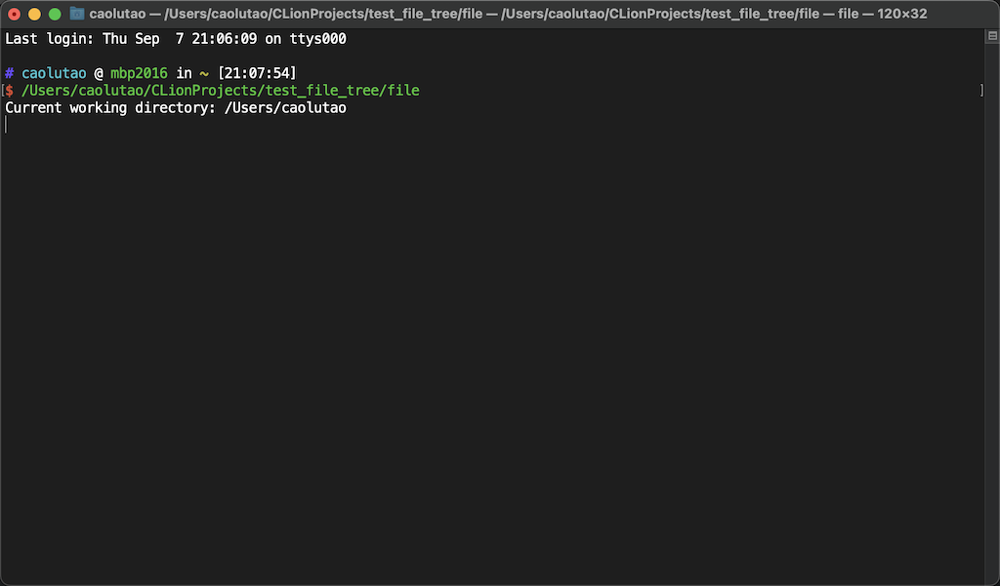

### 简介

本文记录一下 `C++` 的 `IO stream` 的使用

### 相对路径

- **[ios_base](https://cplusplus.com/ios_base)**
- **[ios](https://cplusplus.com/ios)**
- **[istream](https://cplusplus.com/istream)**
- ifstream

首先要说明这个 `相对路径` 是相对于谁

在 `linux` 环境下（我是 `MacOS`）

他相对的其实是，你当前的操作环境的路径

也就是你 `终端（terminal）` 当前的路径

#### 举个例子

`Main.cpp` 输出当前的目录

```C++
#include <iostream>
#include <fstream>
#include <string>
#include <unistd.h>

using namespace std;

int main() {

    char buff[250];
    getcwd(buff, 250);
    string current_working_directory(buff);
    cout << "Current working directory: " << current_working_directory << endl;

    while (true) {}

    return 0;
}
```


现在我们在 `~` 目录下执行 `file` 



可以看到输出的路径就是 `~`

我们换个路径


可以发现结果变了

证实了我们的结论

> ps : 其实 `./file` 前面的 `./` 就是当前目录的意思
>
> 可以通过尝试 `cd ./` 来验证
>
> 读取上一级目录是 `..` ，读取上一级目录的文件是 `../test.txt`
>
> 读取上上一级目录是 `../..` ，读取上上一级目录的文件是 `../../test.txt`

### ifstream

```C++
#include <iostream>
#include <fstream>
#include <string>
using namespace std;

int main() {
    // 指定要读取的文件路径
    std::string file_name = "../test.txt";

    // 创建一个fstream对象，以文本模式打开文件
    std::ifstream file(file_name, std::ios::in);

    // 检查文件是否成功打开
    if (!file.is_open()) {
        std::cerr << "无法打开文件: " << file_name << std::endl;
        return 1;
    }

    // 读取文件内容
    std::string content;
    std::string line;
    while (std::getline(file, line)) {
        content += line;
        content += "\n";
    }

    // 关闭文件
    file.close();

    // 输出文件内容
    std::cout << "文件内容:\n" << content << std::endl;
    
    return 0;
}
```

流程很容易读懂

先打开文件

再用 `getline` 一行一行读

最后调用 `file.close()` 关闭文件

> 如果你是在 `Clion` 或者 `vscode` 里面写的代码，一定要注意它运行的文件夹在哪
>
> 通常情况是当前可执行文件的目录下面

### ofstream

