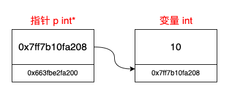

## 指针是操作内存的工具

### 1. 指针也存在内存中，指针也有内存地址

指针本身也是对象，也存在内存中，指针也有内存地址



> 记住这个图，每次难以理解指针的时候，就看看这个图

### 2. 指针的类型及其初始化

首先，一个 `int *n;` ，表明了这个指针类型是 `int *`

所以，通用的指针类型就是 `dataType *`

```c
int a = 10;
int *p = &a;
```

这里 `p` 的类型是 `int*` 而不是 `int`

所以，指针的声明并没有什么难处，他和普通的变量其实没什么区别，只是类型改成对应的指针类型就行了

而指针的赋值，一般就是对象的引用，

```C++
Person person = *new Person;
Person* p = &person;
```



第一行代码， `*new Person()` 是这个分配内存后用一个临时指针所指的内存空间

所以就类似于

```C++
Person* pPerson = new Person;
Person person = *pPerson;
```



> 这里的 `*` 称为指针运算符，用来取得某个地址上的数据

而 `person *p` 是一个指针，`&person` 是这个 `person` 的引用



`auto person = *new Person();` 这里还调用了拷贝构造函数，但这不是本文所述的重点



### 3. 指针通过 `->` 可调用当前指向内存所属对象的内部成员

```C++
class Person {
public:
    char *name;
};

// 调用
Person *p = new Person();
p->name;
```

### 4. 指针指向一个内存地址

可以将指针赋值给指针，也可以将一个地址赋值给指针

```C++
int n = 10;
int *ptr1 = &n;
int *ptr2 = ptr1;
```

### 5. 指针输出（打印或调用）

| 输出形式     | 代码 | 结果           |
| ------------ | ---- | -------------- |
| 输出变量名   | ptr  | 存储的地址     |
| 输出 *变量名 | *ptr | 地址上的数据   |
| 输出 &变量名 | &ptr | 指针本身的地址 |

```C++
int main() {

  int n = 10;
  int *ptr = &n;

  std::cout << "ptr : " << ptr << std::endl;
  // ptr : 0x7ff7b5fe020c
  std::cout << "*ptr : " << *ptr << std::endl;
  // *ptr : 10
  std::cout << "&ptr : " << &ptr << std::endl;
  // &ptr : 0x7ff7b5fe0200

  std::cout << "n : " << &n << std::endl;
  // n : 0x7ff7ba53120c
}
```

### 6. 作为参数传递

> 这里涉及一个 形参、实参 的概念
>
> 简单来说，
> `形参` 就是声明函数（方法）的时候，填写的参数
> `实参` 就是调用函数（方法）的时候，填写的参数

所以

```C++
#include <iostream>

class Person {
public:
    const char *name = "tom";
};

void print(Person *p) {
  std::cout << std::endl;
  std::cout << "print2(Person *p) " << p << std::endl;
  std::cout << "print2(Person &p) " << &p << std::endl;
  std::cout << "print2(Person p->name) " << p->name << std::endl;
}

int main() {

  auto person = *new Person();
  auto *p_ptr = &person;

  std::cout << "p_ptr : " << p_ptr << std::endl;
  std::cout << "&p_ptr : " << &p_ptr << std::endl;
  std::cout << "p_ptr->name : " << p_ptr->name << std::endl;

  print(p_ptr);
}
```

我们来看输出结果

```shell
p_ptr : 0x7ff7bbb55208 // person 地址
&p_ptr : 0x7ff7bbb55200
p_ptr->name : tom

print2(Person *p) 0x7ff7bbb55208
print2(Person &p) 0x7ff7bbb551d8
print2(Person p->name) tom
```

我们知道 `第 20 行` 输出的肯定是`指针 ptr` 存储的地址，也就也是这个 `person` 的地址

并且，`第 21 行` 输出的是 `指针 ptr` 本身的地址

`第 8 行` 定义的函数，括号里是形参

在调用函数的时候，会生成一个新的指针 `p` ，指向 `person` ，也就是把传进去的 `p_ptr` 赋值给 `p`

所以 `第 10 行` 输出的就是 `p` 存储的地址

所以 `第 11 行` 输出的就是 `p` 自身的地址

所以 `第 11 行` 就是用 `p` 访问 `person` ，输出自然是 `person` 的 `name`

所以，指针对象作为参数传入，会生成一个新的指针，和这个传入的指针指向同一块内存，所以你用这个指针执行的操作，在函数外面也会接收到。

所以就可以这么写

```C++
#include <iostream>

void copyStringToDynamicMemory(char *&destination) {
  const char* source = "This is a dynamically allocated string.";
  
  destination = new char[strlen(source) + 1];
  
  std::strcpy(destination, source);
}

int main() {
  char* code = nullptr;
  copyStringToDynamicMemory(code);

  if (code != nullptr) {
    std::cout << "code : " << code << std::endl;
    delete[] code;
  } else {
    std::cerr << "Memory allocation failed." << std::endl;
  }
}
```

我们传入了 `code` 为空，等到执行完函数，`code` 所指的内存已经写入了数据



这里的参数这样写 `char *&destination` ,



### 7. 作为返回值

这里涉及两个概念：堆和栈

堆内存一般指的是动态分配的内存，栈内存一般指的是方法调用栈

在C++中，你可以使用以下几种方法来申请堆内存：

1. **使用`new`运算符**： 使用 `new` 运算符可以动态分配内存并返回一个指向该内存的指针。例如，如果要动态分配一个整数数组：

   ```C++
   int* dynamicArray = new int[10];
   ```

   在分配内存后，不要忘记在不再需要时，使用 `delete` 运算符释放内存：

   ```C++
   delete[] dynamicArray;
   ```

2. **使用`malloc`函数**： 你还可以使用标准C库函数 `malloc` 来分配堆内存。`malloc` 返回一个指向分配的内存块的指针。与 `new` 不同，`malloc` 不会自动调用类的构造函数。你需要手动管理内存。

   ```C++
   int* dynamicArray = (int*)malloc(10 * sizeof(int));
   ```

   同样，你应该使用 `free` 函数来释放内存：

   ```C++
   free(dynamicArray);
   ```

3. **使用`std::allocator`**： C++还提供了 `std::allocator` 类，它可以用于分配内存并构造对象。虽然通常不需要手动使用它，但它提供了更多的内存管理灵活性。

   ```C++
   std::allocator<int> alloc;
   int* dynamicArray = alloc.allocate(10);
   ```

   当你不再需要内存时，你可以使用 `alloc.deallocate` 函数来释放它。

   ```C++
   alloc.deallocate(dynamicArray, 10);
   ```

4. **使用智能指针**： 在现代C++中，推荐使用智能指针来管理堆内存。`std::shared_ptr` 和 `std::unique_ptr`是强大的工具，它们会在对象不再需要时自动释放内存。

   ```C++
   std::shared_ptr<int> dynamicArray = std::make_shared<int[]>(10);
   ```

   当指针超出范围或不再需要时，它们会自动处理内存的释放。

使用 `new` 或 `malloc` 时，请确保在不再需要内存时手动释放它，以避免内存泄漏。同时，了解每种方法的区别和适用场景，以便根据需求选择合适的方法。

当指针作为返回值的时候，只有两种情况

- 指向堆内存
- 指向全局变量

举一个的例子🌰

```C++
int* createAndReturnDynamicArray(int size) {
    int* arr = new int[size];
    return arr;
}
```
