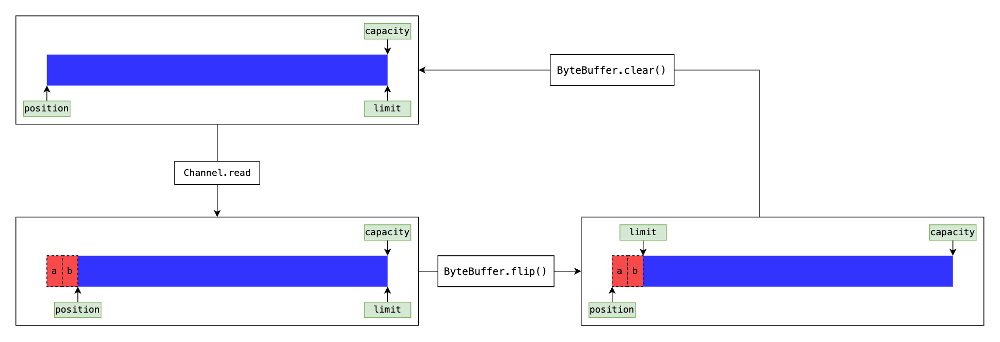

## io



只要是把数据从程序外部拷贝到程序内部，都叫输入，包括但不限于，硬盘文件数据，网络数据，其他应用程序的数据

只要是把数据从程序内部拷贝到程序外部，都叫输入，包括但不限于，硬盘文件数据，网络数据，其他应用程序的数据


### FileInputStream & FileOutPutStream

我们对于 Stream 这类 Closable 对象都知道需要调用 close 函数，就比如 kotlin 的 use 函数，那么我们该如何把编写正确的作用域调用呢？

#### FileInputStream

```kotlin
// (1) 错误
val inPutStream = FileInputStream("./asd.text")
inPutStream.use {
  try {
    val char = inPutStream.read().toChar()
    println(char)
  } catch (e: Exception) {
    e.printStackTrace()
  }
}

// (2) 正确
try {
  val inPutStream = FileInputStream("./asd.text")
  inPutStream.use {
    println(inPutStream.read())
  }
} catch (e: Exception) {
  e.printStackTrace()
}
```

因为 `FileInputStream` 函数会抛出异常

`use` 函数在最后调用的 `Closable.close()` 也会抛出异常

所以这两个函数都应该在 try 的作用域里

```java
// FileInputStream.java
public FileOutputStream(String name) throws FileNotFoundException {
  this(name != null ? new File(name) : null, false);
}

// Closeable.java
public void close() throws IOException;
```

#### FileOutPutStream

同样， 使用 `OutPutStream` 也是这样，应该将初始化和 `use` 都放进 `try` 的作用域

```kotlin
try {
  val outPutStream = FileOutputStream("./asd.text")
  outPutStream.use {
    val byteArray = byteArrayOf('a'.code.toByte())
    outPutStream.write(byteArray)
  }
} catch (e: Exception) {
  e.printStackTrace()
}
```

### Reader & Writer

#### Reader

`reader` : 一次只能读一个字符，需要关闭！！！

```kotlin
// (1) 错误
val inPutStream = FileInputStream("./asd.text")
inPutStream.use {
  val reader = InputStreamReader(inPutStream)
  reader.use {
    println(reader.read().toChar())
    println(reader.read().toChar())
  }
}

// (2) 正确
val inPutStream = FileInputStream("./asd.text")
val reader = InputStreamReader(inPutStream)
reader.use {
  println(reader.read().toChar())
  println(reader.read().toChar())
}
```


由于 InputStreamReader 在调用 close 的时候，调用 InputStream 的 close，所以只需调用一次 InputStreamReader.close 即可



如果你习惯用 `kotlin` 你会发现还有一个方法 `reader.readLines()`，这个方法可以把所有内容都读出来，返回一个文件的字符串数组
这是 `kotlin` 官方写的扩展函数，其实内部实现是把 `reader` 又套了一层，变成了 `BufferedReader`，并不是  `reader` 的成员方法


#### Writer

Writer 和 Reader 一样，同样注意 close 一次

Writer.flush() 是冲洗，效果就是将缓冲区的数据立刻写入文件

在你刚调用 Writer.write() 的时候，文件里并不会有你写入的字符，需要调用 Writer.flush() 或者 Writer.close 才会写进去，这是因为你的缓冲区没有写满，当你的缓冲区写满的时候，会自动 flush()


所以 flush() 的应用场景就是在你缓冲区没写满的时候，并且不再写入或者有其他需要立刻写入文件的需求时，你可以将调用此方法，立刻写入文件


在你调用 Writer.close 的时候也会将缓冲区立刻写入文件，只不过它并不是调用 Writer.flush()，而是另外的原理，这里就不展开讲述了



- OutPutStream.flush() 不做任何操作
- flush() 类似的调用，并不能确保文件的写入，他只是将这部分操作通知给操作系统，并不会进行写入检查


### BufferedReader


在程序执行过程中，频繁进行 io 是会造成很多性能消耗
这取决于很多原因，不过关键因素在于 io 操作会依赖于外部了————也就是硬盘（这里指的不仅是物理硬盘，也有虚拟硬盘，或者操作系统优化过的硬盘，比如 nas）或者网络，也就是并不全都是在内存里进行操作了

而且，开始读写文件到读写第一个字符的时间 要比 读写第一个字符到读写第二个字符的时间 要长的多！！！

- 物理设备速度限制： 硬盘和网络等IO设备相比于内存和CPU速度较慢。
- IO操作的机制： 读写文件涉及操作系统的多个层面。这包括用户空间和内核空间之间的数据传输，文件系统的操作（比如定位文件位置、权限检查等），以及物理设备之间的数据传输。这些操作都需要系统资源，并且可能涉及上下文切换和系统调用，从而引入额外的开销。

- 数据传输的开销： 数据传输本身有开销。在磁盘上，数据可能被分散存储在不同的位置（磁盘碎片化），导致需要更多的寻道时间。此外，网络IO也会受到带宽限制和延迟的影响。

- 系统等待时间： 在进行IO操作时，CPU可能会处于空闲状态，因为IO操作通常会阻塞进程直到完成。这样的等待时间可能会降低系统的整体利用率，特别是在单线程或同步IO的情况下。


`BufferedReader` 就可以一定程度上减少 io 操作，因为他可以一次读写一行数据

它继承自 `Reader` 所以也需要关闭

```kotlin
val inPutStream = FileInputStream("./asd.text")
val reader = InputStreamReader(inPutStream)
val bufferedReader = BufferedReader(reader)
bufferedReader.use {
  println(bufferedReader.readLine())
}
```

### 复制文件

了解了前面的操作，复制操作就会很简单了

```kotlin
fun copyFile(srcFilePath: String, dstFilePath: String) {
  try {
    val inputStream = FileInputStream(srcFilePath)
    val outputStream = FileOutputStream(dstFilePath)
    val data = ByteArray(1024)
    var len: Int
    while (`is`.read(data).also { len = it } != -1) {
      os.write(data, 0, len)
    }
    inputStream.close()
    outputStream.close()
  } catch (e: Exception) {
    e.printStackTrace()
  }
}
```

kotlin 的 use() 会增加嵌套所以有时候，并不一定要使用 use()，用 close() 反而更简洁

如果这里使用 use()，反而会减少可读性

```kotlin
inputStream.use { `is` ->
  outputStream.use { os ->
    while (`is`.read(data).also { len = it } != -1) {
      os.write(data, 0, len)
    }
  }
}
```

### 网络 io

bufferedReader 和 bufferedWriter 在这里是主要的应用场景

我这里列举一个非常简陋的服务器代码

```kotlin
fun networkIO() {
  try {
    val serverSocket = ServerSocket(8080)
    val socket = serverSocket.accept()
    val bufferedReader = BufferedReader(InputStreamReader(socket.getInputStream()))
    val bufferedWriter = BufferedWriter(OutputStreamWriter(socket.getOutputStream()))
    while (true) {
      val requireString = bufferedReader.readLine()
      if (requireString == "exit") {
        break
      }
      bufferedWriter.write("response: $requireString\n")
      bufferedWriter.flush()
    }
    bufferedReader.close()
    bufferedWriter.close()
    socket.close()
  } catch (e: Exception) {
    e.printStackTrace()
  }
}
```

我们通过 ServerSocket.accept() 来等待建立连接，并会将客户端发的信息返回去，在客户端输入 exit 的时候，结束接收新的字符并关闭服务

```shell
$ telnet localhost 8080
Trying ::1...
Connected to localhost.
Escape character is '^]'.
hello
response: hello
exit
Connection closed by foreign host.
```

## nio (强制使用 Buffer)

### Buffer 操作细节

我们以一个读文件的代码来讲解 nio 的原理

```kotlin
try {
  val randomAccessFile = RandomAccessFile("./asd.txt", "rw")
  val channel = randomAccessFile.channel
  val byteBuffer = ByteBuffer.allocate(1024)
  channel.read(byteBuffer)
  byteBuffer.flip()
  println(Charset.defaultCharset().decode(byteBuffer))
} catch (e: Exception) {
  e.printStackTrace()
}
```



我画了一个图，蓝色为 buffer，capacity 是 buffer 的容量，limit 是限制符，position 是当前位置

可以看到，当 Channel 读取字符到 Buffer 里面的时候，position 一直在记录当前位置

ByteBuffer.flip() 是切换读模式，其实就是 limit 记录 position 位置，position 重置为 0，mark 重置（mark 后面会提到）

```java
// ByteBuffer.java
ByteBuffer flip() {
  super.flip();
  return this;
}


// Buffer.java
public Buffer flip() {
  limit = position;
  position = 0;
  mark = -1;
  return this;
}
```

### 非阻塞网络 IO

#### 阻塞式 IO

```kotlin
fun nioNetWorkIO() {
  try {
    val serverSocketChannel = ServerSocketChannel.open()
    serverSocketChannel.bind(InetSocketAddress(8080))
    val socketChannel = serverSocketChannel.accept()
    val byteBuffer = ByteBuffer.allocate(1024)
    while (socketChannel.read(byteBuffer) != -1) {
      byteBuffer.flip()
      val requireString = Charset.defaultCharset().decode(byteBuffer).toString()
      if (requireString == "exit\r\n") {
        break
      }
      byteBuffer.flip()
      socketChannel.write(byteBuffer)
      byteBuffer.clear()
    }
  } catch (e: Exception) {
    e.printStackTrace()
  }
}
```

这段代码就能充分体现出来我们学习 Buffer 操作细节的作用了

第 9 行对 byteBuffer 进行了读取操作，此时 limit 和 position 应该相等了，如果需要再次读取，应该再次修改 position 的位置。

我们直接修改 position 也可以 `byteBuffer.position(0)` 重新调用一遍 flip 也可以

并且在第 15 行，我们执行 clear ，方便下次的写入

#### 非阻塞式 IO



```kotlin
fun nioNetWorkIOunBlocking() {
  try {
    val serverSocketChannel = ServerSocketChannel.open()
    serverSocketChannel.bind(InetSocketAddress(8080))
    serverSocketChannel.configureBlocking(false)
    val selector = Selector.open()
    serverSocketChannel.register(selector, SelectionKey.OP_ACCEPT)
    while (true) {
      selector.select()
      handleRequireData(selector)
    }
  } catch (e: IOException) {
    e.printStackTrace()
  }
}

fun handleRequireData(selector: Selector) {
  val selectedKeys = selector.selectedKeys()
  val keyIterator = selectedKeys.iterator()
  while (keyIterator.hasNext()) {
    val key = keyIterator.next()
    if (key.isAcceptable) {
      val serverChannel = key.channel() as ServerSocketChannel
      val client = serverChannel.accept()
      client.configureBlocking(false)
      client.register(selector, SelectionKey.OP_READ)
      println("Client connected: " + client.remoteAddress)
    } else if (key.isReadable) {
      val client = key.channel() as SocketChannel
      val buffer = ByteBuffer.allocate(1024)
      val bytesRead = client.read(buffer)
      if (bytesRead != -1) {
        buffer.flip()
        val receivedData = String(buffer.array(), 0, bytesRead)
        println("Received data: " + receivedData + " from " + client.remoteAddress)
        buffer.clear()
      } else {
        key.cancel()
        client.close()
        println("Client disconnected: " + client.remoteAddress)
      }
    }
    keyIterator.remove()
  }
}
```



## okio

### 简单用法

```kotlin
fun okioBufferRead(file: File) {
  file.source().buffer().use { bufferedFileSource ->
      println(bufferedFileSource.readUtf8())
  }
}
```

```kotlin
fun okioBufferWrite(file: File) {
  file.sink().buffer().use { sink ->
    sink.writeUtf8("Hello World!")
  }
}
```



使用以下两种方法

- 使用 file.source() 获取 InputStreamSource ，然后调用 fileSource.read(buffer, 1024) 写入 Buffer，然后调用 buffer.readUtf8() 读取 buffer
- 使用 file.source().buffer() 获取 BufferedSource ，然后调用 bufferedFileSource.readUtf8() 读取

这两种其实是一样的，只不过第一种需要你指定 buffer 大小

但第二种是官方指定推荐的形式，并且更加智能\简洁





同样，BufferedSource.close() 会调用 Source.close() ,所以只要调用 BufferedSource.close() 就可以了



### buffer 作为输出对象

在传统 io 里面，Buffer 并不能作为输出位置，也就是说，我们可以有 FileOutPutStream 但是并没有  BufferOutPutStream

而 okio 给了我们机会，他直接在自己的 Buffer 上写了一个 OutPutStream 这样我们就可以就可以直接输出到 Buffer 里了

```kotlin
val buffer = Buffer()
try {
  ObjectOutputStream(buffer.outputStream()).use { objectOutputStream ->
    objectOutputStream.writeUTF("abc")
    objectOutputStream.writeBoolean(true)
    objectOutputStream.writeChar('0'.code)
    objectOutputStream.flush()
    val objectInputStream = ObjectInputStream(buffer.inputStream())
    println(objectInputStream.readUTF())
  }
} catch (e: Exception) {
  e.printStackTrace()
}
```

> 同理 buffer.inputStream() 也是有的
