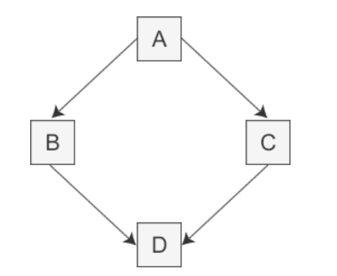
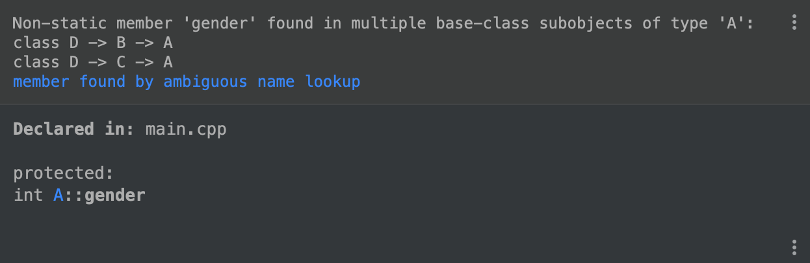
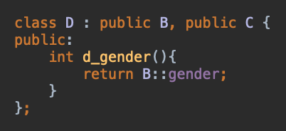
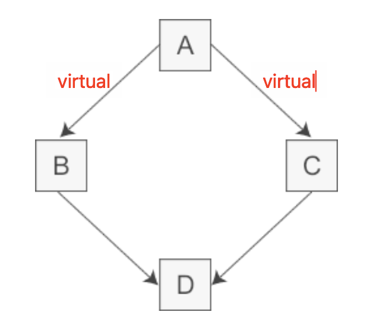

为什么  `Java` 要设计成单继承，但是允许实现多个 `Interface` ，为什么不干脆直接设计成多继承？

## 以 C++ 为例

我们都知道 `C++` 是多继承的，这就会导致一些很复杂的情况出现，比如菱形继承



此时，我们假设 `A` 有一个变量 `gender(性别)`， 
`B` 继承 `A` ，所以 `B` 也有 `gender` ，
`C` 继承 `A` ，所以 `C` 也有 `gender` ， 
那么 `D` 肯定也有 `gender` ，
但是由于同时继承了 `B` 和 `C` ，所以 `D` 就有了两个 `gender` ，这太奇怪了，两个性别？？？
这样我们该如何操作 `gender` ？？？

```Java
class A {
protected:
    int gender;
};

class B : public A {
protected:
    int b_gender() {
        return gender;
    };
};

class C : public A {
protected:
    int c_gender() {
        return gender;
    };
};

class D : public B, public C {
public:
    int d_gender() {
        return gender; //这里会编译错误
    }
};
```



可以看到根本没法操作，编译就报错了，所以，我们只能改成这样...



但是这写法也太难理解了，更何况我们确实知道还存在一个 `C::gender` 存在，但是却用不到它，这意味着这部分空间浪费了！！！

所以 `C++` 推出了虚继承



> 但说实话，这个虚继承很难用！！！

以菱形继承为例，假设 `A` 定义了一个名为 `gender` 的成员变量，当我们在 `D` 中直接访问 `gender` 时，会有三种可能性：

- 如果 `B` 和 `C` 中都没有 `gender` 的定义，那么 `gender` 将被解析为 `A` 的成员，此时不存在二义性。
- 如果 `B` 或 `C` 其中的一个类定义了 `gender` ，也不会有二义性，派生类 D 的 `gender` ，比 `虚基类 A` 的 `gender` 优先级更高。
- 如果 `B` 和 `C` 中都定义了 `gender` ，那么直接访问 `gender` 将产生二义性问题。

如果多继承变得更复杂，织成了一张网，那就很痛苦了，这样代码会耦合严重，一旦设计不合理很容易出现离谱的问题

不仅是成员变量，成员函数也是一样的道理

这也就是为什么包括 `Java` 在内，很多语言设计为单继承的原因



- `Java` 的接口多实现，仅在一种情况下有二义性，那就是变量名冲突的情况
  - 但是这种情况下，并不复杂，因为即使是多实现，也只需要处理现在这个类就可以了，因为实现接口的是类，再往下就是单继承了
- `Java` 的接口多实现，不会使成员函数有二义性
  - 因为只要实现了接口，就会有对成员函数的重新实现，所以只要以当前的实现为准就好了

