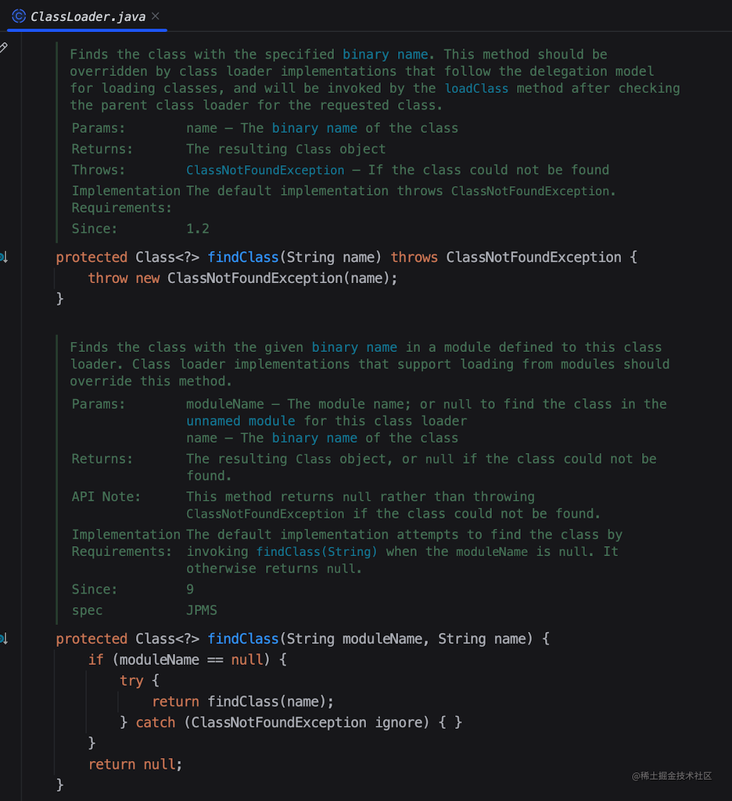

本文大量挪用 [我竟然被” 双亲委派” 给虐了！-HollisChuang's Blog](https://www.hollischuang.com/archives/6055) 
如果可以还请看原文，原文写的非常好！！！强烈建议观看原文并点赞 
并且全网写得比较全的，我找了好几篇，基本都是抄的这个文章！！！

另外 `juejin` 某篇 [双亲委派机制（奥利给干就完了）](https://juejin.cn/post/7218916720324182071) 也是我写的，我正在慢慢把 `juejin` 里写过的文章慢慢倒过来。。。

## 起因

起因是因为某实习期的同事，在写代码的时候，写了大量 `static` 代码，导致启动缓慢

因为 `kotlin` 去掉了 `static` 关键字，所以很多人在使用的时候会写入很多 `static` 代码

趁此机会我输出一篇关于类加载的文章

## 看类加载器

#### 1. 启动类加载器（Bootstrap Class Loader）



启动类加载器（Bootstrap Class Loader）是`Java`类加载器体系中的最顶层加载器，也是类加载器中最特殊的一个。它负责加载`Java`核心库，如 `java.lang` 等核心类，以及其他基础类库。以下是关于启动类加载器的详细讲解：

1. 实现和特点：
  - 启动类加载器通常是由`Java`虚拟机的实现提供的，并不是一个普通的`Java`类。
  - 它位于`JVM`内部，不是`Java`代码实现的，因此不能通过`Java`代码直接访问或自定义。
  - 启动类加载器是`Java`类加载器体系的最顶层，没有父加载器。

2. 加载范围：
 - 启动类加载器负责加载`Java`核心类库，这些类位于`JVM`的核心运行时环境中，如`java.lang`、`java.util`等核心包中的类。
 - 启动类加载器加载的类是所有`Java`应用程序共享的，它们具有最高的优先级。

3. 加载过程：
 - 启动类加载器的加载过程不同于其他类加载器。它是`JVM`启动时自行加载的，不经过类路径（Classpath）的搜索。
 - `JVM`内部的实现机制确保了核心类库的加载，因此无需自定义加载逻辑或自定义类加载器。

4. 安全性：
 - 启动类加载器的主要目的是确保`Java`核心库的安全性和完整性，防止用户自定义的类或恶意代码覆盖核心类库。
 - 由于启动类加载器不经过类路径的搜索，这样可以防止用户通过自定义的类加载器来加载核心类库的替代版本。

5. 自定义类加载器和扩展类加载器：
 - 虽然不能自定义或修改启动类加载器，但可以自定义类加载器，并通过它加载应用程序自身的类和资源。
 - 扩展类加载器（Extension Class Loader）位于启动类加载器和应用程序类加载器之间，它可以加载位于扩展类路径中的类。

总之，启动类加载器是Java类加载器体系中的顶层加载器，负责加载`Java`核心类库，确保核心类库的安全性和完整性。它是`Java`虚拟机的一部分，不需要自定义或修改，通常由`JVM`的实现提供。这个加载器的存在有助于保持`Java`的安全性和稳定性。



#### 2. 扩展类加载器（Extension Class Loader）



扩展类加载器（Extension Class Loader）是`Java`类加载器体系中的一个重要组成部分，位于应用程序类加载器（Application Class Loader）之上，负责加载`Java`的扩展库和用户自定义的扩展类。以下是关于扩展类加载器的详细讲解：

1. 实现和层次结构：

 - 扩展类加载器通常由`Java`类`sun.misc.Launcher$ExtClassLoader`实现。
 - 它是应用程序类加载器的父加载器，属于类加载器体系中的第二层。
 - 扩展类加载器是纯`Java`代码实现的，相对于启动类加载器来说更容易理解和扩展。

2. 加载范围：

 - 扩展类加载器主要负责加载`Java`的扩展库，这些库包括位于`<JAVA_HOME>/lib/ext`目录下的JAR文件和用户自定义的扩展类库。
 - 用户可以将自己编写的扩展类放置在扩展类库目录中，然后扩展类加载器就可以加载它们。

3. 扩展类库目录：

 - 扩展类加载器搜索扩展类库的目录通常位于`<JAVA_HOME>/lib/ext`，这个目录包含了`Java`的标准扩展库。
 - 用户可以通过`Java`系统属性`java.ext.dirs`来指定其他扩展类库目录，以加载自定义扩展类。

4. 加载过程：

 - 当需要加载一个类时，扩展类加载器首先会检查是否已经加载了该类。如果已经加载，它直接返回类的`Class`对象。
 - 如果尚未加载该类，扩展类加载器尝试加载它。首先，它询问自己的父加载器（应用程序类加载器）是否能够加载。只有在父加载器无法加载时，扩展类加载器才会尝试加载。

5. 用户自定义扩展类：

 - 用户可以创建自定义的扩展类，并将它们放置在扩展类库目录中。
 - 这些自定义扩展类可以用于扩展`Java`的功能，例如添加自定义的API或功能。

6. 使用场景：

 - 扩展类加载器通常用于加载与`Java`平台相关的扩展库，以及用户自定义的扩展类。这些库和类通常不包含在`Java`核心库中，但可以为特定应用或环境提供有用的功能。

总之，扩展类加载器是`Java`类加载器体系中的一个重要组成部分，用于加载`Java`的扩展库和用户自定义的扩展类。它的存在有助于扩展`Java`平台的功能，同时保持类加载的层次结构和隔离性。用户可以通过将自定义扩展类放置在扩展类库目录中来扩展`Java`的功能，而不需要修改核心类库或创建自定义类加载器。



#### 3. 应用程序类加载器（Application Class Loader）



应用程序类加载器（Application Class Loader），也称为系统类加载器，是Java类加载器中的一个重要组成部分。它主要负责加载应用程序中的类，包括用户编写的类和第三方库，通常是位于类路径（Classpath）上的类。以下是关于应用程序类加载器的详细讲解：

1. 实现和层次结构：

 - 应用程序类加载器是由 `Java` 虚拟机提供的，通常由Java类 `sun.misc.Launcher$AppClassLoader` 实现。
 - 它属于类加载器体系中的一级，是双亲委派模型中的中间层，其父加载器是扩展类加载器（Extension Class Loader），并且它的父加载器没有固定的 `Java` 类来实现。

2. 加载范围：

 - 应用程序类加载器负责加载应用程序的类，包括主程序和应用程序所依赖的第三方库。
 - 它搜索的类路径包括环境变量 `CLASSPATH` 指定的目录，以及 ` Java` 虚拟机启动时通过命令行参数指定的类路径。

3. 加载过程：

 - 当应用程序需要加载一个类时，应用程序类加载器首先检查是否已经加载了该类。如果已经加载，它直接返回类的 `Class` 对象。
 - 如果尚未加载该类，应用程序类加载器会尝试加载它。首先，它询问扩展类加载器是否能够加载，如果扩展类加载器也无法加载，最终由应用程序类加载器自行尝试加载。

4. 自定义类加载器：

 - 应用程序类加载器可以作为自定义类加载器的父加载器，这意味着开发人员可以通过自定义类加载器来扩展或修改类加载的行为。
 - 自定义类加载器通常继承自 `ClassLoader` 类，并重写 `findClass` 方法以实现自定义的加载逻辑。

5. 安全性和隔离：

 - 应用程序类加载器有助于实现类加载的隔离和安全性。不同的Java应用程序可以有不同的应用程序类加载器，它们加载的类互相隔离，不会相互影响。
 - 这有助于防止不同应用程序之间的类冲突，确保每个应用程序都能够独立加载并执行其自己的类。

总之，应用程序类加载器是 `Java` 类加载器体系中的一个重要组成部分，它负责加载应用程序中的类，包括用户编写的类和第三方库。它的工作遵循双亲委派模型，有助于保持类的一致性和安全性，并支持类加载的隔离和独立性。



#### 4. 自定义类加载器（Custom Class Loader）



自定义类加载器（Custom Class Loader）是 `Java` 类加载机制的一个重要部分，允许开发人员根据特定需求创建自定义加载逻辑，以加载类或资源。自定义类加载器通常用于特殊的场景，如加载加密的类文件、动态生成类、热部署等。以下是关于自定义类加载器的详细讲解：

1. 实现自定义类加载器：

 - 要实现自定义类加载器，需要创建一个 `Java` 类，该类应该继承自`ClassLoader`类，并重写其中的方法，尤其是`findClass`方法。`findClass`方法负责加载指定名称的类字节码，并将其转换为`Class`对象。

```java
public class MyClassLoader extends ClassLoader {
    @Override
    protected Class<?> findClass(String name) throws ClassNotFoundException {
        // 加载类的字节码并转换为Class对象的逻辑
    }
}
```

2. 加载逻辑：

 - 在`findClass`方法中，您需要实现加载类的逻辑，通常是从特定位置加载类文件的字节码。
 - 您可以从文件系统、网络、数据库或其他来源加载字节码。
 - 加载的字节码需要经过类加载器转换成`Class`对象。

3. 父加载器：

 - 自定义类加载器通常会有一个父加载器，可以是应用程序类加载器或其他自定义类加载器。您可以在构造函数中指定父加载器，也可以使用系统类加载器作为默认父加载器。

```java
public MyClassLoader() {
    super(); // 使用系统类加载器作为父加载器
}
```

4. 使用场景：

 - 自定义类加载器可用于许多场景，包括动态代码生成、插件化架构、热部署、安全沙盒等。
 - 例如，Web应用程序容器（如Tomcat）使用自定义类加载器来隔离不同Web应用程序的类加载，以防止类冲突。

5. 安全性和隔离：

 - 自定义类加载器的一个重要作用是实现类加载的隔离，防止不同类加载器加载的类相互干扰。
 - 每个自定义类加载器加载的类都在其加载范围内，不会影响其他类加载器加载的类。

6. 类加载器层次结构：

 - 自定义类加载器可以作为类加载器层次结构的一部分，可以根据需要创建多个自定义类加载器，形成类加载器的层次结构。

7. 安全性和权限：

 - 自定义类加载器可以设置安全策略和权限控制，以确保加载的类或资源遵循安全规则。

总之，自定义类加载器是`Java`类加载机制的灵活部分，允许开发人员根据具体需求实现自定义加载逻辑。自定义类加载器通常继承自`ClassLoader`类，重写`findClass`方法来实现加载逻辑，同时可以实现加载的隔离和安全性。这些特性使自定义类加载器在特殊场景下非常有用。



## 分析 static 类加载

1. 静态变量（Static Variables）：

    - 静态变量是属于类而不是对象的成员变量。它们在类加载时被初始化，且只会初始化一次。
    - 静态变量的初始化通常发生在类加载的初始化阶段，这是类加载的一个子阶段。初始化是在类加载时执行的代码块，用来初始化静态变量。
    - 静态变量的值在整个应用程序中是共享的，可以通过类名访问，而不需要创建类的实例。


2. 静态方法（Static Methods）：

    - 静态方法也属于类而不是对象。它们在类加载时被加载到内存中，并且不需要类的实例来调用。

    - 静态方法可以在类加载时执行一些初始化工作，例如初始化静态变量，或执行其他与类相关的操作。

    - 静态方法通常用于工具类或辅助方法，不需要与特定的实例关联。

所以他会在加载类的时候，把静态成员执行加载

## 双亲委派机制是什么

当一个`ClassLoader` 收到了 类加载的请求 的时候，他不会直接去加载指定的类，而是把这个请求 委托给自己的 父加载器 去加载。只有父加载器 无法加载这个类的时候，才会由 当前这个加载器 来负责类的加载。



也就是说，一个用户自定义的类，是永远不会被 `Bootstrap ClassLoader` `Extension ClassLoader` 加载的
但是一个用户自定义的类，他也会被一直委托到 `Bootstrap ClassLoader`，但是因为 `Bootstrap ClassLoader` 不负责加载该类，那么会再由 `Extension ClassLoader` 尝
试加载，而 `Extension ClassLoader` 也不负责这个类的加载，最终才会被 `Application ClassLoader` 加载。



### 为什么需要双亲委派？

首先，`通过委派的方式，可以避免类的重复加载`，当父加载器已经加载过某一个类时，子加载器就不会再重新加载这个类。

另外，`通过双亲委派的方式，还保证了安全性`。

因为 `Bootstrap ClassLoader` 在加载的时候，只会加载 `JAVA_HOME` 中的 `jar` 包里面的类，如 `java.lang.Integer`，那么这个类是不会被随意替换的。

除非有人跑到你的机器上， 在你的应用启动前破坏你的 `JDK`，
如果他在 `JDK` 已经启动的时候破坏你的`JDK`，因为你已经用`Bootstrap ClassLoader`加载了类，所以并不影响 ，所以只有从启动前对 `JDK` 搞破坏才可以。

### “父子加载器” 之间的关系是继承吗？

很多人看到父加载器、子加载器这样的名字，就会认为 `Java` 中的类加载器之间存在着继承关系。

甚至网上很多文章也会有类似的错误观点。

> 这里需要明确一下，双亲委派模型中，类加载器之间的父子关系一般不会以继承（Inheritance）的关系来实现，而是都使用组合（Composition）关系来复用父加载器的代码的。

如下为 ClassLoader 中父加载器的定义：

```java
public abstract class ClassLoader {

    // The parent class loader for delegation
    private final ClassLoader parent;
}
```
### 双亲委派是怎么实现的？
双亲委派模型对于保证 `Java` 程序的稳定运作很重要，但它的实现并不复杂。

实现双亲委派的代码都集中在 `java.lang.ClassLoader` 的 `loadClass()` 方法之中：

```java
protected Class<?> loadClass(String name, boolean resolve)
    throws ClassNotFoundException
{
    synchronized (getClassLoadingLock(name)) {
    
        // 第一步，先检查类是否已经被加载过 
        Class<?> c = findLoadedClass(name);
        
        
        if (c == null) {
        
            // 第二步，若没有加载则调用父加载器的 loadClass() 方法进行加载
            long t0 = System.nanoTime();
            try {
                if (parent != null) {
                    c = parent.loadClass(name, false);
               } else {
               
                   // 第三步，若父加载器为空则默认使用 Bootstrap ClassLoader 作为父加载器 
                   c = findBootstrapClassOrNull(name);
               }
           } catch (ClassNotFoundException e) {
               // 第四步，如果父类加载失败，抛出 ClassNotFoundException 异常
               // ClassNotFoundException thrown if class not found
               // from the non-null parent class loader
           }
           
           if (c == null) {
               // 第五步，如果前面都失败，再调用自己的 findclass() 
               long t1 = System.nanoTime();
               c = findClass(name);
               // this is the defining class loader; record the stats
               PerfCounter.getParentDelegationTime().addTime(t1 - t0);
               PerfCounter.getFindClassTime().addElapsedTimeFrom(t1);
               PerfCounter.getFindClasses().increment();
           }
       }
       if (resolve) {
           resolveClass(c);
       }
       return c;
   }
}
```

代码不难理解，主要就是以下几个步骤：

1. 先检查类是否已经被加载过 
2. 若没有加载则调用父加载器的 `loadClass()` 方法进行加载
3. 若父加载器为空则默认使用`Bootstrap ClassLoader`作为父加载器
4. 如果父类加载失败，抛出 `ClassNotFoundException` 异常
5. 上一步如果失败，再调用自己的 `findClass()` 方法进行加载。

### 如何主动破坏双亲委派机制？

知道了双亲委派模型的实现，那么想要破坏双亲委派机制就很简单了。

因为他的双亲委派过程都是在 loadClass 方法中实现的，那么`想要破坏这种机制，那么就自定义一个类加载器，重写其中的 loadClass 方法，使其不进行双亲委派即可。`

### loadClass（）、findClass（）、defineClass（）区别

`ClassLoader` 中和类加载有关的方法有很多，前面提到了 `loadClass`，除此之外，还有 `findClass` 和 `defineClass` 等，那么这几个方法有什么区别呢？

`loadClass()` 
就是主要进行类加载的方法，默认的双亲委派机制就实现在这个方法中，重写这个方法可以破坏双亲委派机制。

`findClass()` 
根据名称或位置加载 `.class` 字节码

`definclass()` 
把 `.class` 字节码转化为 `Class`

这里面需要展开讲一下 `loadClass` 和 `findClass`，我们前面说过，当我们想要自定义一个类加载器的时候，并且想破坏双亲委派原则时，我们会重写 `loadClass` 方法。

> 那么，如果我们想定义一个类加载器，但是不想破坏双亲委派模型的时候呢？

这时候，就可以继承 `ClassLoader`，并且重写 `findClass` 方法。`findClass()` 方法是 `JDK1.2` 之后的 `ClassLoader` 新添加的一个方法。

> 这是显而易见的，`ClassLoader`是一个抽象类，并且 `findClass(String name)` 是一个没有具体实现的方法，并且在上面我们看到了`loadClass()`里面调用了`findClass()`




> 如图：这个方法只抛出了一个异常，没有默认实现。

> `JDK1.2` 之后已不再提倡用户直接覆盖 `loadClass()` 方法，而是建议把自己的类加载逻辑实现到 `findClass()` 方法中。
>
> 因为在 `loadClass()` 方法的逻辑里，如果父类加载器加载失败，则会调用自己的 `findClass()` 方法来完成加载。

所以，如果你想定义一个自己的类加载器，并且要遵守双亲委派模型，那么可以继承 `ClassLoader`，并且在 `findClass()` 中实现你自己的加载逻辑即可。

### 双亲委派被破坏的例子

双亲委派机制的破坏不是什么稀奇的事情，很多框架、容器等都会破坏这种机制来实现某些功能。

1. 第一种被破坏的情况是在双亲委派出现之前。  
   由于双亲委派模型是在 `JDK1.2` 之后才被引入的，而在这之前已经有用户自定义类加载器在用了。所以，这些是没有遵守双亲委派原则的。

2. 第二种，是 JNDI、JDBC 等需要加载 SPI 接口实现类的情况。

3. 第三种是为了实现热插拔热部署工具。  
   为了让代码动态生效而无需重启，实现方式时把模块连同类加载器一起换掉就实现了代码的热替换。

4. tomcat 等 web 容器的出现。

5. OSGI、Jigsaw 等模块化技术的应用。

### 为什么 JNDI，JDBC 等需要破坏双亲委派？

我们日常开发中，大多数时候会通过 `API` 的方式调用 `Java` 提供的那些基础类，这些基础类时被 `Bootstrap` 加载的。

但是，调用方式除了 `API` 之外，还有一种 `SPI` 的方式。

如典型的 `JDBC` 服务，我们通常通过以下方式创建数据库连接：

```java
Connection conn = DriverManager.getConnection("jdbc:mysql://localhost:3306/mysql", "root", "1234");
```

在以上代码执行之前，`DriverManager` 会先被类加载器加载，因为 `java.sql.DriverManager` 类是位于 `rt.jar` 下面的 ，所以他会被`Bootstrap ClassLoader`加载。

类加载时，会执行该类的静态方法。其中有一段关键的代码是：

```java
ServiceLoader<Driver> loadedDrivers = ServiceLoader.load(Driver.class);
```

这段代码，会尝试加载 `classpath` 下面的所有实现了 `Driver` 接口的实现类。

那么，问题就来了。

> `DriverManager` 是被`Bootstrap ClassLoader`加载的，那么在加载时遇到以上代码，会尝试加载所有 `Driver` 的实现类，但是这些实现类基本都是第三方提供的，根据双亲委派原则，第三方的类不能`Bootstrap ClassLoader`加载。

那么，怎么解决这个问题呢？

于是，就在 `JDBC` 中通过引入 `ThreadContextClassLoader`（线程上下文加载器，默认情况下是 `ApplicationClassLoader`）的方式破坏了双亲委派原则。

我们深入到 `ServiceLoader.load` 方法就可以看到：

```java
public static <S> ServiceLoader<S> load(Class<S> service) {
    ClassLoader cl = Thread.currentThread().getContextClassLoader();
    return ServiceLoader.load(service, cl);
}
```

第一行，获取当前线程的线程上下⽂类加载器 `ApplicationClassLoader`，⽤于加载 `classpath` 中的具体实现类。

> 说实话，我没怎么深入了解过`JDBC`，这一段没看太懂

### 为什么 Tomcat 要破坏双亲委派

我们知道，Tomcat 是 web 容器，那么一个 web 容器可能需要部署多个应用程序。

不同的应用程序可能会依赖同一个第三方类库的不同版本，但是不同版本的类库中某一个类的全路径名可能是一样的。

如多个应用都要依赖 `lucas.jar`，但是 A 应用需要依赖 `1.0.0` 版本，但是 B 应用需要依赖 `1.0.1` 版本。这两个版本中都有一个类是 `com.lucas.Test.class`。

**如果采用默认的双亲委派类加载机制，那么是无法加载多个相同的类。**

所以，`Tomcat` 破坏双亲委派原则，提供隔离的机制，为每个 `web 容器`单独提供一个 `WebAppClassLoader` 加载器。

`Tomcat` 的类加载机制：为了实现隔离性，优先加载` Web 应用自己定义的类`，所以没有遵照双亲委派的约定，每一个应用自己的类加载器——`WebAppClassLoader` 负责加载本身的目录下的 `class` 文件，加载不到时再交给 `CommonClassLoader` 加载，这和双亲委派刚好相反。

### 模块化技术与类加载机制

近几年模块化技术已经很成熟了，在 JDK 9 中已经应用了模块化的技术。

> 其实早在 `JDK 9` 之前，`OSGI` 这种框架已经是模块化的了，而 `OSGI` 之所以能够实现模块热插拔和模块内部可见性的精准控制都归结于其特殊的类加载机制，加载器之间的关系不再是双亲委派模型的树状结构，而是发展成复杂的网状结构。


> 在 `JDK` 中，双亲委派也不是绝对的了。

在 `JDK9` 之前，`JVM` 的基础类以前都是在 `rt.jar` 这个包里，这个包也是 `JRE` 运行的基石。

这不仅是违反了单一职责原则，同样程序在编译的时候会将很多无用的类也一并打包，造成臃肿。

在 `JDK9` 中，整个 `JDK` 都基于模块化进行构建，以前的 `rt.jar`, `tool.jar` 被拆分成数十个模块，编译的时候只编译实际用到的模块，同时各个类加载器各司其职，只加载自己负责的模块。

```java
Class<?> c = findLoadedClass(cn);
if (c == null) {
    // 找到当前类属于哪个模块
    LoadedModule loadedModule = findLoadedModule(cn);
    if (loadedModule != null) {
        //获取当前模块的类加载器
        BuiltinClassLoader loader = loadedModule.loader();
        //进行类加载
        c = findClassInModuleOrNull(loadedModule, cn);
     } else {
          // 找不到模块信息才会进行双亲委派
            if (parent != null) {
              c = parent.loadClassOrNull(cn);
            }
      }
}
```

### 总结

... 没有总结