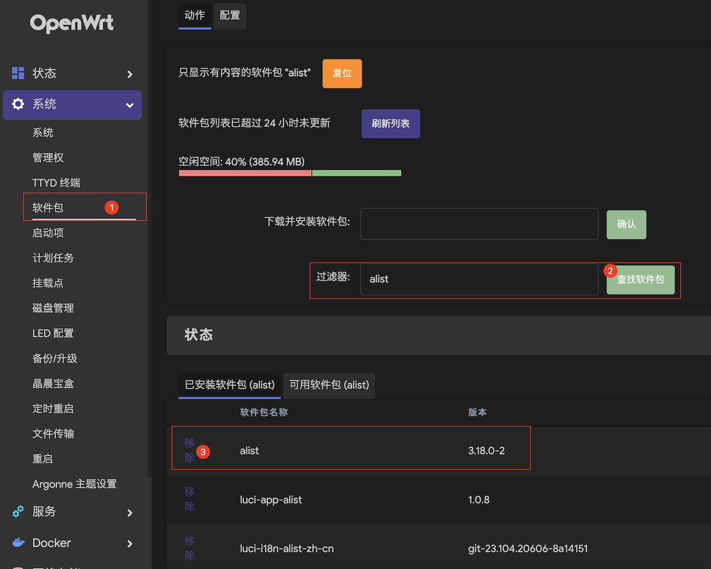
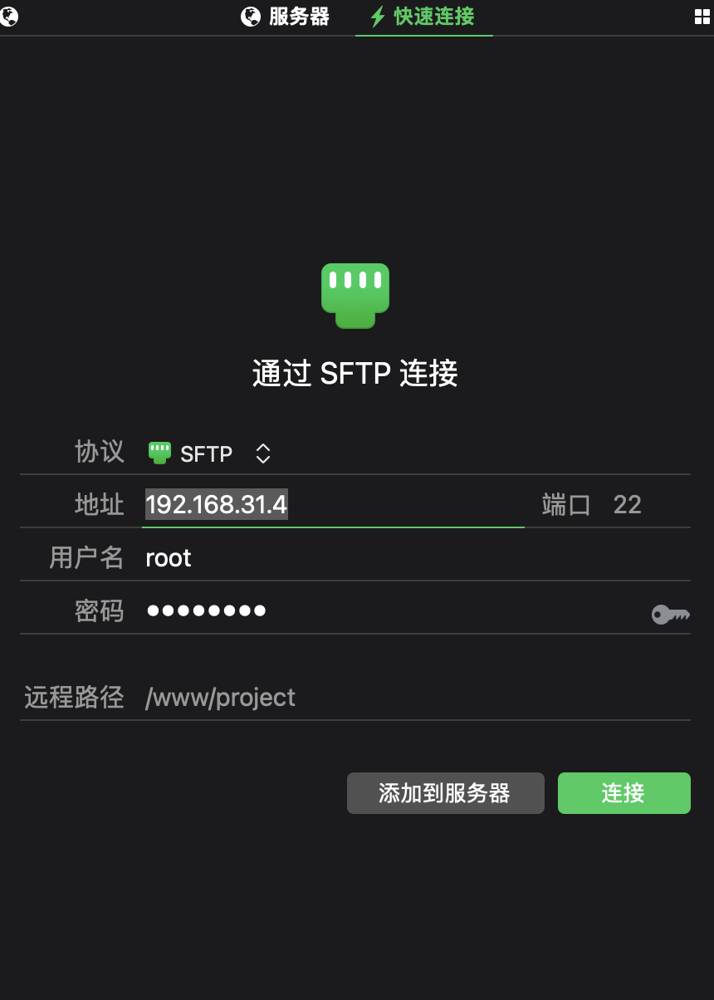
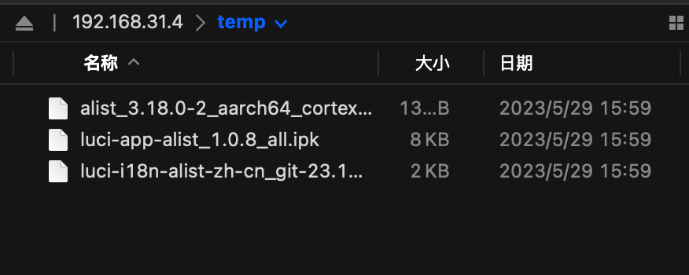

## 前提

1. 固件 flippy-82+o 基于 OpenWrt R23.04.15
2. N1 盒子（家境贫寒）

## 问题列表

### Alist 相关

#### 1. 如何更新

1. 下载好 [ipk 软件包](https://github.com/sbwml/luci-app-alist/releases/)  
例如这个 `openwrt-22.03-aarch64_cortex-a53.tar.gz`  
2. 解压
  
3. 卸载原来的 alist  
  
卸载一个就行, 其他的会跟着卸载的, 不放心可以卸载完自己检查一下  
4. 把文件放进去, 怎么放都行, 我直接用的 sftp  
  
  
5. 进 ssh 这个肯定都会  
`ssh root@192.168.31.4` ip 改为你的路由器 ip
6. 然后一个个安装, 一定要先安装 alist, 因为其他两个是依赖 alist 的  
就像这样

    ```bash
    opkg install /temp/alist_3.18.0-2_aarch64_cortex-a53.ipk

    opkg install /temp/luci-app-alist_1.0.8_all.ipk

    opkg install /temp/luci-i18n-alist-zh-cn_git-23.104.20606-8a14151_all.ipk
    ```

7. 这样就算装好了, 此时应该就看到 Alist 更新了, 看不到就重启一下
