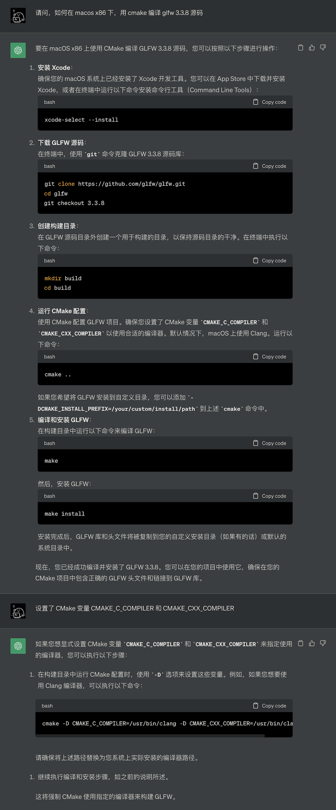
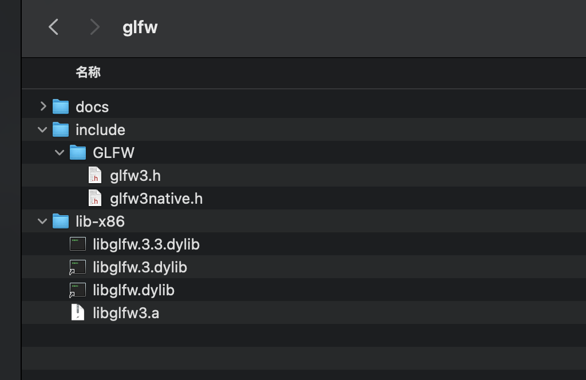
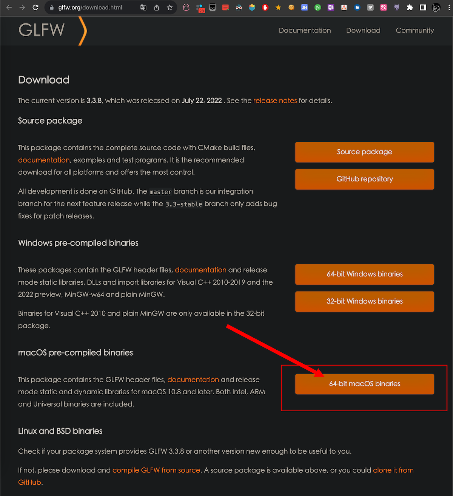
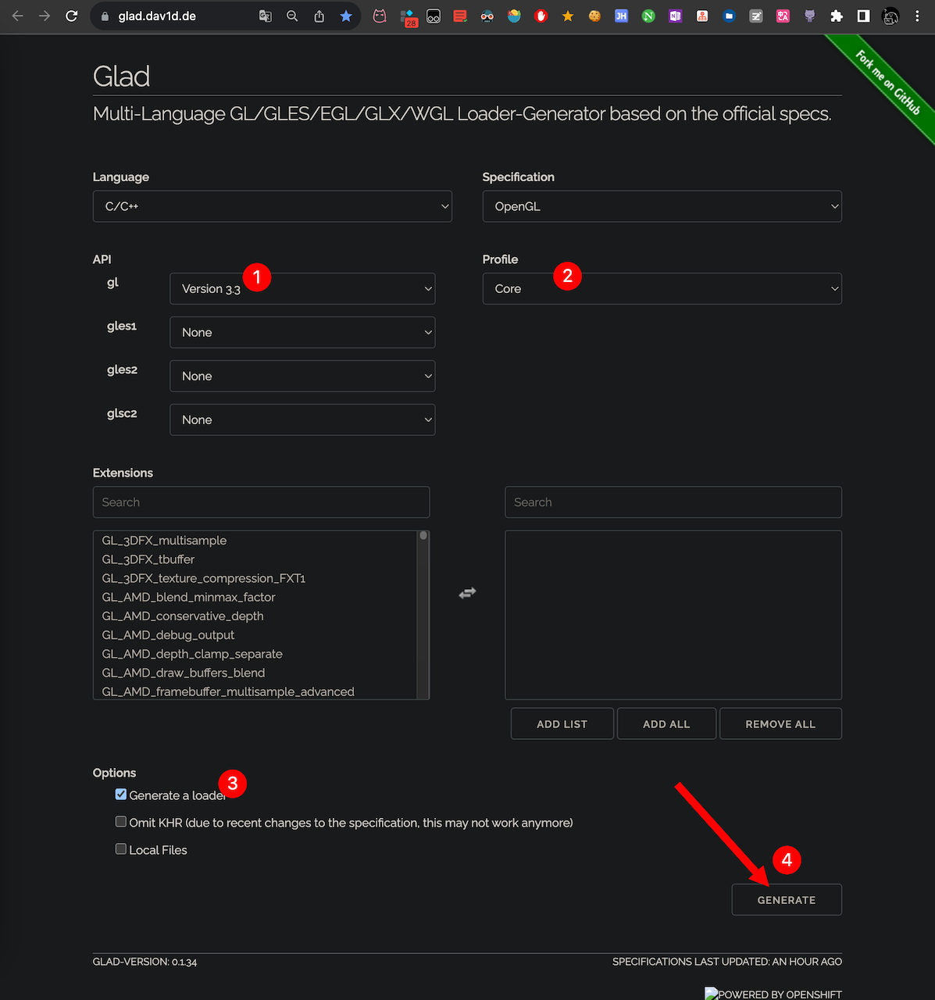
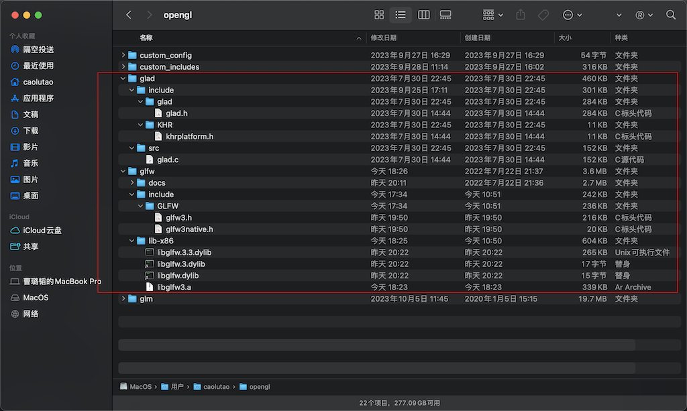
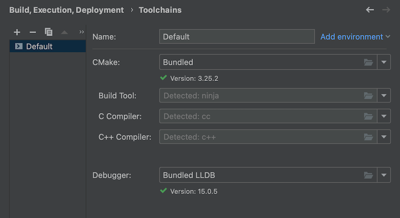

## 环境介绍

这次我将环境部署到了 `Mac + Clion` 上

> ~~其实并没有解决上次的编译 `glfw` 的问题，但好像不太影响使用  
> 因为我不会自己写编译脚本(〒︿〒)~~
>
> 解决了！！！chatGPT 真好用！！！
>
> 

```shell
xcode-select --install
```

```shell
git clone https://github.com/glfw/glfw.git
cd glfw
git checkout 3.3.8
```

```shell
mkdir build
cd build
```

```shell
cmake -D CMAKE_C_COMPILER=/usr/bin/clang -D CMAKE_CXX_COMPILER=/usr/bin/clang++ ..
```

```shell
cmake ..
```


>   如果你需要生成动态库，就使用下面这个命令
>
>   ```shell
>   cmake -DBUILD_SHARED_LIBS=ON ..
>   ```


```shell
make
```

>   最后一个`make install` 不一定要执行，这个命令会将编译的文件放进系统目录，我觉得没必要，你可以直接把文件拖出来，就像这样
>
>   
>
>   如果你成功编译了，那么后续的步骤中，你就不需要再下载 `glfw` 了，只要下载 `glad` 就行了

1. 先看编译器

    ```shell
    $ gcc -v
    Apple clang version 14.0.0 (clang-1400.0.29.202)
    Target: x86_64-apple-darwin21.6.0
    Thread model: posix
    InstalledDir: /Library/Developer/CommandLineTools/usr/bin
    ```

2. 你可以用自己编译好的 `glfw` 库，也可以下载 `glfw` 和 `glad`

   [glfw下载地址](https://www.glfw.org/download.html)

   [glad下载地址](https://glad.dav1d.de/)

   

   

3. `zshrc` 添加环境变量

    ```zshrc
    export GLFW_HOME="/Users/.../opengl/glfw"
    export GLAD_HOME="/Users/.../opengl/glad"
    ```

    

4. 都是默认的，参考上面的 步骤 1，gcc -v 里的 `InstalledDir`
   

5. CMakeLists.txt

   ```cmake
   cmake_minimum_required(VERSION 3.25)
   project(Cpp11)
   
   set(CMAKE_CXX_STANDARD 11)
   
   # 检查环境变量
   if (NOT DEFINED ENV{GLFW_HOME})
     message(FATAL_ERROR "found no env named GLFW_HOME")
   endif ()
   if (NOT DEFINED ENV{GLAD_HOME})
     message(FATAL_ERROR "found no env named GLAD_HOME")
   endif ()
   
   # 暂存环境变量
   set(GLFW_HOME $ENV{GLFW_HOME})
   set(GLAD_HOME $ENV{GLAD_HOME})
   
   # 设置头文件目录
   include_directories("${GLFW_HOME}/include")
   include_directories("${GLAD_HOME}/include")
   
   # 添加 GLFW3 预编译库
   add_library(glfw SHARED IMPORTED)
   SET_TARGET_PROPERTIES(glfw PROPERTIES IMPORTED_LOCATION "${GLFW_HOME}/lib-x86/libglfw.3.dylib")
   
   # 编译 GLAD 库
   add_library(glad SHARED "${GLAD_HOME}/src/glad.c")
   
   
   # 创建可执行文件
   add_executable(Cpp11
       main.cpp
       hello_triangle.cpp
       hello_triangle.h
   )
   
   # 链接 GLFW GLAD OpenGL
   target_link_libraries(Cpp11 glfw glad "-framework OpenGL")
   ```

6. 运行代码

    ````C++
    #include <glad/glad.h>
    #include <GLFW/glfw3.h>
    #include <iostream>
    
    void framebuffer_size_callback(GLFWwindow*  window, int width, int height);
    void processInput(GLFWwindow* window);
    
    int main() {
        glfwInit(); // init glfw
    
        // use version 3.3
        glfwWindowHint(GLFW_CONTEXT_VERSION_MAJOR,  3); // set major version
        glfwWindowHint(GLFW_CONTEXT_VERSION_MINOR,  3); // set minor version
    
        glfwWindowHint(GLFW_OPENGL_PROFILE,
            GLFW_OPENGL_CORE_PROFILE); // use core profile
    
        // MacOS specific code
        glfwWindowHint(GLFW_OPENGL_FORWARD_COMPAT, GL_TRUE);
    
        GLFWwindow* window = glfwCreateWindow(800, 600, "LearnOpenGL", NULL, NULL);   // 800*600 size window called LearnOpenGL
        if (window == NULL) {
            std::cout << "Failed to create GLFW window" << std::endl;
            glfwTerminate();    // 释放/删除之前的分配的所有资源
            return -1;
        }
        glfwMakeContextCurrent(window);   // set the current window
        if (!gladLoadGLLoader((GLADloadproc)    glfwGetProcAddress)) {
            std::cout << "Failed to initialize GLAD" << std::endl;
            return -1;
        }
        glViewport(0, 0, 800, 600);    // 设置窗口位置
        glfwSetFramebufferSizeCallback(window, framebuffer_size_callback);    // 设置窗口大小调整回调
    
        // 循环检查窗口是否需要被关闭
        while (!glfwWindowShouldClose(window)){
        
            processInput(window);    // 监控ESC退出窗口
            glClearColor(0.2f, 0.3f, 0.3f, 1.0f);     // 调用glClearColor来设置清空屏幕所用的颜色
            glClear(GL_COLOR_BUFFER_BIT);    // 调用glClear函数来清空屏幕的颜色缓冲
            glfwSwapBuffers(window);    // 函数会交换颜 色缓冲（它是一个储存着GLFW窗口每一个像素颜色值的大缓冲），它在这一迭代中被用来绘制，并且将会作为输出显示在屏幕上。
            glfwPollEvents();    // 检查有没有触发什么事件（比如键盘输入、鼠标移动等）、更新窗口状态，并调用对应的回调函数（可以通过回调方法手动设置）
        }
    
        // 释放/删除之前的分配的所有资源
        glfwTerminate();
    
        return 0;
    }
    
    void framebuffer_size_callback(GLFWwindow*  window, int width, int height){
        glViewport(0, 0, width, height);
    }
    
    // 监控ESC退出窗口
    void processInput(GLFWwindow* window){
        if (glfwGetKey(window, GLFW_KEY_ESCAPE) ==  GLFW_PRESS)
            glfwSetWindowShouldClose(window, true);
    }
    ```
    ````

    注意这里多了一个 `glfwWindowHint(GLFW_OPENGL_FORWARD_COMPAT, GL_TRUE);`

    这是 `MacOS` 的区别于别于 `Windows` 的代码
