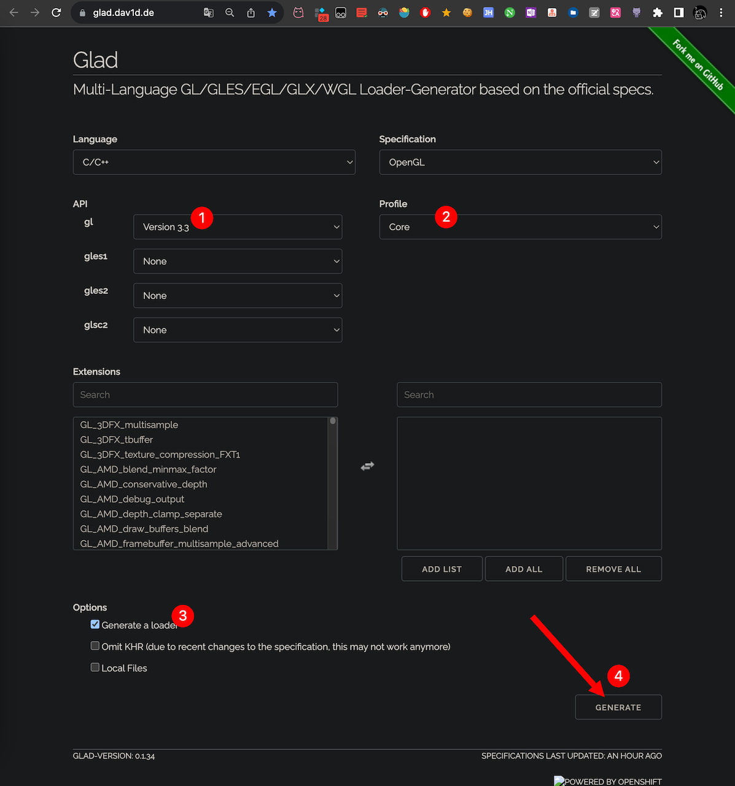
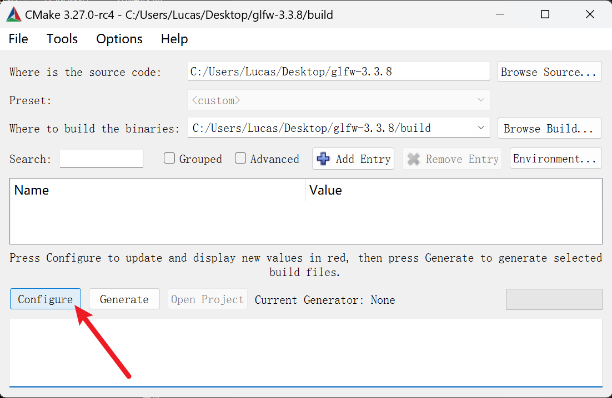
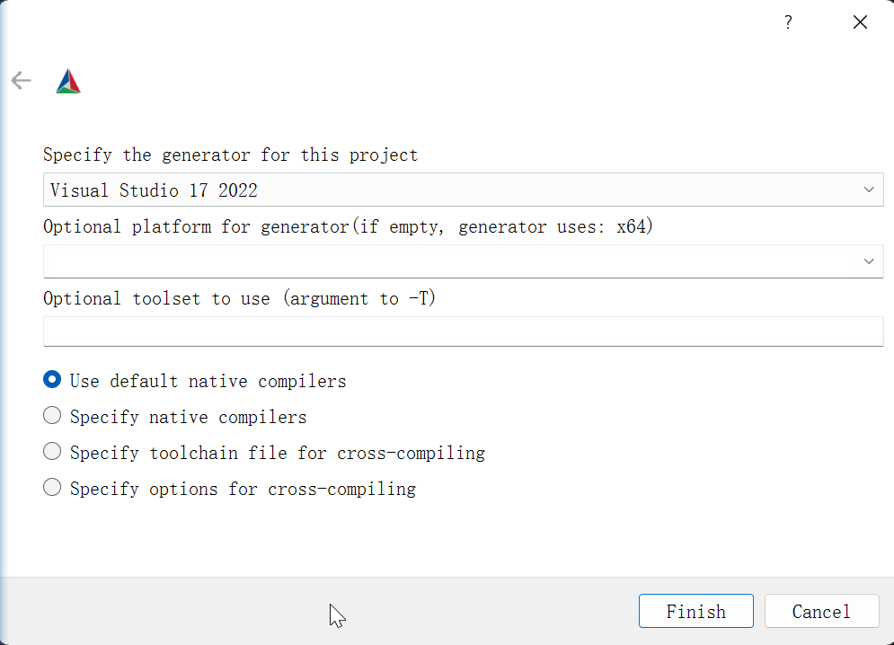
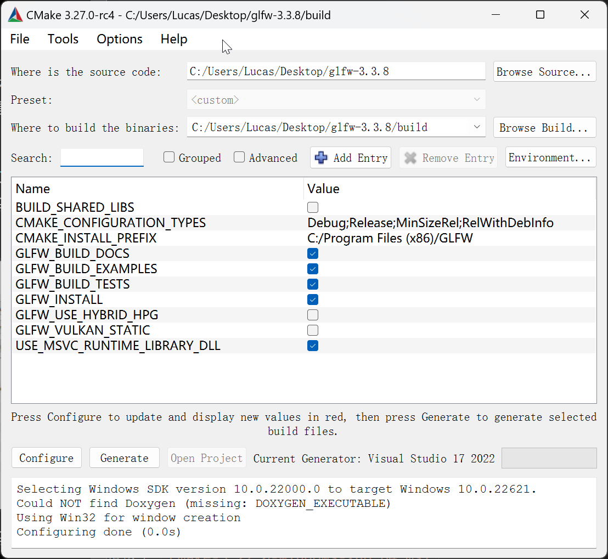
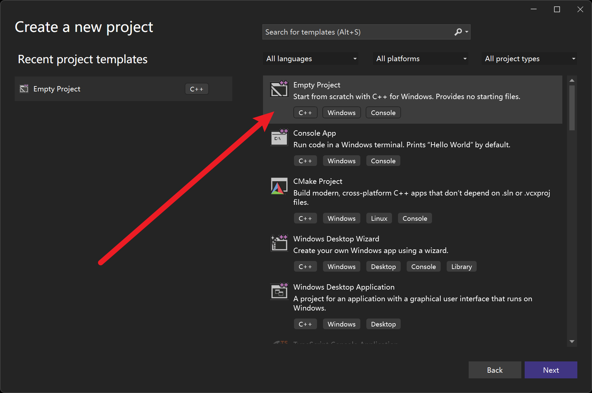
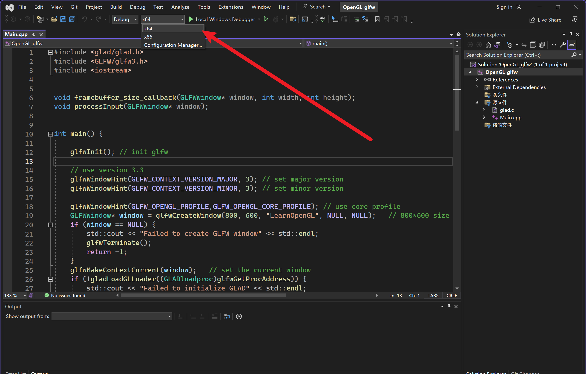
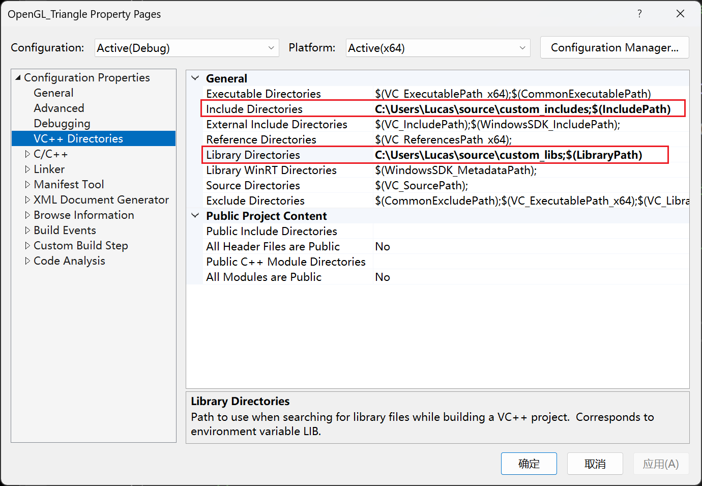
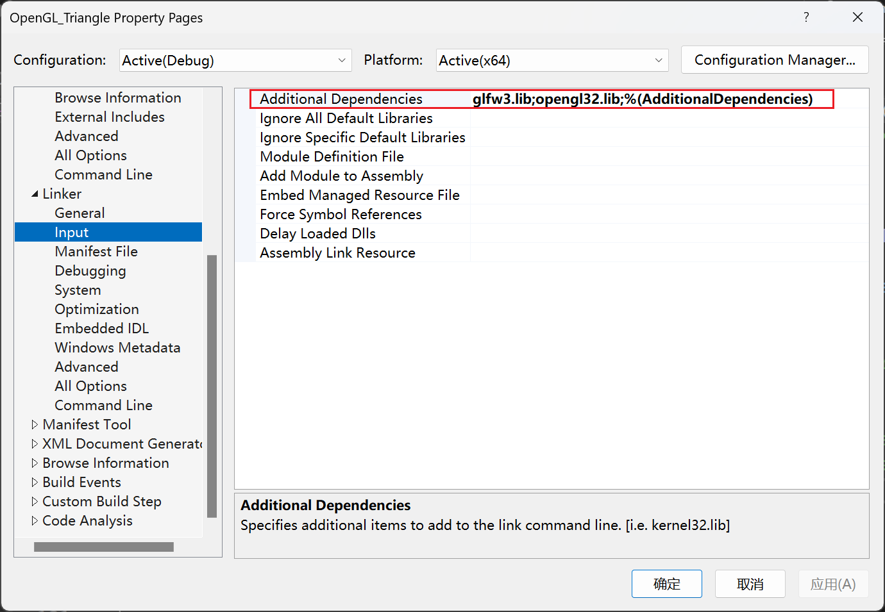

### 配置glad

`GLAD` 是一个开源的库，它能解决我们上面提到的那个繁琐的问题。`GLAD` 的配置与大多数的开源库有些许的不同，`GLAD` 使用了一个在线服务。在这里我们能够告诉 `GLAD` 需要定义的 `OpenGL` 版本，并且根据这个版本加载所有相关的 `OpenGL` 函数。

[打开GLAD的在线服务](https://glad.dav1d.de/)，

将语言 (Language) 设置为 `C/C++` ，

在 API 选项中，选择 3.3 以上的OpenGL (gl) 版本（我们的教程中将使用 3.3 版本，但更新的版本也能用）。

之后将模式(Profile)设置为 `Core` ，

并且保证选中了`生成加载器(Generate a loader)`选项。

现在可以先（暂时）忽略`扩展(Extensions)`中的内容。

都选择完之后，点击`生成(Generate)`按钮来生成库文件。



`GLAD` 现在应该提供给你了一个  `zip` 压缩文件，  
包含两个头文件目录，和一个 `glad.c` 文件。

> 在你想要的位置新建一个文件夹，比如叫 `custom_include`

将两个头文件目录（ `glad` 和 `KHR` ）复制到 `custom_include` 文件夹中（或者增加一个额外的项目指向这些目录），并添加 `glad.c` 文件到你的工程中。

经过前面的这些步骤之后，你就应该可以将以下的指令加到你的文件顶部了：

```C++
#include <glad/glad.h> 
```

### 配置glfw

> 这个就是不通用的地方了，因为我只会用 `CMake` 生成 VS project 的库

`glfw` 是一个专门针对 `OpenGL` 的 `C` 语言库，它提供了一些渲染物体所需的最低限度的接口。它允许用户创建 `OpenGL_Context` 、定义窗口参数以及处理用户输入，对我们来说这就够了。

`CMake 编译 glfw 源码`

这一步可以让库保证完整性，还可以完全适配我们的操作系统，毕竟是用我们自己编译器编译的

[glfw 下载链接](http://www.glfw.org/download.html)

下载 `源代码` 之后

[下载 CMake](https://cmake.org/download/)

我下载的是这个 `cmake-3.27.0-windows-x86_64.msi`

1. 选择 Where is the source code 为你下载的 glfw 的地址

2. 新建一个 build 文件夹，再选择 Where to build the Binaries
    

3. 再点击 `Configure` ，选择你自己 VS 版本，其他默认

    

4. 再次点击 `Configure` ，保存

    

5. 点击 `Generate`

6. 打开 build 文件夹，`build/src/Debug` 文件夹内就会出现 `GLFW.sln` 文件

7. 用 `Visual Studio 2019` 打开。因为 `CMake` 已经配置好了项目，并按照默认配置将其编译为64位的库，所以我们直接点击 `Build Solution(生成解决方案)` 按钮，然后在 `build/src/Debug` 文件夹内就会出现我们编译出的库文件 `glfw3.lib` 。

### 配置 VS

1. 创建两个文件夹，用来存放自己定义的 lib 和 include

   我直接在这里创建的 我也推荐在这里创建

   `C:\Users\用户名\source\custom_includes`

   `C:\Users\用户名\source\custom_lib`

   把 include 和 lib 放进这俩文件夹里面

2. 新建一个 VS 空项目

   

3. 将这里改成 `×64`

   

4. 设置 `Library_Directories` 和 `Include_Directories`

   这里也可以设置环境变量，然后再设置环境变量的名

   

5. 设置链接

   添加 `opengl32.lib` （这个库 32 位和 64 位名字居然一样！！！）和 `glfw3.lib`

   

这就算配好了

### 运行代码

```C++
#include <glad/glad.h>
#include <GLFW/glfw3.h>
#include <iostream>

void framebuffer_size_callback(GLFWwindow* window, int width, int height);
void processInput(GLFWwindow* window);


int main() {
    glfwInit(); // init glfw

    // use version 3.3
    glfwWindowHint(GLFW_CONTEXT_VERSION_MAJOR, 3); // set major version
    glfwWindowHint(GLFW_CONTEXT_VERSION_MINOR, 3); // set minor version

    glfwWindowHint(GLFW_OPENGL_PROFILE,
        GLFW_OPENGL_CORE_PROFILE); // use core profile
    GLFWwindow* window = glfwCreateWindow(800, 600, "LearnOpenGL", NULL, NULL);   // 800*600 size window called LearnOpenGL
    if (window == NULL) {
        std::cout << "Failed to create GLFW window" << std::endl;
        glfwTerminate();    // 释放/删除之前的分配的所有资源
        return -1;
    }
    glfwMakeContextCurrent(window);   // set the current window
    if (!gladLoadGLLoader((GLADloadproc)glfwGetProcAddress)) {
        std::cout << "Failed to initialize GLAD" << std::endl;
        return -1;
    }
    glViewport(0, 0, 800, 600);    // 设置窗口位置
    glfwSetFramebufferSizeCallback(window, framebuffer_size_callback);    // 设置窗口大小调整回调

    // 循环检查窗口是否需要被关闭
    while (!glfwWindowShouldClose(window)){
      
        processInput(window);    // 监控ESC退出窗口
        glClearColor(0.2f, 0.3f, 0.3f, 1.0f);     // 调用glClearColor来设置清空屏幕所用的颜色
        glClear(GL_COLOR_BUFFER_BIT);    // 调用glClear函数来清空屏幕的颜色缓冲
        glfwSwapBuffers(window);    // 函数会交换颜色缓冲（它是一个储存着GLFW窗口每一个像素颜色值的大缓冲），它在这一迭代中被用来绘制，并且将会作为输出显示在屏幕上。
        glfwPollEvents();    // 检查有没有触发什么事件（比如键盘输入、鼠标移动等）、更新窗口状态，并调用对应的回调函数（可以通过回调方法手动设置）
    }

    // 释放/删除之前的分配的所有资源
    glfwTerminate();

    return 0;
}


void framebuffer_size_callback(GLFWwindow* window, int width, int height){
    glViewport(0, 0, width, height);
}

// 监控ESC退出窗口
void processInput(GLFWwindow* window){
    if (glfwGetKey(window, GLFW_KEY_ESCAPE) == GLFW_PRESS)
        glfwSetWindowShouldClose(window, true);
}
```

前面两行就是引用的配置好的库

> 注意两个库的引用顺序，不能反过来！！！
