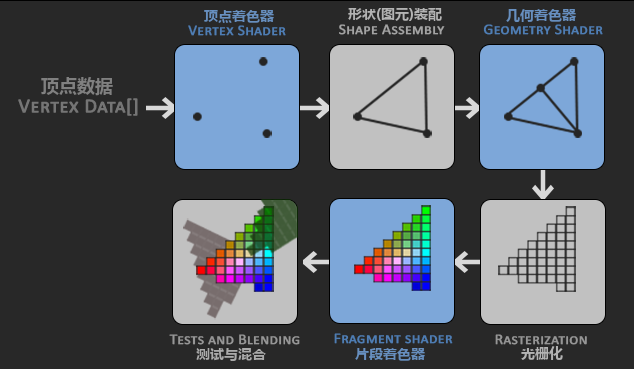
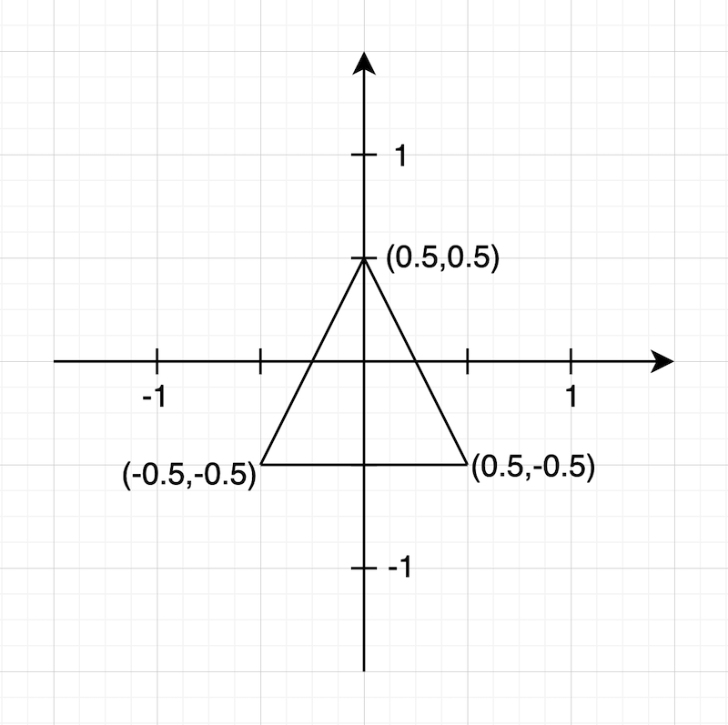
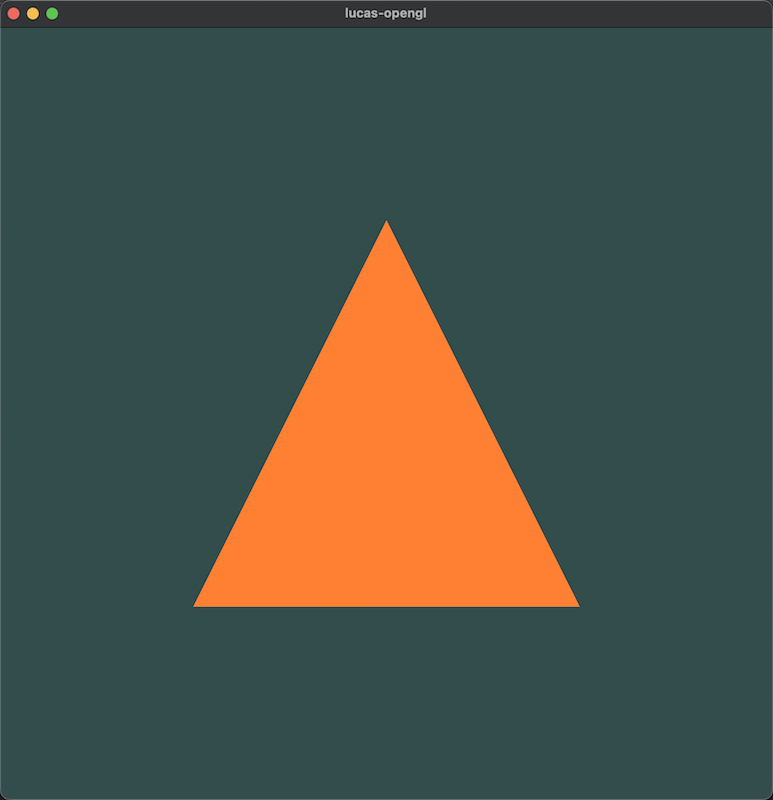

## 渲染管线



这是常见的渲染管线的图，每一步都以上一步的输出为输入，图形渲染管线接受一组3D坐标，然后把它们转变为你屏幕上的有色2D像素输出。

1. 图形渲染管线的第一个部分是顶点着色器(Vertex Shader)，它把一个单独的顶点作为输入。

   顶点着色器主要的目的是把3D坐标转为另一种3D坐标，同时顶点着色器允许我们对顶点属性进行一些基本处理。

2. 图元装配(Primitive Assembly)阶段将顶点着色器输出的所有顶点作为输入（如果是GL_POINTS，那么就是一个顶点），并所有的点装配成指定图元的形状；本节例子中是一个三角形。

3. 图元装配阶段的输出会传递给几何着色器(Geometry Shader)。几何着色器把图元形式的一系列顶点的集合作为输入，它可以通过产生新顶点构造出新的（或是其它的）图元来生成其他形状。例子中，它生成了另一个三角形。

4. 几何着色器的输出会被传入光栅化阶段(Rasterization Stage)，这里它会把图元映射为最终屏幕上相应的`像素`，生成供片段着色器(Fragment Shader)使用的`片段(Fragment)`。在片段着色器运行之前会执行`裁切(Clipping)`。裁切会丢弃超出你的视图以外的所有像素，用来提升执行效率。

   OpenGL中的一个片段是OpenGL渲染一个像素所需的所有数据。

5. 片段着色器的主要目的是`计算一个像素的最终颜色`，这也是所有OpenGL高级效果产生的地方。通常，片段着色器包含3D场景的数据（比如光照、阴影、光的颜色等等），这些数据可以被用来计算最终像素的颜色。

6. 在所有对应颜色值确定以后，最终的对象将会被传到最后一个阶段，我们叫做`Alpha测试和混合(Blending)阶段`。这个阶段检测片段的对应的深度（和模板(Stencil)）值，用它们来判断这个像素是其它物体的前面还是后面，决定是否应该丢弃。这个阶段也会检查`alpha值（alpha值定义了一个物体的透明度）`并对物体进行混合(Blend)。所以，即使在片段着色器中计算出来了一个像素输出的颜色，在渲染多个三角形的时候最后的像素颜色也可能完全不同。

## 看代码之前

看代码之前我们要明确怎么写

1. 我们要初始化我们使用的工具, 比如：glfw
2. 创建一个窗口，并为窗口注册事件监听，后面的绘制都在这个窗口上操作
3. 编译着色器
   - 编译顶点着色器
   - 编译片段着色器
4. 生成 program，链接着色器
5. 绑定 VAO，VBO，或者以后还可能有 EBO，并设置他们的参数
6. 循环中绘制图形

## 代码

`hello_triangle.h` 👇

```c++
#ifndef OPENGL_ENVIRONMENT_TEST_HELLO_TRIANGLE_H
#define OPENGL_ENVIRONMENT_TEST_HELLO_TRIANGLE_H

#include <string>

// GLAD is used to manage Open GL function pointers
#include <glad/glad.h>
#include <GLFW/glfw3.h>

#define WINDOW_WIDTH 800
#define WINDOW_HEIGHT 800
#define WINDOW_TITLE "lucas-opengl"
using namespace std;

class hello_triangle {

public:
    static int create_a_triangle();

private:
    static void draw_frame(unsigned int shaderProgram, unsigned int VAO);

    static void processInput(GLFWwindow *window);

    static void framebuffer_size_callback(GLFWwindow *window, int width, int height);

    static void init_glfw();

    static GLFWwindow *create_glfw_window();

    static void check_shader(unsigned int shader, const string &type);

    static void check_program(unsigned int shaderProgram);
};


#endif //OPENGL_ENVIRONMENT_TEST_HELLO_TRIANGLE_H

```

`hello_triangle.cpp` 👇

```c++
#include <iostream>

#include "hello_triangle.h"

int hello_triangle::create_a_triangle() {
    init_glfw();

    GLFWwindow *window = create_glfw_window();

    if (window == nullptr) {
        return -1;
    }

    // Set the context of our window to the main context of the current thread
    glfwMakeContextCurrent(window);

    // glfwGetProcAddress is the function GLFW get Open GL pointer
    // check if GLAD can use the glfw function in order to initialize GLAD
    if (!gladLoadGLLoader((GLADloadproc) glfwGetProcAddress)) {
        std::cout << "failed to initialize GLAD" << std::endl;
        glfwTerminate();
        return -1;
    }

    // 注册 framebuffer_size_callback
    glfwSetFramebufferSizeCallback(window, framebuffer_size_callback);


    // ********************* 编译着色器 ****************************


    const char *vertexShaderSource = "#version 330 core\n"
                                     "layout (location = 0) in vec3 aPos;\n"
                                     "void main(){\n"
                                     "   gl_Position = vec4(aPos.x, aPos.y, aPos.z, 1.0);\n"
                                     "}\0";

    const char *fragmentShaderSource = "#version 330 core\n"
                                       "out vec4 FragColor;\n"
                                       "void main(){\n"
                                       "    FragColor = vec4(1.0f, 0.5f, 0.2f, 1.0f);\n"
                                       "}\0";
    // vertex shader
    // create a shader
    unsigned int vertexShader = glCreateShader(GL_VERTEX_SHADER);
    glShaderSource(vertexShader, 1, &vertexShaderSource, nullptr);
    glCompileShader(vertexShader);

    // check if the vertexShader compiled successfully
    check_shader(vertexShader, "GL_VERTEX_SHADER");

    // fragment shader
    // create a shader
    unsigned int fragmentShader = glCreateShader(GL_FRAGMENT_SHADER);
    glShaderSource(fragmentShader, 1, &fragmentShaderSource, NULL);
    glCompileShader(fragmentShader);

    // check if the fragmentShader compiled successfully
    check_shader(fragmentShader, "GL_FRAGMENT_SHADER");

    // ********************* 链接着色器，编译 program ****************************
    unsigned int shaderProgram = glCreateProgram();
    glAttachShader(shaderProgram, vertexShader);
    glAttachShader(shaderProgram, fragmentShader);
    glLinkProgram(shaderProgram);

    // check if the program compiled successfully
    check_program(shaderProgram);

    // delete shader
    glDeleteShader(vertexShader);
    glDeleteShader(fragmentShader);

 // ********************************************************************************
 // bind the Vertex Array Object first, then bind and set vertex buffer(s), and then configure vertex attributes(s).
    
    float vertices[] = {
            -0.5f, -0.5f, 0.0f,
            0.5f, -0.5f, 0.0f,
            0.0f, 0.5f, 0.0f
    };

    unsigned int VAO_handle, VBO_handle;
    glGenVertexArrays(1, &VAO_handle);
    glGenBuffers(1, &VBO_handle);

    // 1.绑定 VAO_handle
    glBindVertexArray(VAO_handle);
    // 2.绑定 VBO_handle
    glBindBuffer(GL_ARRAY_BUFFER, VBO_handle);
    glBufferData(GL_ARRAY_BUFFER, sizeof(vertices), vertices, GL_STATIC_DRAW);
    // 3.设置 Attribute
    glVertexAttribPointer(0, 3, GL_FLOAT, GL_FALSE, 3 * sizeof(float), (void *) nullptr);
    glEnableVertexAttribArray(0);
    // ********************************************************************************

    // note that this is allowed, the call to glVertexAttribPointer registered VBO_handle as the vertex attribute's bound vertex buffer object so afterward we can safely unbind
    glBindBuffer(GL_ARRAY_BUFFER, 0);

    // You can unbind the VAO_handle afterward so other VAO_handle calls won't accidentally modify this VAO_handle, but this rarely happens. Modifying other
    // VAOs requires a call to glBindVertexArray , so we generally don't unbind VAOs (nor VBOs) when it's not directly necessary.
    glBindVertexArray(0);


    while (!glfwWindowShouldClose(window)) {
        processInput(window);
        draw_frame(shaderProgram, VAO_handle);

        // 交换 Buffer
        glfwSwapBuffers(window);

        // glfwPollEvents函数检查有没有触发什么事件（比如键盘输入、鼠标移动等）、更新窗口状态，并调用对应的回调函数（可以通过回调方法手动设置）
        glfwPollEvents();
    }

    // 释放/删除之前的分配的所有资源
    glfwTerminate();
    return 0;
}


/**
 * initialize glfw
 */
void hello_triangle::init_glfw() {
    // glfw initialize
    glfwInit();

    // Use OpenGL 3.3 version

    glfwWindowHint(GLFW_CONTEXT_VERSION_MAJOR, 3);
    glfwWindowHint(GLFW_CONTEXT_VERSION_MINOR, 3);

    // GLFW use core profile
    glfwWindowHint(GLFW_OPENGL_PROFILE, GLFW_OPENGL_CORE_PROFILE);

    // MacOS specific code
    glfwWindowHint(GLFW_OPENGL_FORWARD_COMPAT, GL_TRUE);
}

/**
 * create_glfw_window and check
 */
GLFWwindow *hello_triangle::create_glfw_window() {
    // Create a windows
    GLFWwindow *window = glfwCreateWindow(WINDOW_WIDTH, WINDOW_HEIGHT, WINDOW_TITLE, nullptr, nullptr);

    // Check if the window is created successfully
    if (window == nullptr) {
        std::cout << "failed to create GLFW window" << std::endl;
        glfwTerminate();
    }
    return window;
}

/**
 * 回调函数，在窗口大小调整的时候，调整 ViewPort 的大小
 * @param window
 * @param width
 * @param height
 */
void hello_triangle::framebuffer_size_callback(GLFWwindow *window, int width, int height) {
    glViewport(0, 0, width, height);
}

/**
 * 检测是否有按键输入
 * 如果按下了 esc 就设置当前窗口应该退出
 * @param window
 */
void hello_triangle::processInput(GLFWwindow *window) {
    if (glfwGetKey(window, GLFW_KEY_ESCAPE) == GLFW_PRESS) {
        glfwSetWindowShouldClose(window, true);
    }
}

void hello_triangle::check_shader(unsigned int shader, const string &type) {
    int success;
    char infoLog[512];
    glGetShaderiv(shader, GL_COMPILE_STATUS, &success);
    if (!success) {
        glGetShaderInfoLog(shader, 512, NULL, infoLog);
        std::cout << "ERROR::SHADER:: " << type << " ::COMPILATION_FAILED\n" << infoLog << std::endl;
    }
}

void hello_triangle::check_program(unsigned int shaderProgram) {
    int success;
    char infoLog[512];
    glGetProgramiv(shaderProgram, GL_LINK_STATUS, &success);
    if (!success) {
        glGetProgramInfoLog(shaderProgram, 512, NULL, infoLog);
        cout << "ERROR::shaderProgram::COMPILATION_FAILED\n" << infoLog << endl;
    }
}


void hello_triangle::draw_frame(unsigned int shaderProgram, unsigned int VAO) {

    // 设置调用 clear 所使用的颜色
    glClearColor(0.2f, 0.3f, 0.3f, 1.0f);

    // 清空屏幕
    glClear(GL_COLOR_BUFFER_BIT);

    // draw our first triangle
    glUseProgram(shaderProgram);

    // seeing as we only have a single VAO there's no need to bind it every time, but we'll do so to keep things a bit more organized
    glBindVertexArray(VAO);
    glDrawArrays(GL_TRIANGLES, 0, 3);
    glBindVertexArray(0);
}
```

## 代码讲解

对比上次的代码，这次多了不少，除了一些代码结构的改动，剩下的主要是在于  

### 1. 编译着色器

`第 29 到 59 行`

这里是编译着色器

```C++
// ********************* 编译着色器 ****************************
const char *vertexShaderSource = "#version 330 core\n"
                                 "layout (location = 0) in vec3 aPos;\n"
                                 "void main(){\n"
                                 "   gl_Position = vec4(aPos.x, aPos.y, aPos.z, 1.0);\n"
                                 "}\0";

const char *fragmentShaderSource = "#version 330 core\n"
                                   "out vec4 FragColor;\n"
                                   "void main(){\n"
                                   "    FragColor = vec4(1.0f, 0.5f, 0.2f, 1.0f);\n"
                                   "}\0";
// vertex shader
// create a shader
unsigned int vertexShader = glCreateShader(GL_VERTEX_SHADER);
glShaderSource(vertexShader, 1, &vertexShaderSource, nullptr);
glCompileShader(vertexShader);

// check if the vertexShader compiled successfully
check_shader(vertexShader, "GL_VERTEX_SHADER");

// fragment shader
// create a shader
unsigned int fragmentShader = glCreateShader(GL_FRAGMENT_SHADER);
glShaderSource(fragmentShader, 1, &fragmentShaderSource, NULL);
glCompileShader(fragmentShader);

// check if the fragmentShader compiled successfully
check_shader(fragmentShader, "GL_FRAGMENT_SHADER");
```

这里定义了两个着色器源代码

#### 1.1 顶点着色器源码 GLSL

`layout (location = 0) in vec3 aPos;`

这里是 `in` 代表输入，类型是 vec3 ，含有 3 个值的向量，同时设置了 `location=0` 的位置值

`gl_position` 为输出，是一种图元类型，类型为 vec4 ，四个分量分别是 gl_position.x , gl_position.y , gl_position.z , gl_position.w ，xyz 是坐标量，w 是到相机的距离（这个以后再研究）

vec 最多有 4 个分量，通过后缀可以看出来

#### 1.2 片段着色器源码 GLSL

`out vec4 FragColor`

`out` 代表输出，`FragColor` 类型是 vec4，四个分量分别是 red , green , blue , alpha(透明度)

每个值的范围都是 0-1，float

#### 1.3 编译操作

我们先调用`glCreateShader(GL_VERTEX_SHADER)` 创建一个`GL_VERTEX_SHADER`类型的着色器，并返回句柄

在调用`glShaderSource`来指定着色器源代码

```C++
void glShaderSource(GLuint shader, GLsizei count, const GLchar **string, const GLint *length);
```

这个函数帮我们把多个字符串拼接成一整个源代码，以便编译

> 这个函数有四个参数，第一个是我们上一行创建的 `shader` 的句柄，第二个是字符串的数量（因为有可能我们会编译多个 `shader`，如果这些 `shader`的某些源代码是一样的，我们就可以将这部分写成共用的，减少字符串冗余），第三个是字符串数组的起始指针（也就是数组的起始地址，如果只有一个字符串，只需传入这个字符串的首地址即可），最后一个是结束编译源代码的结束标志（这里也是一个指针类型，要求传入一个长度为第二个参数`count`的整形数组，为了给每个字符串设置长度限制，如果整形数组里有负数，对应字符串以空字符为结束标志，如果这里直接传入 `NULL` 那么所有字符串都以空字符为结束标志）

`glCompileShader`就是编译源代码的过程，我们可以通过 `glGetShaderiv` 来检查是否编译成功

> ps : 片段着色器创建的时候，和顶点着色器填写的类型不同，为 `GL_FRAGMENT_SHADER`

### 2. 生成 program，链接着色器

`第 61 到 72 行`

```C++
unsigned int shaderProgram = glCreateProgram();
glAttachShader(shaderProgram, vertexShader);
glAttachShader(shaderProgram, fragmentShader);
glLinkProgram(shaderProgram);

// check if the program compiled successfully
check_program(shaderProgram);

// delete shader
glDeleteShader(vertexShader);
glDeleteShader(fragmentShader);
```

这里我们需要将编译好的着色器链接到一个可执行的程序，以便后续一键执行

这里和上面是一样的，我们需要调用一个 `create` 函数，来创建一个 `program` ，并拿到他的句柄

`glAttachShader` 是用来着色器附到 `program` 上面

`glLinkProgram` 是用来将他们链接起来，这步操作会生成着色器对应的可执行文件

同样我们可以使用 `glGetProgramiv` 来检验是否链接成功

然后，我们链接成功了，编译好的 `Shader` 就没用了，可以直接删除了

直接调用 `glDelete` 将它删除

### 3. 绑定 Buffer，设置点属性

`第 74 到 102 行`

```C++
// ********************************************************************************
// bind the Vertex Array Object first, then bind and set vertex buffer(s), and then configure vertex attributes(s).

float vertices[] = {
        -0.5f, -0.5f, 0.0f,
        0.5f, -0.5f, 0.0f,
        0.0f, 0.5f, 0.0f
};

unsigned int VAO_handle, VBO_handle;
glGenVertexArrays(1, &VAO_handle);
glGenBuffers(1, &VBO_handle);

// 1.绑定 VAO_handle
glBindVertexArray(VAO_handle);
// 2.绑定 VBO_handle
glBindBuffer(GL_ARRAY_BUFFER, VBO_handle);
glBufferData(GL_ARRAY_BUFFER, sizeof(vertices), vertices, GL_STATIC_DRAW);
// 3.设置 Attribute
glVertexAttribPointer(0, 3, GL_FLOAT, GL_FALSE, 3 * sizeof(float), (void *) nullptr);
glEnableVertexAttribArray(0);
// ********************************************************************************

// note that this is allowed, the call to glVertexAttribPointer registered VBO_handle as the vertex attribute's bound vertex buffer object so afterward we can safely unbind
glBindBuffer(GL_ARRAY_BUFFER, 0);

// You can unbind the VAO_handle afterward so other VAO_handle calls won't accidentally modify this VAO_handle, but this rarely happens. Modifying other
// VAOs requires a call to glBindVertexArray , so we generally don't unbind VAOs (nor VBOs) when it's not directly necessary.
glBindVertexArray(0);
```

这里定义了 `vertices` 也就是顶点，为了说明三角形的位置

```c++
float vertices[] = {
     -0.5f, -0.5f, 0.0f,
     0.5f, -0.5f, 0.0f,
     0.0f, 0.5f, 0.0f
 };
```

这里是 3D 坐标，所以最后一个都是 0  

图形大概长这样



#### 3.1 VAO 和 VBO

我么定义了两个对象

- 顶点数组对象：`Vertex Array Object，VAO`
- 顶点缓冲对象：`Vertex Buffer Object，VBO`

`VAO` 存储顶点属性（vertex attributes），比如数据类型（float、int），一个点占多大内存。。。

`VBO` 存储顶点本身，是为了一次性向 `GPU` 传输大量顶点，因为从 `CPU` 往 `GPU` 发送数据是相对慢的。

```C++
// 1.绑定 VAO_handle
glBindVertexArray(VAO_handle);
// 2.绑定 VBO_handle
glBindBuffer(GL_ARRAY_BUFFER, VBO_handle);
glBufferData(GL_ARRAY_BUFFER, sizeof(vertices), vertices, GL_STATIC_DRAW);
```

`glBind`来绑定 `VAO` 和 `VBO`

`glBufferData` 会把之前定义的顶点数据复制到缓冲的内存中

```C++
/**
 * 它的第一个参数是目标缓冲的类型：顶点缓冲对象当前绑定到GL_ARRAY_BUFFER目标上。
 * 第二个参数指定传输数据的大小(以字节为单位)；用一个简单的`sizeof`计算出顶点数据大小就行。
 * 第三个参数是我们希望发送的实际数据。
 * 第四个参数指定了我们希望显卡如何管理给定的数据。它有三种形式：
 * - GL_STATIC_DRAW ：数据不会或几乎不会改变。
 * - GL_DYNAMIC_DRAW：数据会被改变很多。
 * - GL_STREAM_DRAW ：数据每次绘制时都会改变。
 * 
 * 三角形的位置数据不会改变，每次渲染调用时都保持原样，所以它的使用类型最好是GL_STATIC_DRAW。
 * 如果，比如说一个缓冲中的数据将频繁被改变，那么使用的类型就是GL_DYNAMIC_DRAW或GL_STREAM_DRAW，这样就能确保显卡把数据放在能够高速写入的内存部分。
*/
void glBufferData(GLenum target, GLsizeiptr size, const GLvoid * data, GLenum usage);
```

#### 3.2 顶点属性

顶点着色器允许我们指定任何以顶点属性为形式的输入。

这使其具有很强的灵活性的同时，它还的确意味着我们必须手动指定输入数据的哪一个部分对应顶点着色器的哪一个顶点属性。

所以，我们必须在渲染前指定OpenGL该如何解释顶点数据。

```C++
glVertexAttribPointer(0, 3, GL_FLOAT, GL_FALSE, 3 * sizeof(float), (void *) nullptr);
glEnableVertexAttribArray(0);
```

```C++
/**
 * index : 指定要修改的通用顶点属性的索引，还记得我们一开始 vertices 里填写的 location 吗，就是这个数。
 * size : 指定每个顶点属性的向量大小。vec3 就填写 3 就行。
 * type : 指定数组中每个组件的数据类型，直接填写 GL_FLOAT。
 * normalized : 是否标准化，填写 GL_TRUE 会让显卡帮我们把点映射到 0~1 之间（因为这里我们写的是 unsigned），
 * 如果我们写的是有符号的数，则会被限制在 -1~1 之间，
 * 所以我们这里填写 GL_FALSE
 * stride : 步长（步幅），指定连续通顶点属性之间的字节偏移量。显然我们下一组顶点数据在 3 个 float 之后，所以我们直接 sizeof 3 个 float
 * pointer : 这里是位置数据偏移量，由于是从头开始，我们可以直接写 0（C++ 新标准 写的是 nullptr）
 */
glVertexAttribPointer(GLuint index, GLint size, GLenum type, GLboolean normalized, GLsizei stride, const void *pointer)
```

这样我们的顶点属性就设置好了，最后调用一句 `glEnableVertexAttribArray(0);` 让这个 `location` 为 `0` 的定点生效（激活）

> 每个顶点属性从一个`VBO`管理的内存中获得它的数据，而具体是从哪个`VBO`（程序中可以有多个`VBO`）
>
> 获取则是通过在调用`glVertexAttribPointer`时绑定到`GL_ARRAY_BUFFER`的VBO决定的。
>
> 由于在调用`glVertexAttribPointer`之前绑定的是先前定义的`VBO`对象，顶点属性`0`现在会链接到它的顶点数据。

#### 3.3 解绑

```C++
glBindBuffer(GL_ARRAY_BUFFER, 0);
glBindVertexArray(0);
```

然后我们就可以解绑 `VAO` 和 `VBO` 了，可以看到，我们希望 VAO 和 VBO 对应起来，就需要绑定并设置他们，然后在解绑

在后面我们需要调用 VAO 来绘制的时候，也是这样

绑定 -> 操作 -> 解绑

只不过这是只有一个 `VAO` ，没有切换到其他 `VAO` 的需求，所以我们没必要不断绑定再解绑，但如果写了解绑其实更加标准，更加完整。

### 4. 开始绘制

```C++
while (!glfwWindowShouldClose(window)) {
    processInput(window);
    draw_frame(shaderProgram, VAO_handle);

    // 交换 Buffer
    glfwSwapBuffers(window);

    // glfwPollEvents函数检查有没有触发什么事件（比如键盘输入、鼠标移动等）、更新窗口状态，并调用对应的回调函数（可以通过回调方法手动设置）
    glfwPollEvents();
}

// 释放/删除之前的分配的所有资源
glfwTerminate();
```

这里我们用一个循环不断执行绘制流程，这个上篇文章就讲过，我们这里尤其讲一下这个 `draw_frame`

```C++
void hello_triangle::draw_frame(unsigned int shaderProgram, unsigned int VAO) {

    // 设置调用 clear 所使用的颜色
    glClearColor(0.2f, 0.3f, 0.3f, 1.0f);

    // 清空屏幕
    glClear(GL_COLOR_BUFFER_BIT);

    // draw our first triangle
    glUseProgram(shaderProgram);

    // seeing as we only have a single VAO there's no need to bind it every time, but we'll do so to keep things a bit more organized
    glBindVertexArray(VAO);
    glDrawArrays(GL_TRIANGLES, 0, 3);
    glBindVertexArray(0);
}
```

我们这里中看下最后四行代码

```C++
// draw our first triangle
glUseProgram(shaderProgram);

// seeing as we only have a single VAO there's no need to bind it every time, but we'll do so to keep things a bit more organized
glBindVertexArray(VAO);
glDrawArrays(GL_TRIANGLES, 0, 3);
glBindVertexArray(0);
```

可以看到在调用了 `glUseProgram` 之后，和之前说的一样，绑定 -> 绘制 -> 解绑

```C++
/**
 * mode : 渲染的图元类型，我们这里指定的是 GL_TRIANGLES（三角形）
 * first : 起始索引
 * count : 一共绘制几个顶点
 */
void glDrawArrays(GLenum mode, GLint first, GLsizei count);
```

到这里，三角形应该就会出现在你的屏幕上了



开始欢呼吧！！！🎉🎉🎉
