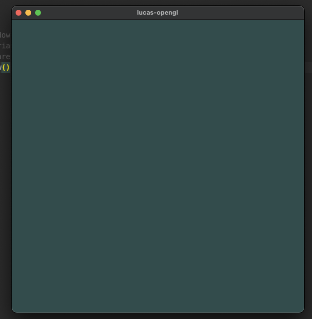
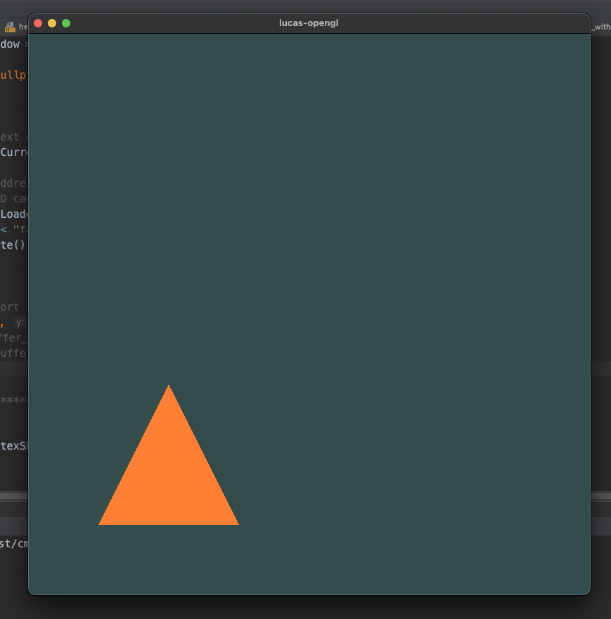
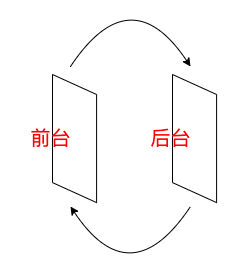
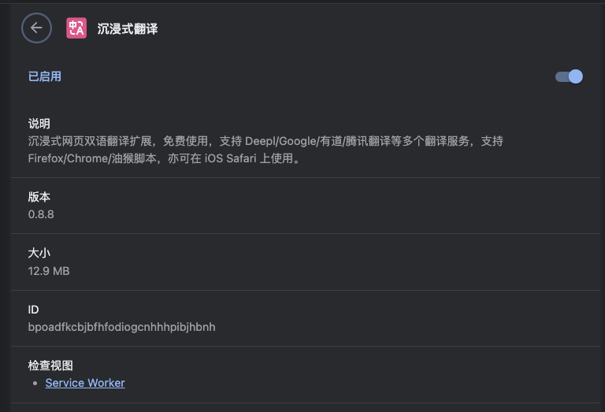

## 学习地址

我是从这里学习的 OpenGL [LearnOpenGL-CN](https://learnopengl-cn.github.io/)

## 了解背景

首先，了解背景很重要的，这能让我们更好地初步对OpenGL有一个概念

### 概念

OpenGL 并不是一个 API ，它仅仅是一个由 `Khronos` 组织制定并维护的规范（ Specification ）。  
[文档链接](https://registry.khronos.org/OpenGL/specs/gl/)

实际的 `OpenGL` 库的开发者通常是显卡的生产商。你购买的显卡所支持的 `OpenGL` 版本都为这个系列的显卡专门开发的。

当你使用 `Apple` 系统的时候， `OpenGL` 库是由 `Apple` 自身维护的。

在 Linux 下，有显卡生产商提供的 `OpenGL` 库，也有一些爱好者改编的版本。这也意味着任何时候 `OpenGL` 库表现的行为与规范规定的不一致时，基本都是库的开发者留下的 `bug` 。

### 渲染模式的变更

早期的 `OpenGL` `使用立即渲染模式` （ `Immediate mode` ，也就是 `固定渲染管线` ），这个模式下绘制图形很方便，容易学习和使用，但不够灵活。一旦要进行细节实现，效率低下的弊端就会暴露出来。

因此从 `OpenGL3.2` 开始，规范文档开始废弃立即渲染模式，并鼓励开发者在 `OpenGL` 的 `核心模式 (Core-profile)` 下进行开发，这个分支的规范完全移除了旧的特性。

正是因为完全废除了旧特性，所以我们就没法使用已经废弃的函数了，而不像某些语言，废弃只是不建议使用，而废弃函数本身还可以勉强使用

> ps：相对于 `立即渲染模式` ， `核心渲染模式` 更加灵活高效，但你需要深入理解 `OpenGL` 的渲染流程，因此学习起来更加复杂。

### 对扩展(Extension)的支持

当一个显卡公司提出一个新特性或者渲染上的大优化，通常会以 `扩展` 的方式在驱动中实现。

开发者可以使用支持此 `扩展` 的显卡来编写更新的代码，只需判断是否支持即可

就像这样

```C++
if(GL_ARB_extension_name){
    // 使用硬件支持的全新的现代特性
}else{
    // 不支持此扩展: 用旧的方式去做
}
```

### OpenGL 是个状态机

`OpenGL` 的状态通常被称为 `OpenGL_Context` 。我们通常使用如下途径去更改 `OpenGL` 状态：设置选项，操作缓冲。最后，我们使用当前 `OpenGL_Context` 来渲染。

假设当我们想告诉 `OpenGL` 去画线段而不是三角形的时候，我们通过改变一些 `Context` 变量来改变 `OpenGL` 状态，从而告诉 `OpenGL` 如何去绘图。

一旦我们改变了 OpenGL 的状态为绘制线段，`下一个绘制命令` 就会画出线段而不是三角形。

> 所以很多人在学习 `OpenGL` 的时候总是感觉不明白 `gl` 函数的意义，其实本质就是在操作 `OpenGL` 这个状态机

### OpenGL 里的对象

`OpenGL` 库是用 `C` 语言写的，同时也支持多种语言的派生，但其内核仍是一个 `C` 库。

所以 `OpenGL` 里的对象就是 `C` 语言里的结构体。

他表示的就是 `OpenGL` 里的状态小集合

```C++
struct object_name {
    float  option1;
    int    option2;
    char[] name;
};
```

而 `OpenGL` 本身就是一个状态的集合

```C++
// OpenGL的状态
struct OpenGL_Context {
    ...
    object* object_Window_Target;
    ...     
};
```

我们操作 `OpenGL` 的时候，就会类似下面这样的操作

```C++
unsigned int objectId = 0;
glGenObject(1, &objectId);  // 创建对象
glBindObject(GL_WINDOW_TARGET, objectId);   // 绑定对象至上下文
glSetObjectOption(GL_WINDOW_TARGET, GL_OPTION_WINDOW_WIDTH, 800);   // 设置当前绑定到 GL_WINDOW_TARGET 的对象的一些选项
glSetObjectOption(GL_WINDOW_TARGET, GL_OPTION_WINDOW_HEIGHT, 600);
glBindObject(GL_WINDOW_TARGET, 0);  // 将上下文对象设回默认
```

这一小段代码展现了你以后使用 `OpenGL` 时常见的工作流。

我们首先创建一个对象，然后用一个 `id` 保存它的引用（实际数据被储存在后台）。

然后我们将对象绑定至上下文的目标位置（例子中窗口对象目标的位置被定义成 `GL_WINDOW_TARGET` ）。

接下来我们设置窗口的选项。

最后我们将目标位置的对象 `id` 设回 `0` ，解绑这个对象。

设置的选项将被保存在 `objectId` 所引用的对象中，一旦我们重新绑定这个对象到 `GL_WINDOW_TARGET` 位置，这些选项就会重新生效。

## 代码讲解

这里我以在 Mac 端为例，贴上全部代码，其实就是 [OpenGL on Mac 环境](https://darkflamemasterdev.github.io/2023/08/08/OpenGL-on-Mac-%E7%8E%AF%E5%A2%83/) 的那些代码

### 源码

```C++
#include <glad/glad.h>
#include <GLFW/glfw3.h>
#include <iostream>

void framebuffer_size_callback(GLFWwindow*  window, int width, int height);
void processInput(GLFWwindow* window);


int main() {
    glfwInit(); // init glfw

    // use version 3.3
    glfwWindowHint(GLFW_CONTEXT_VERSION_MAJOR,  3); // set major version
    glfwWindowHint(GLFW_CONTEXT_VERSION_MINOR,  3); // set minor version

    glfwWindowHint(GLFW_OPENGL_PROFILE,
        GLFW_OPENGL_CORE_PROFILE); // use core profile

    // MacOS specific code
    glfwWindowHint(GLFW_OPENGL_FORWARD_COMPAT, GL_TRUE);

    GLFWwindow* window = glfwCreateWindow(800,  600, "LearnOpenGL", NULL, NULL);   //    800*600 size window called LearnOpenGL
    if (window == NULL) {
        std::cout << "Failed to create GLFW window" << std::endl;
        glfwTerminate();    // 释放/删除之前的分配的所有资源
        return -1;
    }
    glfwMakeContextCurrent(window);   // set the current window
    if (!gladLoadGLLoader((GLADloadproc) glfwGetProcAddress)) {
        std::cout << "Failed to initialize GLAD"    << std::endl;
        return -1;
    }
    glViewport(0, 0, 800, 600);    // 设置窗口位置
    glfwSetFramebufferSizeCallback(window,  framebuffer_size_callback);    // 设置窗口大小调整回调

    // 循环检查窗口是否需要被关闭
    while (!glfwWindowShouldClose(window)){
    
        processInput(window);    // 监控ESC退出窗口
        glClearColor(0.2f, 0.3f, 0.3f, 1.0f);     // 调用glClearColor来设置清空屏幕所用的颜色
        glClear(GL_COLOR_BUFFER_BIT);    // 调用glClear函数来清空屏幕的颜色缓冲
        glfwSwapBuffers(window);    // 函数会交换颜色缓冲（它是一个储存着GLFW窗口每一个像素 颜色值的大缓冲），它在这一迭代中被用来绘 制，并且将会作为输出显示在屏幕上。
        glfwPollEvents();    // 检查有没有触发什么事件（比如键盘输入、鼠标移动等）、更新窗口状态，并调用对应的回调函数（可以通过回调方法手动设置）
    }

    // 释放/删除之前的分配的所有资源
    glfwTerminate();

    return 0;
}

void framebuffer_size_callback(GLFWwindow*  window, int width, int height){
    glViewport(0, 0, width, height);
}

// 监控ESC退出窗口
void processInput(GLFWwindow* window){
    if (glfwGetKey(window, GLFW_KEY_ESCAPE) ==  GLFW_PRESS)
        glfwSetWindowShouldClose(window, true);
}
```

> ps: 再次强调，引用的时候 `glad` 在前 `glfw` 在后，不能反过来

### 初始化工作

```C++
glfwInit(); // init glfw
// use version 3.3
glfwWindowHint(GLFW_CONTEXT_VERSION_MAJOR,  3); // set major version
glfwWindowHint(GLFW_CONTEXT_VERSION_MINOR,  3); // set minor version
glfwWindowHint(GLFW_OPENGL_PROFILE,
    GLFW_OPENGL_CORE_PROFILE); // use core  profile
// MacOS specific code
glfwWindowHint(GLFW_OPENGL_FORWARD_COMPAT, GL_TRUE);
```

这一部分基本算是死代码，所以暂时不需要过多关心

### 设置 window

```C++
GLFWwindow* window = glfwCreateWindow(800,  600,"LearnOpenGL", NULL, NULL);   //    800*600 size window called LearnOpenGL
if (window == NULL) {
    std::cout << "Failed to create GLFW window" <<std::endl;
    glfwTerminate();    // 释放/删除之前的分配的所有资源
    return -1;
}
glfwMakeContextCurrent(window);   // set the current window
if (!gladLoadGLLoader((GLADloadproc)glfwGetProcAddress)) {
    std::cout << "Failed to initialize GLAD"    << std::endl;
    return -1;
}
glViewport(0, 0, 800, 600);    // 设置窗口位置
glfwSetFramebufferSizeCallback(window,  framebuffer_size_callback);    // 设置窗口大小调整回调
```

这里是 `window` 设置，也就是窗口大小（没错就是我们平时看到的 Mac 窗口）



`viewport` 指的是渲染的区域大小

doc here

```C++
/**
 * Parameters
 * x, y
 * Specify the lower left corner of the viewport rectangle, in pixels. The initial value is (0,0).
 * 
 * width, height
 * Specify the width and height of the viewport. When a GL context is first attached to a window, width and height are set to the dimensions of that window.
*/
void glViewport(GLint x, GLint y, GLsizei width, GLsizei height);
```

如果指定的 `viewport` 比 `windows` 小，就会出现这样的现象

# 

左下角有一个远远小于窗口大小的图形

```C++
glfwSetFramebufferSizeCallback(window, framebuffer_size_callback);
```

这是设置 `framebuffer` 回调，`framebuffer_size_callback` 的定义在下面

```C++
void framebuffer_size_callback(GLFWwindow* window, int width, int height){
    glViewport(0, 0, width, height);
}
```

### 渲染循环

```C++
while (!glfwWindowShouldClose(window)){

    processInput(window);    // 监控ESC退出窗口
    glClearColor(0.2f, 0.3f, 0.3f, 1.0f);     // 调glClearColor来设置清空屏幕所用的颜色
    glClear(GL_COLOR_BUFFER_BIT);    // 调用glClear函数来清空屏的颜色缓冲
    glfwSwapBuffers(window);    // 函数会交换颜色缓冲（它是一个储着GLFW窗口每一个像素 颜色值的大缓冲），它在这一迭代中被用绘 制，并且将会作为输出显示在屏幕上。
    glfwPollEvents();    // 检查有没有触发什么事件（比如键盘输入、鼠移动等）、更新窗口状态，并调用对应的回调函数（可以通过回调法手动设置）
}
```

我们可不希望只绘制一个图像之后我们的应用程序就立即退出并关闭窗口。

我们希望程序在我们主动关闭它之前不断绘制图像并能够接受用户输入。

因此，我们需要在程序中添加一个 `while` 循环，我们可以把它称之为渲染循环(Render Loop)，它能在我们让`GLFW`退出前一直保持运行。

`processInput` 是检测按键是否是`ESC`，定义在这里，`glfwSetWindowShouldClose(window, true);` 通过把`WindowShouldClose`属性设置为 `true`的方法关闭`GLFW`

```C++
void processInput(GLFWwindow* window){
    if (glfwGetKey(window, GLFW_KEY_ESCAPE) ==  GLFW_PRESS)
        glfwSetWindowShouldClose(window, true);
}
```

`glClearColor(0.2f, 0.3f, 0.3f, 1.0f);`这是设置 `glClearColor`的值，也就是清除颜色缓冲的颜色值，在下一行 `glClear`调用的时候用的就是我们设置的这个颜色

```C++
glClearColor(0.2f, 0.3f, 0.3f, 1.0f);     // 调glClearColor来设置清空屏幕所用的颜色
glClear(GL_COLOR_BUFFER_BIT);    // 调用glClear函数来清空屏幕的颜色缓冲
```

`glfwSwapBuffers(window);` 是渲染下一帧的指令 

为了渲染的连贯性，`opengl` 有两个缓冲，当上一帧在前台显示的时候，会在后台继续渲染，然后将后台渲染好的缓冲直接加载到前台变成了前台缓冲，而前台的 `buffer`变成了后台缓冲，继续渲染后续的帧，就这么不断地交换缓冲，这就叫`双缓冲`

> **双缓冲(Double Buffer)**
>
> 应用程序使用单缓冲绘图时可能会存在图像闪烁的问题。 这是因为生成的图像不是一下子被绘制出来的，而是按照从左到右，由上而下逐像素地绘制而成的。最终图像不是在瞬间显示给用户，而是通过一步一步生成的，这会导致渲染的结果很不真实。为了规避这些问题，我们应用双缓冲渲染窗口应用程序。**前**缓冲保存着最终输出的图像，它会在屏幕上显示；而所有的的渲染指令都会在**后**缓冲上绘制。当所有的渲染指令执行完毕后，我们**交换**(Swap)前缓冲和后缓冲，这样图像就立即呈显出来，之前提到的不真实感就消除了。



`glfwPollEvent` : `poll` 是轮训的意思，意思就是在检查事件，并返回给 OpenGL

```C++
glfwPollEvents();    // 检查有没有触发什么事件（比如键盘输入、鼠标移动等）、更新窗口状态，并调用对应的回调函数（可以通过回调方法手动设置）
```


放个文档在这

```C++
/*This function processes only those events that are already in the event queue and then returns immediately. Processing events will cause the window and input callbacks associated with those events to be called.
 *此函数仅处理事件队列中已有的那些事件，然后立即返回。处理事件将导致调用与这些事件关联的窗口和输入回调。
 *
 *On some platforms, a window move, resize or menu operation will cause event processing to block. This is due to how event processing is designed on those platforms. You can use the window refresh callback to redraw the contents of your window when necessary during such operations.
 *在某些平台上，窗口移动、调整大小或菜单操作将导致事件处理阻塞。这是由于事件处理在这些平台上的设计方式。在此类操作期间，如有必要，可以使用窗口刷新回调重绘窗口的内容。
 *
 *Do not assume that callbacks you set will only be called in response to event processing functions like this one. While it is necessary to poll for events, window systems that require GLFW to register callbacks of its own can pass events to GLFW in response to many window system function calls. GLFW will pass those events on to the application callbacks before returning.
 *不要假设您设置的回调只会在响应像这样的事件处理函数时才被调用。虽然有必要轮询事件，但需要 GLFW 注册自己的回调的窗口系统可以将事件传递给 GLFW 以响应许多窗口系统函数调用。GLFW 会在返回之前将这些事件传递给应用程序回调。
 *
 *Event processing is not required for joystick input to work.
 *游戏杆输入不需要事件处理即可工作。
 */
void glfwPollEvents(void)
```

[glfw文档在这里看](https://www.glfw.org/docs/3.3/)

另外有一个翻译插件非常好用，之前也有 `safari 版本`现在好像只有 `Chrome 版本`了




```C++
glfwTerminate();
```

这个是设置所有资源，我们放在 `return 0;`的前一行

