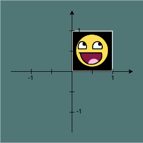
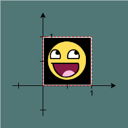
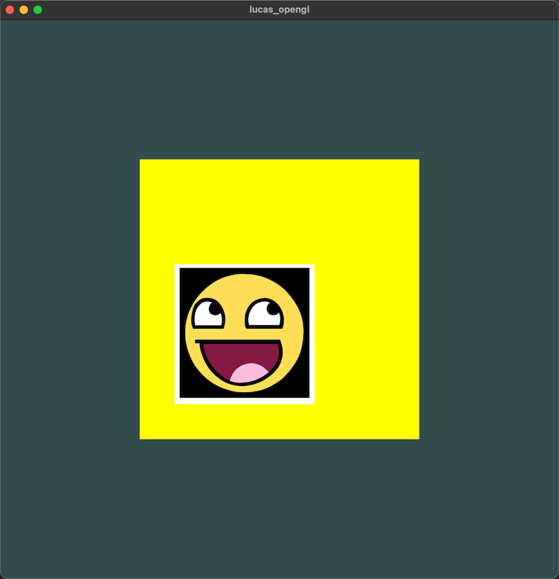
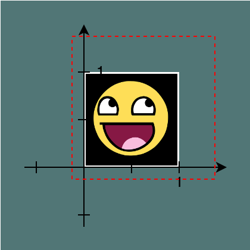
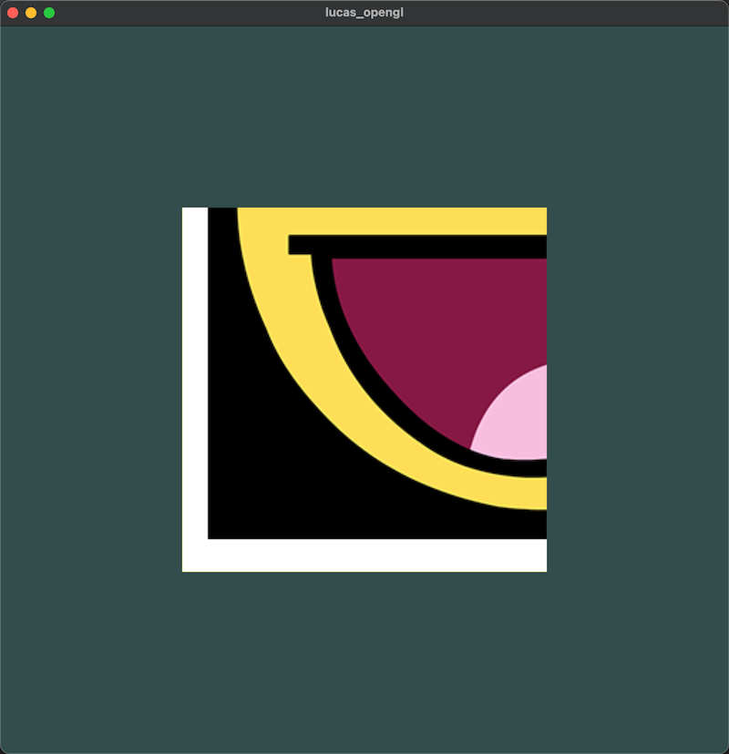
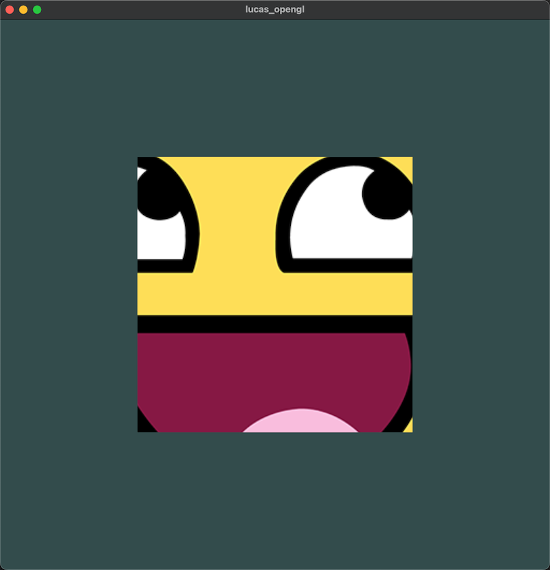
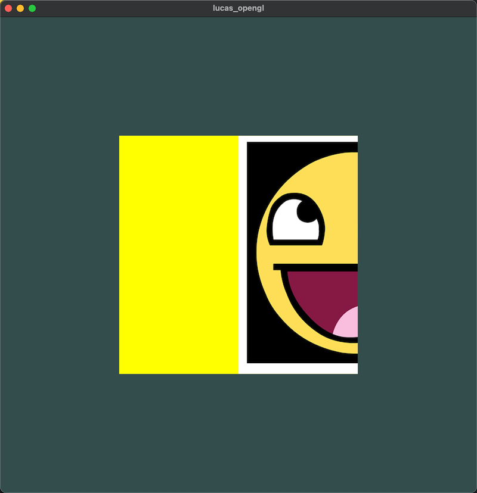
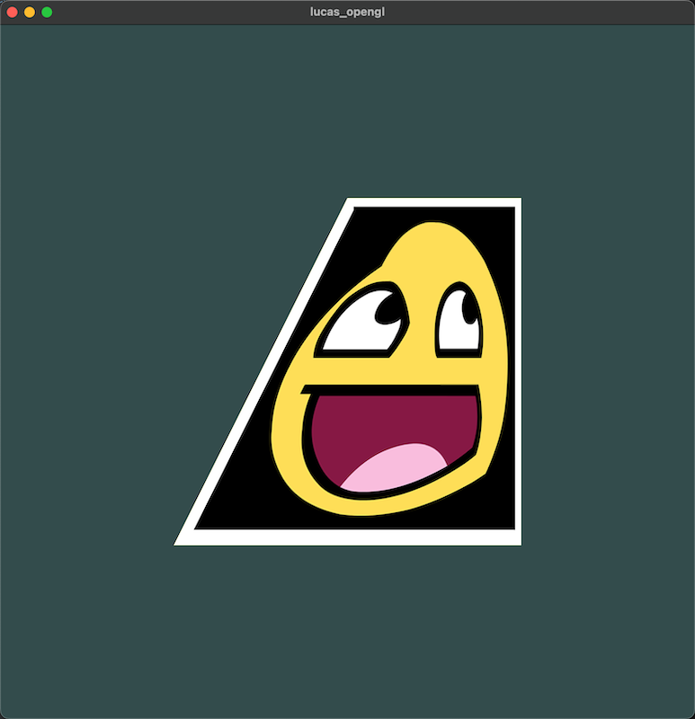
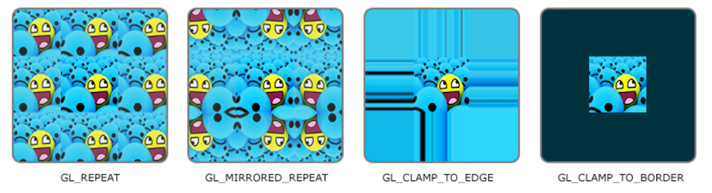

## 纹理坐标（2D）

纹理坐标在 x 和 y 轴上，范围为 0 到 1 之间

> blue 使用纹理坐标获取纹理颜色叫做采样(Sampling)
>
> 这个采样是什么意思呢？我们看一个图
>
> 
>
> 这是一个纹理的坐标图
>
> ```C++
> float texCoords[] = {
>     0.0f, 0.0f, // 左下角
>     1.0f, 0.0f, // 右下角
>     0.0f, 1.0f, // 左上角
>     1.0f, 1.0f  // 右上角
> };
> ```
>
> 这是一个纹理的坐标
>
> 这些点的坐标和上面那个图是什么关系？看下面这个图
>
> 
>
> 也就是说：这个坐标其实就是红色虚线框的坐标，红色虚线框是用来裁切图片的
>
> 将图片以某种算法填充到这个红色虚线框里，这就叫纹理映射。

### 坐标的常见操作

- 缩小（裁切）

  将纹理坐标写为

  ```C++
  float texCoords[] = {
      -0.25f, -0.25f, // 左下角
      1.75f, -0.25f, // 右下角
      -0.25f, 1.75f, // 左上角
      1.75f, 1.75f  // 右上角
  };
  ```

  纹理将这样显示

  

  也就是这样

  

- 放大

  将纹理坐标写为

  ```C++
  float texCoords[] = {
      0.0f, 0.0f, // 左下角
      0.5f, 0.0f, // 右下角
      0.0f, 0.5f, // 左上角
      0.5f, 0.5f  // 右上角
  };
  ```

  纹理将这样显示

  

  也就是这样

  

  那么我想显示中间一块小区域该怎么写坐标呢？

  ```C++
  float texCoords[] = {
      0.25f, 0.25f, // 左下角
      0.75f, 0.25f, // 右下角
      0.25f, 0.75f, // 左上角
      0.75f, 0.75f  // 右上角
  };
  ```

  

  

- 错位

  纹理坐标并不一定是裁切或者放大，还可以将纹理平移

  这很容易理解，比如我想不放大缩小，只是向右平移纹理，那么坐标应该这样写

  ```C++
  float texCoords[] = {
      -0.5f, 0.0f, // 左下角
      0.5f, 0.0f, // 右下角
      -0.5f, 1.0f, // 左上角
      0.5f, 1.0f  // 右上角
  };
  ```

  

  你甚至可以将纹理映射成梯形，平行四边形，只要你写对了这四个点的坐标

  

  但是如果我们将它映射成梯形，就不同了
  
  

  但是这里涉及一个纹理过滤（也就是一开始提到的插值的问题）的问题，我接下来会讲

### 环绕方式

环绕方式只有你在漏出不存在区域（图片外的区域）的时候，才会起效果

OpenGL默认的行为是重复这个纹理图像（我们基本上忽略浮点纹理坐标的整数部分），但OpenGL提供了更多的选择（也就是环绕方式，玩过 WinXP 的桌面的肯定很熟悉）：



图片就很直观，唯一要说的是 `GL_CLAMP_TO_BORDER` ，这个需要你制定一个颜色，图片外的区域都会渲染成这个颜色，上面我就选了黄色

### 纹理过滤

当你
你可能已经猜到了，OpenGL也有对于纹理过滤(Texture Filtering)的选项。
纹理过滤有很多个选项，但是现在我们只讨论最重要的两种：GL_NEAREST和GL_LINEAR。

- GL_NEAREST（也叫邻近过滤，Nearest Neighbor Filtering）是OpenGL默认的纹理过滤方式。当设置为GL_NEAREST的时候，OpenGL会选择中心点最接近纹理坐标的那个像素。下图中你可以看到四个像素，加号代表纹理坐标。左上角那个纹理像素的中心距离纹理坐标最近，所以它会被选择为样本颜色：

- GL_LINEAR（也叫线性过滤，(Bi)linear Filtering）它会基于纹理坐标附近的纹理像素，计算出一个插值，近似出这些纹理像素之间的颜色。一个纹理像素的中心距离纹理坐标越近，那么这个纹理像素的颜色对最终的样本颜色的贡献越大。下图中你可以看到返回的颜色是邻近像素的混合色：


那么这两种纹理过滤方式有怎样的视觉效果呢？让我们看看在一个很大的物体上应用一张低分辨率的纹理会发生什么吧（纹理被放大了，每个纹理像素都能看到）：


GL_NEAREST产生了颗粒状的图案，我们能够清晰看到组成纹理的像素，而GL_LINEAR能够产生更平滑的图案，很难看出单个的纹理像素。GL_LINEAR可以产生更真实的输出，但有些开发者更喜欢8-bit风格，所以他们会用GL_NEAREST选项。

当进行放大(Magnify)和缩小(Minify)操作的时候可以设置纹理过滤的选项，比如你可以在纹理被缩小的时候使用邻近过滤，被放大时使用线性过滤。我们需要使用glTexParameter*函数为放大和缩小指定过滤方式。这段代码看起来会和纹理环绕方式的设置很相似：

glTexParameteri(GL_TEXTURE_2D, GL_TEXTURE_MIN_FILTER, GL_NEAREST);
glTexParameteri(GL_TEXTURE_2D, GL_TEXTURE_MAG_FILTER, GL_LINEAR);

#### 多级渐远纹理（mipmap）

mipmap 主要解决 2 个事情

- 线性插值的计算问题，这个后面会说到
- 内存或者性能的占用问题

让我们看一下多级渐远纹理是什么样子的：


手动为每个纹理图像创建一系列多级渐远纹理很麻烦，幸好 OpenGL 有一个 glGenerateMipmaps 函数，在创建完一个纹理后调用它 OpenGL 就会承担接下来的所有工作了。

在渲染中切换多级渐远纹理级别(Level)时，OpenGL在两个不同级别的多级渐远纹理层之间会产生不真实的生硬边界。

就像普通的纹理过滤一样，切换多级渐远纹理级别时你也可以在两个不同多级渐远纹理级别之间使用 NEAREST 和 LINEAR 过滤。

为了指定不同多级渐远纹理级别之间的过滤方式，你可以使用下面四个选项中的一个代替原有的过滤方式：

GL_NEAREST_MIPMAP_NEAREST 以这个为例，前半部分 GL_NEAREST 是纹理过滤的插值算法，后半部分 MIPMAP_NEAREST 多级纹理切换的方式

 描述
| 过滤方式 | 描述 |
| --- | --- |
| GL_NEAREST_MIPMAP_NEAREST | 使用邻近插值进行插值，使用最邻近的多级渐远纹理 |
| GL_LINEAR_MIPMAP_NEAREST | 使用线性插值进行采样，使用最邻近的多级渐远纹理 |
| GL_NEAREST_MIPMAP_LINEAR | 使用邻近插值进行采样，在两个邻近的多级渐远纹理之间使用线性插值 |
| GL_LINEAR_MIPMAP_LINEAR | 使用线性插值进行采样，在两个邻近的多级渐远纹理之间使用线性插值 |

就像纹理过滤一样，我们可以使用 glTexParameteri 将过滤方式设置为前面四种提到的方法之一：

glTexParameteri(GL_TEXTURE_2D, GL_TEXTURE_MIN_FILTER, GL_LINEAR_MIPMAP_LINEAR);
glTexParameteri(GL_TEXTURE_2D, GL_TEXTURE_MAG_FILTER, GL_LINEAR);

> ps: 一个常见的错误是，将放大过滤的选项设置为多级渐远纹理过滤选项之一。
>
> 这样没有任何效果，因为多级渐远纹理主要是使用在纹理被缩小的情况下的：纹理放大不会使用多级渐远纹理，为放大过滤设置多级渐远纹理的选项会产生一个 GL_INVALID_ENUM 错误代码。

多级渐远纹理背后的理念很简单：在小的范围上，映射一个分辨率非常高的纹理，会导致线性插值的时候，计算颜色变得复杂

反应到十几种就是距观察者的距离过远，OpenGL会使用不同的多级渐远纹理，即最适合物体的距离的那个。

由于距离远，解析度不高也不会被用户注意到。

同时，多级渐远纹理另一加分之处是它的性能非常好。
