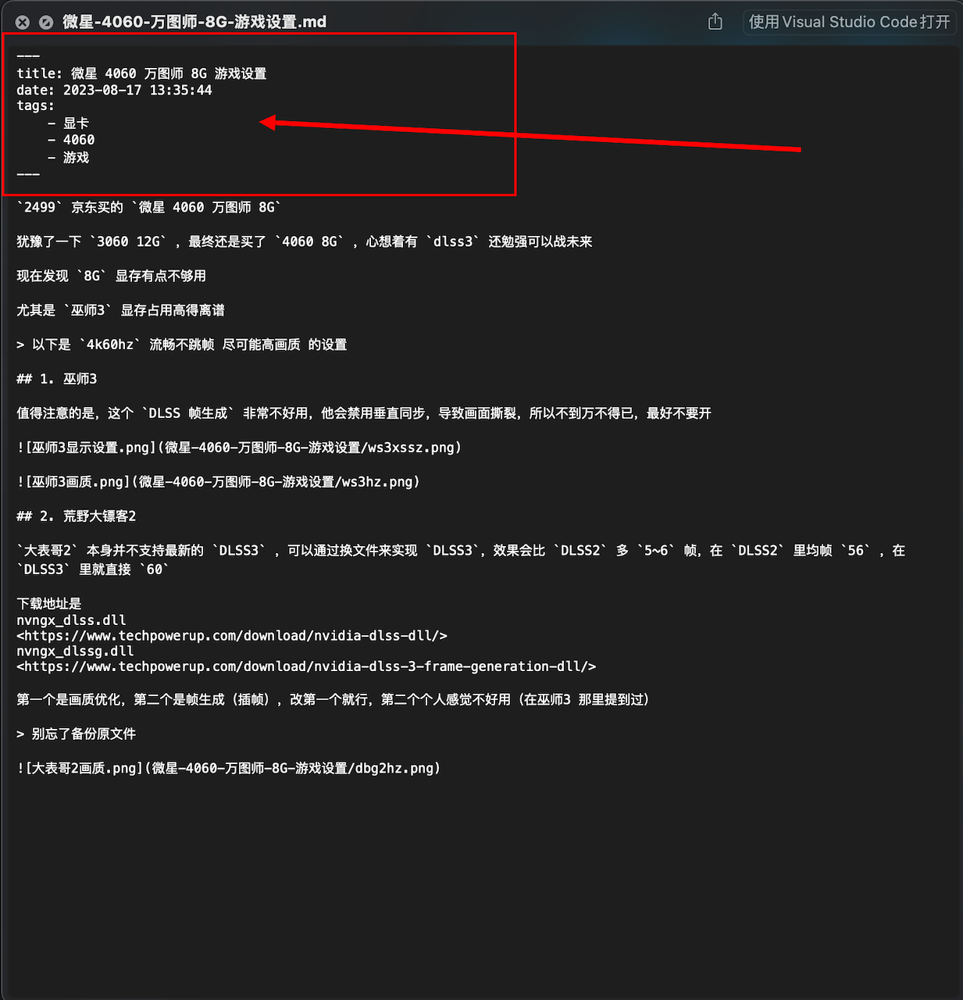
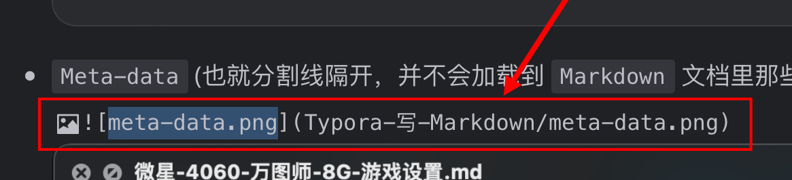
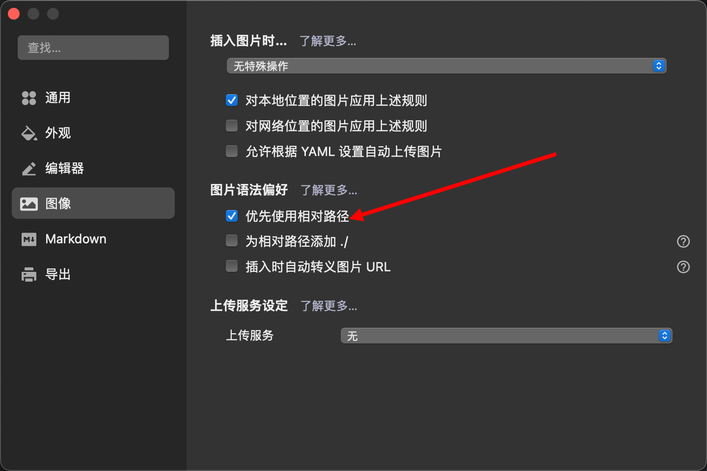

最近不用 `VSCode` 了，改用 `Typora` 感觉还不错

主要是 `VSCode`  没行号，就有点痛苦，快捷键也麻烦一点

#### 1. 改字体

- 全局字体

  ```css
  body{
  	font-family: Menlo, Monaco, "Courier New", monospace;
  }
  ```

- 行内代码块

  ```css
  code{
        font-family: Menlo, Monaco, "Courier New", monospace;
  }
  ```

- 代码块（代码段）

  ```css
  pre > * {
      font-family: ""
  }
  ```
  
- `Meta-data` (也就分割线隔开，并不会加载到 `Markdown` 文档里那些)

  
  
- 图片链接字体

  ```css
  .md-image>.md-meta {
    font-family: Menlo, Monaco, "Courier New", monospace;
  }
  ```
  
  

#### 2. 图片引入


