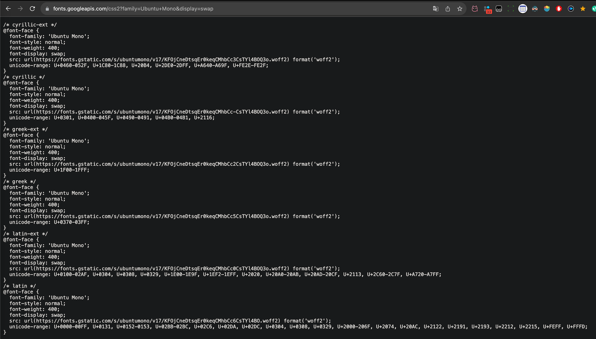
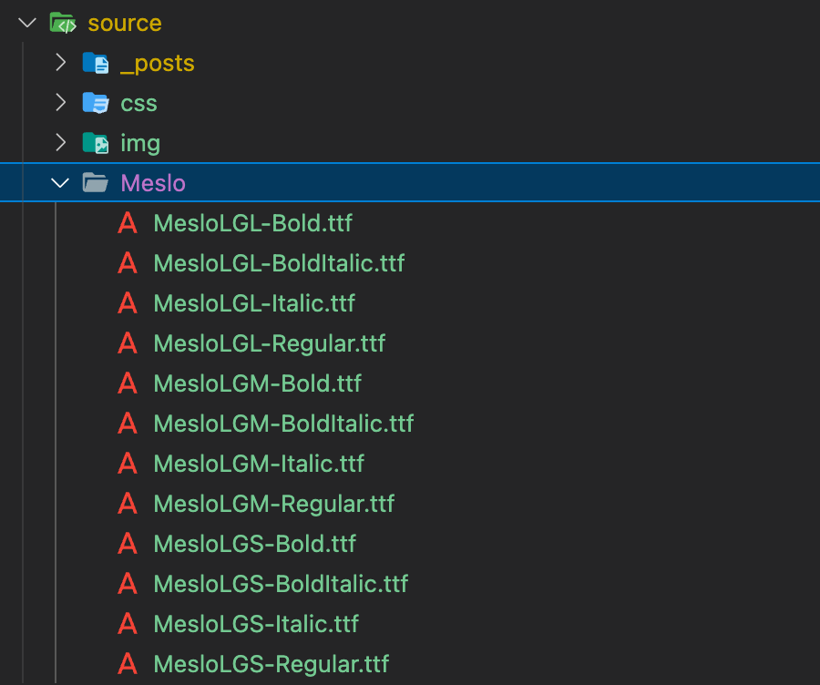
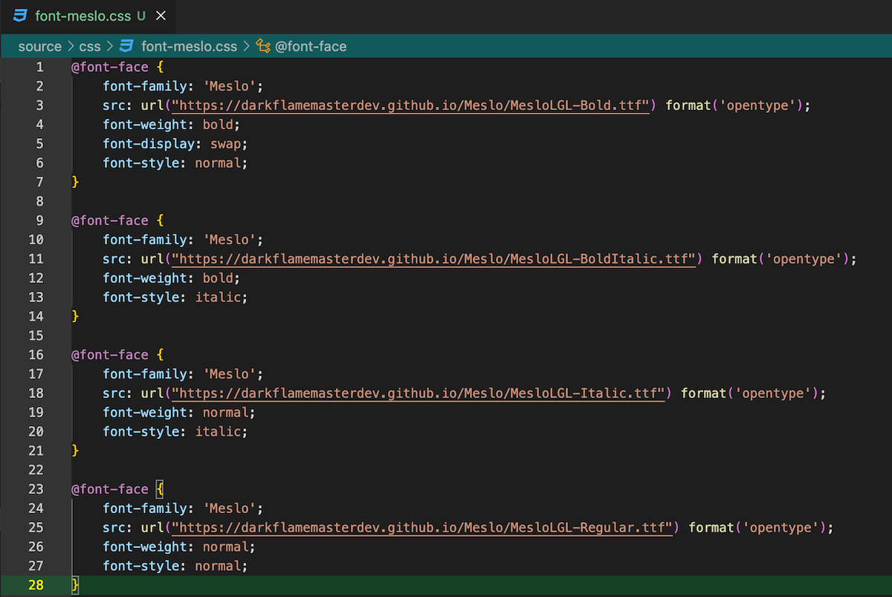


很多博客自定义字体的时候，都是用的 google fonts 的链接
但是很多字体 google fonts 里面没有，那我们该怎么办呢？


### google fonts 的原理

我们点开一个链接 [Ubuntu mono https://fonts.googleapis.com/css2?family=Ubuntu+Mono&display=swap]("https://fonts.googleapis.com/css2?family=Ubuntu+Mono&display=swap")



可以看到里面就是 css @font-face

### 自己模仿写一个

所以我们只要自己写一个链接，让他打开也是这样的，就可以了

#### 放置字体

首先我们将需要的字体放进自己的 source 文件目录下



此时我们只需要一个链接指向该字体就行了

#### 编写 css 文件

然后把我们自己的字体放进我这里是自己新建了一个 css 文件夹，可以看到下图的路径栏 source/css/font-meslo.css



编写 css 的时候，最重要的就是这个 url

我们只要正确编写链接即可，如果你使用的是 github.io 大概率可以从你的仓库查找到这个文件的相对地址，只要前面加上你博客的域名即可

确认链接正确，我们可以将链接复制到浏览器，看是否会下载

### 修改博客配置

```yml
family: 'Meslo'
url: https://darkflamemasterdev.github.io/css/font-meslo.css
```

同样，我们需要将链接指向对应的文件，这里我们可以通过将连接复制到浏览器进行验证，链接依旧是博客的域名+这个文件的相对地址

### 提交修改

```shell
hexo clean
hexo d
```

执行提交后，等待博客构建完，应该就可以看到字体更改成功了
