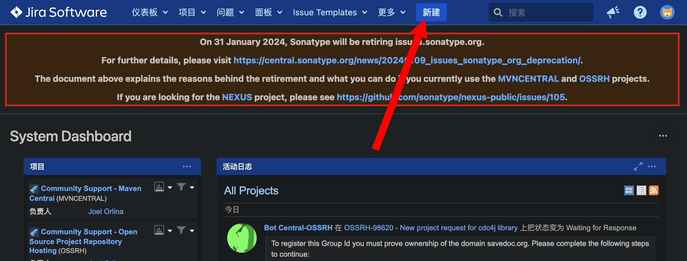
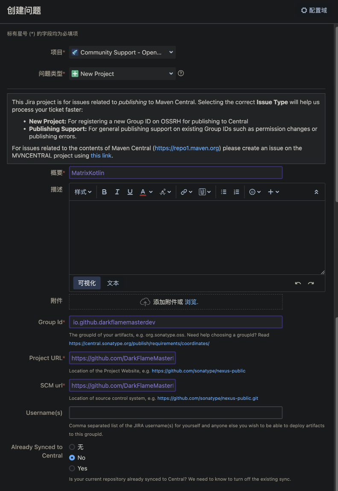
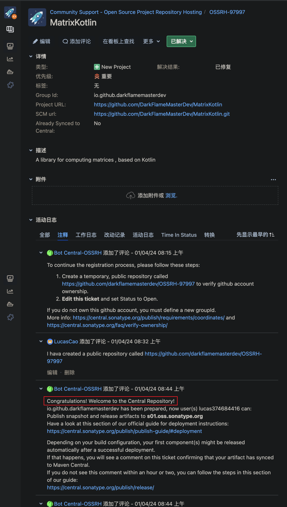
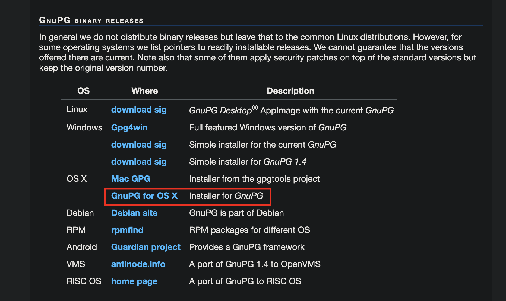
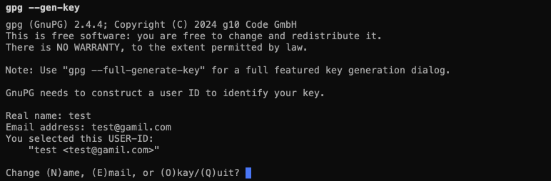
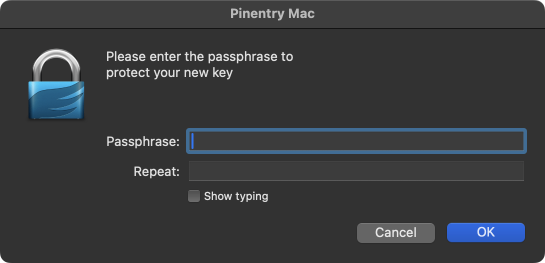
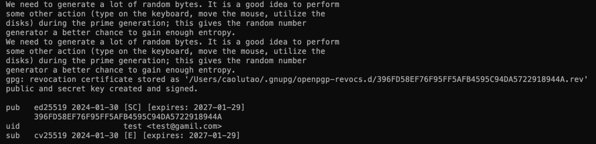
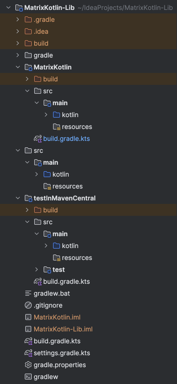

参考链接：<https://juejin.cn/post/7023219116534136840>

## 注册账号

Maven Central 是由 Sonatype 公司负责维护的，所以我们要使用Maven Central 的话，首先需要注册 Sonatype 账号。

链接：[https://issues.sonatype.org/secure/Dashboard.jspa](https://issues.sonatype.org/secure/Dashboard.jspa)

账号密码会在提交 SDK 的时候用到

## 新建提交 SDK 的工单

新建一个工单





Group Id 填你的域名

Project URL 填你仓库的地址

SCM url 填你仓库的 git 链接

最后点击 新建 就会生成一个工单



## 审核通过

接下来就是等待审核，这个时长可能很短，也可能有点长，一般不到 24 小时

审核通过后，会让你建一个 public 临时仓库，来证明这就是你自己的仓库

新建完了之后回复一下就行，可以参考我的回复

然后再等待，等他说 Congratulations! 就说明你拥有了上传的权限

## 登录仓库

登录链接：<https://s01.oss.sonatype.org/>

使用一开始注册的 Sonatype 的账号密码

现在你的仓库已经准备完毕了

## 创建 GPG 签名

GPG签名主要是给上传的library使用，每个上传的library都需要进行签名后才可以

不同的library可以使用相同的签名文件，所以GPG密钥一般只需要申请一次即可

gpg 工具：<https://www.gnupg.org/download/index.html>

这个工具 Windows 和 MacOS 通用，并且推荐使用命令行

我这里以 MacOS 为例：



使用这行命令开始创建你的 gpg 签名

```shell
gpg --gen-key
```

然后会让你输入 real name （其实只要输入一个你记得的名字就行，不一定要是真实姓名）和 email address



确认无误输入 O



创建一个密码并记住他，点击 OK



这样就生成成功了！（那串数字就是公钥，最后 8 位这就是你这个签名的 ID）

## 上传 gpg

使用这行命令（记得将最后的 8 位改成你的签名 ID，也就是你刚刚得到的那串数字的后8位）

```shell
gpg --keyserver hkp://keyserver.ubuntu.com --send-keys 2918944A
```

上传完之后，记得使用 `search-key` 验证一下

```shell
gpg --keyserver hkp://keyserver.ubuntu.com --search-keys 2918944A
```

## 导出私钥 gpg

这里需要填写路径并命名 gpg 文件，同样使用你自己的 8 位 ID

```shell
gpg -o ~/Desktop/test.gpg --export-secret-keys 2918944A
```

这个 test.gpg 就是你的私钥，切记不要上传这个东西

## 开始准备上传

我这里使用的是大佬写的上传插件：<https://github.com/vanniktech/gradle-maven-publish-plugin>

这里是官方文档：<https://vanniktech.github.io/gradle-maven-publish-plugin/>

可以参考我的 `build.gradle.kts`

```kotlin
import com.vanniktech.maven.publish.SonatypeHost

plugins {
  kotlin("jvm")
  id("com.vanniktech.maven.publish") version "0.27.0"
}

group = "io.github.darkflamemasterdev"
version = "1.1.2"

// see the link:https://vanniktech.github.io/gradle-maven-publish-plugin/central/
mavenPublishing {
  publishToMavenCentral(SonatypeHost.S01)

  signAllPublications()

  // groupId: artifactId: version cannot be wrong!!!
  coordinates(group.toString(), "MatrixKotlin", version.toString())

  pom {
    name.set("MatrixKotlin")
    description.set("a kotlin library for matrix calculations")
    inceptionYear.set("2024")
    url.set("https://github.com/darkflamemasterdev/MatrixKotlin")
    licenses {
      license {
        name.set("GNU Lesser General Public License, Version 3.0")
        url.set("https://www.gnu.org/licenses/gpl-3.0.txt")
        distribution.set("https://www.gnu.org/licenses/gpl-3.0.txt")
      }
    }
    developers {
      developer {
        id.set("DarkFlameMasterDev")
        name.set("lucas")
        url.set("https://github.com/darkflamemasterdev")
      }
    }
    scm {
      url.set("https://github.com/darkflamemasterdev/MatrixKotlin")
      connection.set("scm:git:git://github.com/darkflamemasterdev/MatrixKotlin.git")
      developerConnection.set("scm:git:ssh://git@github.com/darkflamemasterdev/MatrixKotlin.git")
    }
  }
}

repositories {
  mavenCentral()
}

dependencies {
  implementation("com.vanniktech:gradle-maven-publish-plugin:0.27.0")
}

kotlin {
  jvmToolchain(11)
}
```

这个插件给了两种配置 MavenCentral 账号密码的方式，一种是配置在 `gradle.properties` 里

一种是写在本地环境变量里

我是直接写在了环境变量里，这个参考 <https://vanniktech.github.io/gradle-maven-publish-plugin/central/#in-memory-gpg-key>

使用这个命令生成 signingInMemoryKey

```shell
gpg2 --export-secret-keys --armor <key id> <path to secring.gpg> | grep -v '\-\-' | grep -v '^=.' | tr -d '\n'
```

参考我的环境变量配置 （.zshrc）

```shell
# mavenCentral
export ORG_GRADLE_PROJECT_mavenCentralUsername=你的 MavenCentral 账号
export ORG_GRADLE_PROJECT_mavenCentralPassword=你的 MavenCentral 密码

# signingInMemoryKey
export ORG_GRADLE_PROJECT_signingInMemoryKey=你自己的 key

# signingInMemoryKeyId
export ORG_GRADLE_PROJECT_signingInMemoryKeyId=你的 ID
# signingInMemoryKeyPassword
export ORG_GRADLE_PROJECT_signingInMemoryKeyPassword=你的 gpg 密码
```

## 结尾

另外，我介绍一下我的项目目录



这里涉及三个模块

- MatrixKotlin 用来编写库的代码并上传
- 总模块用来测试本地库运行情况
- testInMavenCentral 用来引入已上传的代码
