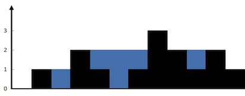
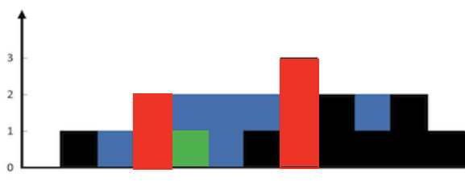

### 题目

给定 n 个非负整数表示每个宽度为 1 的柱子的高度图，计算按此排列的柱子，下雨之后能接多少雨水。

#### 示例 1

  

> 输入：height = \[0,1,0,2,1,0,1,3,2,1,2,1]\
> 输出：6\
> 解释：上面是由数组 \[0,1,0,2,1,0,1,3,2,1,2,1] 表示的高度图，在这种情况下，可以接 6 个单位的雨水（蓝色部分表示雨水）。

#### 示例 2

> 输入：height = \[4,2,0,3,2,5]
> 输出：9

#### 提示

> n == height.length\
> 1 <= n <= 2 \* 104\
> 0 <= height\[i] <= 105

### 分析

和 [上一题](https://darkflamemasterdev.github.io/2023/04/18/%E5%8A%9B%E6%89%A311%EF%BC%9A%E7%9B%9B%E6%9C%80%E5%A4%9A%E6%B0%B4%E7%9A%84%E5%AE%B9%E5%99%A8%EF%BC%88%E9%9D%A2%E8%AF%95%E5%BE%97%E5%88%B0%E6%B2%A1%E5%86%99%E5%87%BA%E6%9D%A5%EF%BC%89/) 相比，这一题要求考虑柱子整体的排列规律

而对于单个柱子能放下多少水，需要考虑左边最大柱子和右边最大柱子 中较小的那个，减去当前柱子的高度，也就是这样  
  
图可见，绿色柱子是由两个红柱子挡起来的，并且绿柱子位置是两个红柱子较小的那个高度决定的

由此我们就可以编写代码  
记录下每个柱子的左边最高柱子和右边最高柱子，再遍历数组进行减法即可

```kotlin
// i 位置的左边最高柱子，要么左临元素的左边最高柱子，要么是他自己
// i 位置的右边最高柱子，要么右临元素的左边最高柱子，要么是他自己
lMax[i] = maxOf(lMax[i - 1], height[i])
rMax[i] = maxOf(rMax[i + 1], height[i])
```

> 为什么要考虑他自己呢？  
> 因为最高的柱子如果不考虑自己，minOf(lMax,rMax) - height 就会是负值
> 所以我们编码如下

### 代码

#### 第一种

```kotlin
class Solution {
    fun trap(height: IntArray): Int {
        val lMax = IntArray(height.size)
        val rMax = IntArray(height.size)
        lMax[0] = height[0]
        rMax[height.lastIndex] = height[height.lastIndex]
        var left:Int
        var right:Int
        for (i in 1..height.lastIndex) {
            left = i
            right = height.lastIndex - i
            lMax[left] = maxOf(lMax[left - 1], height[left])
            rMax[right] = maxOf(rMax[right + 1], height[right])
        }
        var count = 0
        for (i in height.indices) {
            count += (minOf(rMax[i], lMax[i]) - height[i])
            println(count)
        }
    }
}
```

这个时间复杂度是 O(n) ，空间复杂度是 O(n)

#### 优化后

其实我们不需要确定两个最大值，只需确定一个最大值，并且另一个最大值一定比这个大，就可以了\
举个例子，我们知道一个柱子 lMax 是 2 ，而不知道 rMax，但是知道 rMax 肯定 >=2 ，所以 minOf(lMax,rMax) 的结果就已经可以确定了

这样我们就可以将记录 lMax rMax 的数组空间节省出来，并且立刻算出结果，不用最后再遍历一遍了

```kotlin
class Solution {
    fun trap(height: IntArray): Int {
        if (height.size <= 2) {
            return 0
        }
        var lM = 0
        var rM = 0
        var left = 0
        var right = height.lastIndex
        var count = 0
        while (left < right) {
            lM = maxOf(lM, height[left])
            rM = maxOf(rM, height[right])
            if (lM < rM) {
                count += lM - height[left]
                left++
            } else {
                count += rM - height[right]
                right--
            }
        }
        return count
    }
}
```

这个时间复杂度是 O(n) ，空间复杂度是 O(1)

### 总结

没有总结
