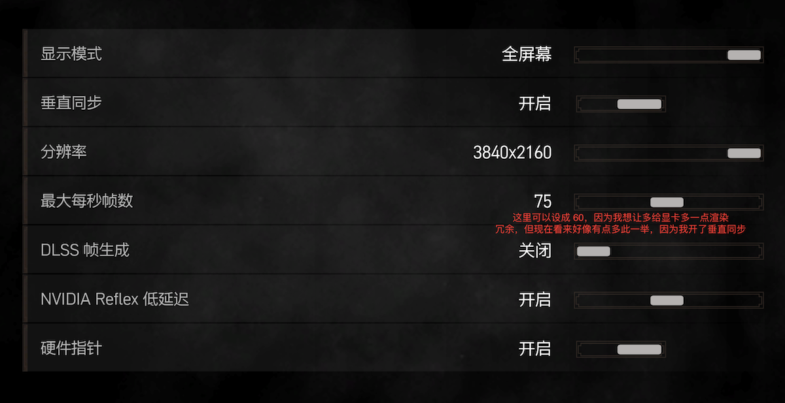
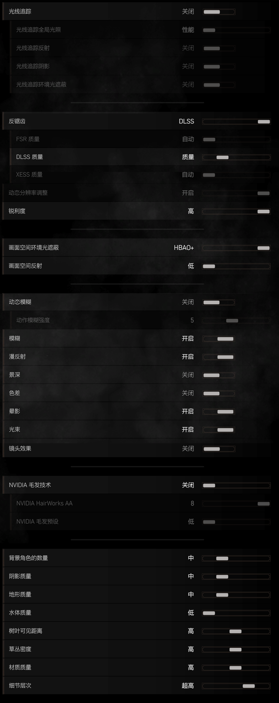
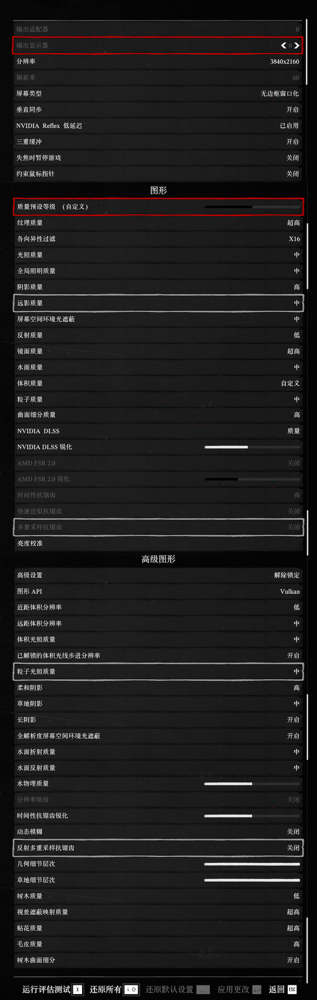

`2499` 京东买的 `微星 4060 万图师 8G`

犹豫了一下 `3060 12G` ，最终还是买了 `4060 8G` ，心想着有 `dlss3` 还勉强可以战未来

现在发现 `8G` 显存有点不够用

尤其是 `巫师3` 显存占用高得离谱

> 以下是 `4k60hz` 流畅不跳帧 尽可能高画质 的设置

## 1. 巫师3

值得注意的是，这个 `DLSS 帧生成` 非常不好用，他会禁用垂直同步，导致画面撕裂，所以不到万不得已，最好不要开

## 2. 荒野大镖客2

`大表哥2` 本身并不支持最新的 `DLSS3` ，可以通过换文件来实现 `DLSS3`，效果会比 `DLSS2` 多 `5~6` 帧，在 `DLSS2` 里均帧 `56` ，在 `DLSS3` 里就直接 `60`

下载地址是  
nvngx_dlss.dll
<https://www.techpowerup.com/download/nvidia-dlss-dll/>  
nvngx_dlssg.dll
<https://www.techpowerup.com/download/nvidia-dlss-3-frame-generation-dll/>

第一个是画质优化，第二个是帧生成（插帧），改第一个就行，第二个个人感觉不好用（在巫师3 那里提到过）

> 别忘了备份原文件

