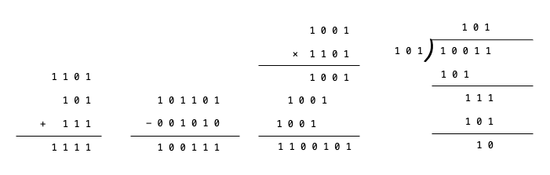
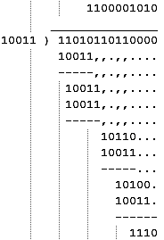
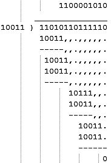
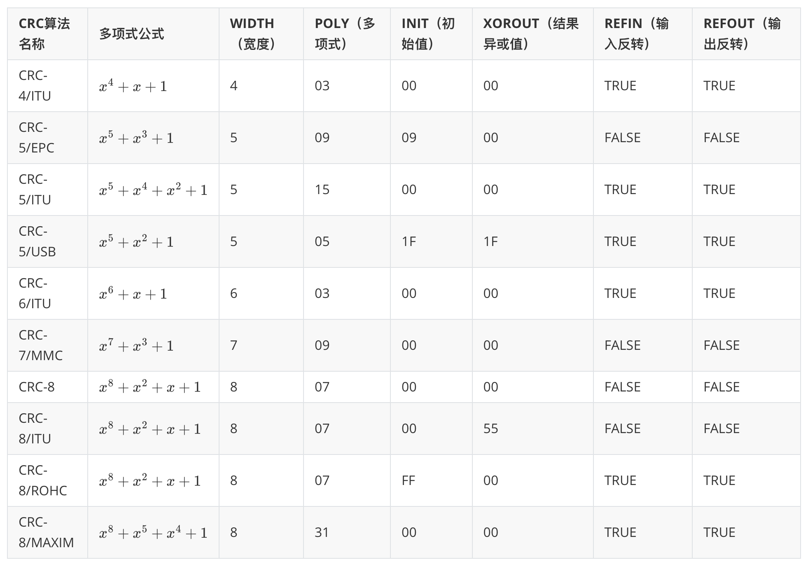
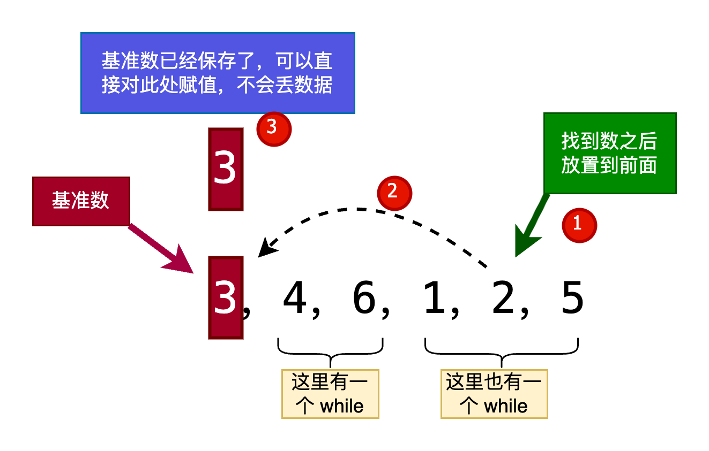

---

### 1. CRC 循环冗余校验（Cyclic Redundancy Check， CRC）

#### 1.1 原理解释

CRC 的原理是模二除法。

模二运算是一种二进制算法。与四则运算相同，模二运算也包括加、减、乘、除四种运算，运算符也是相同的。





* 当最后余数的位数小于除数位数时，除法停止。
* 当被除数的位数小于除数位数时，则商数为0，被除数就是余数。
* 只要被除数或部分余数的位数与除数一样多，且最高位为1，不管其他位是什么数，皆可商1。



#### 1.2 实际应用

实际应用时，发送方和接收方按以下方式通信：

1. 发送方和接收方在通信前，约定好一个预设整数作为除数。
2. 发送方在发送前根据原始数据和约定好的除数进行模二除法运算生成余数（即CRC码），然后将其附加到原始数据后面一起发送给接收方。
3. 接收方收到后将其模二除以约定好的除数，当且仅当余数为 0 时接收方认为没有差错。

**示例**:

假设要传输的原始数据为 `1101011011B`，发送方和接收方在通信前约定好的除数为 `10011B`。由于除数10011B是五位数（5bit），那么假设余数（即CRC码）为四位数（4bit）。因为现在余数未知，所以在进行模二除法运算前先将余数设为 `0000B`，即待发送的数据为`11010110110000B`。

下面开始进行模二除法运算来确定余数（即CRC码）：



可见余数（即CRC码）为 `1110B`，因此发送方实际发送的是 `11010110111110B`。

接收方在接收后需要将其模二除以10011B来进行CRC校验：



可见余数为0，因此本次通信没有差错。

#### 1.3 数学描述

##### 1.3.1 基本原理

设原始数据为 $D(x)$ ，约定好的除数为 $P(x)$，$P(x)$ 最高次数为 $r$ ，模二除法运算的余数为 $R(x)$ ，即 $R(x) = [2^r D(x)]mod P(x)$，CRC码为 $F(x)$，实际发送的数据为 $T(x)$。

显然，$T(x)=2^{r}D(x)+F(x)$。

所以CRC算法问题变为：求解 $F(x)$ 使 $T(x)modP(x)=0$。（这里不考虑正负，所以取模和取余等效）

$$
    \begin{align*}
    &T(x)modP(x) \\\\
    &=[2^{r}D(x)+F(x)]modP(x) \\\\
    &=[2^{r}D(x)]modP(x)+F(x)modP(x) \\\\
    &=R(x)+F(x) \\\\
    \end{align*}
$$



注意，这里是模二加法，模二加法里，两个相同的数，相加会等于 0



取 $F(x) = R(x)$

$$
    \begin{align*}
    & R(x)+F(x) \\\\
    &=R(x)+R(x) \\\\
    &=0 \\\\
    &modP(x)=0 \\\\
    \end{align*}
$$

故 $F(x)=R(x)=[2^{r}D(x)]modP(x)$。

##### 1.3.2  如何确定 $P(x)$

所以，CRC 主要涉及 3 个数

* 原始数据 $D(x)$
* 约定除数 $P(x)$
* 余数 $R(x)$

原始数据是已经确定好的要发送的数据，余数是通过 $2^rD(x)\div p(x)$ 来计算出的

那么 $P(x)$ 该如何确定呢

实际上，$P(x)$ 是由一种称为 `本原元` 的特殊多项式计算而来的，P(x)应该满足：

* 最高位和最低位都是 1
* 当被传送信息任何一位发生错误时，$P(x)$ 不被 $T(x)$ 整除（ $T(x)$ 是实际发送的数据 ）
* 不同位发生错误时，余数应该不同
* 对余数继续做模二除法时，应该使余数循环

##### 常见 CRC 类型（部分）



上表中，

* 多项式公式代表着除数，也就是 $P(X)$，你会发现他的除数 符合最高位最低位都是 1
* 宽度就是 CRC 码的二进制位数
* 初始值是运算初始值。需要将被除数先减去初始值再进行计算
* 结果异或值和输入输出反转都是对结果进行的操作

上面局的计算例子就是 CRC-4/ITU，具体流程如下：

1. 我们确定被除数是否需要反转（反转就是0变1，1变0），这里不需要反转
2. 先减去初始值，这里是0
3. 然后通过多项式公式确定除数为10011
4. 计算完之后在看是否需要异或运算，这里不需要
5. 最后再看是否需要反转，这里也不需要

### 数据库

#### 关系代数

[数据库-关系代数](https://darkflamemasterdev.github.io/2024/04/22/数据库-关系代数/)

#### SQL 语句

语句分4类

* DQL 数据查询（select）
* DDL 数据定义（create table，alter table，drop table）
* DML 数据操作（insert，update，delete）
* DCL 数据控制（grant，revoke）

基本操作？我也不知道这些属于什么类型的语句

``` sql
# 创建数据库
create database 数据库名

# 显示所有的数据库
show databases;

# 切换到指定数据库
use 数据库名;

# 显示表结构
desc 表名;

# 显示 sql 语句（以 table 为例）
show create table <table>;
```

##### DDL

```sql
# 创建表
create table 表名(
  列名 类型 [列-完整性约束],
  列名 类型 [列-完整性约束],
  列名 类型 [列-完整性约束],
  ...
) 表-完整性约束;
```

```sql
# 修改表
alter table 表名 [操作语句];
```

操作语句有

* `add 列名 类型 [列-完整性约束]` 增加新列和新的完整性约束
* `drop column 列名` 删除列和指定的完整性约束条件
* `alter column 列名 类型` 修改列名和数据类型
* `add primary key(列名，...)` 增加主键
* `add foreign key(列名) referneces (列名)` 增加外键
* `add default key [默认值] for (列名)`
* `add check (约束表达式)`
* `add unique (列名)`

```sql
# 删除表
drop table 表名 [restrict|cascade]; # 默认是 restrict ，cascade 是删除相关的其他依赖，包括索引、视图、触发器等等

# 删除并重建表（格式化）
truncate table 表名;
```

##### DML

```sql
insert [into] 表名 [(属性列,...)]
values (常量,...);
```

### 算法

#### 1.快速排序

直接上代码

```kotlin
fun quickSort(a: IntArray, l: Int, r: Int) {

    if (l < r) {
        var i = l
        var j = r
        val x = a[i]
        while (i < j) {
            while (i < j && a[j] > x) {
                j--
            }
            if (i < j) {
                a[i++] = a[j]
            }
            while (i < j && a[i] < x) {
                i++
            }
            if (i < j) {
                a[j--] = a[i]
            }
        }
        a[i] = x
        quickSort(a, l, i - 1)
        quickSort(a, i + 1, r)
    }
}
```

我不知道为什么，快排我每次都要重新学，每次学完，过了半年，再问我，我就只记得“选一个基准数，把比他小的放在左边，比他大的放在右边”，然后后面的就不记得了

感觉是因为我，对于数据的精细操作，不够熟练，比如链表，数组，while 循环之类的

首先，假设我们有一个数组 `a[6] = 3，4，6，1，2，5`

1. 我们首先要选一个基准数，比如 `a[0] = 3` 对应第 6 行代码
2. 然后我们要先从右找比基准数小的数，这里使用 `while 循环` `j--` ，循环的条件是当没有找到比基准数小，并且 `i<j`

   同样，我们在左边找到比基准数更小的，循环条件也要对应改变

   对应第 8 到 第 19 行代码

   这里有一个知识点，在将右边那个较小得数赋值到左边 i 位置的时候，可以直接赋值而不是交换，因为 i 位置已经被赋值给了 基准数 pri ，所以不会丢数据

   并且在后续，将左边那个较大的数赋值到右边 j 的时候，可以直接赋值，因为 j 位置的数据已经在刚才赋值给左边了

   我称之为 `连环存储 不丢数据 赋值`

   

3. 请注意，这是我觉的一个难点，就是 while 循环的条件

   这里一级循环条件是 `i<j` ，因为在找到一大一小并进行赋值之后，进行判断，是否需要再进行下一次循环

   而内部的二级循环，是为了判断，当前这次循环是否符合大小关系，并且当前这个数是否符合大小关系，是否需要判断下一个数

   所以 while 有 if 的作用

4. 最后 i 和 j 相遇，将 `连环存储 不丢数据 赋值` 最开始的基准数 pri 赋值到最后 i 的位置（此时 i=j ，用谁其实都一样），完成第一趟将数据大小分开的操作
5. 然后将左边的分过一次的较小的数，进行二次分开操作，同样右边也需要二次分开操作
6. 最后，我们需要一个判断条件，也就是判断什么时候递归停止，当然是数组里元素等于 1 的时候，此时当然也就是 `l=r` 的时候，所以我们只需要在 `l<r` 的时候，进行操作就可以了

   对应 第 3 行的代码

这就是快排的整体思路
