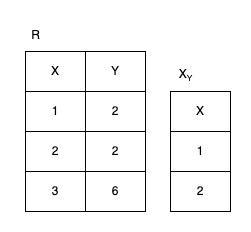
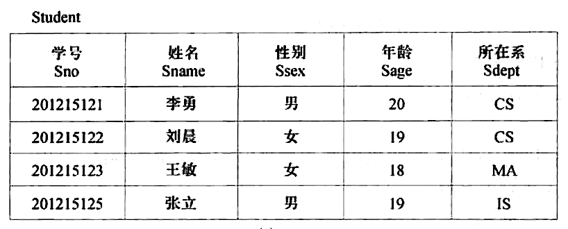
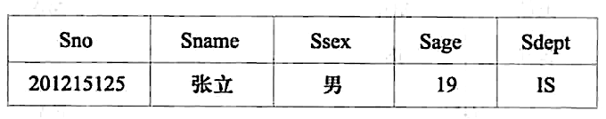
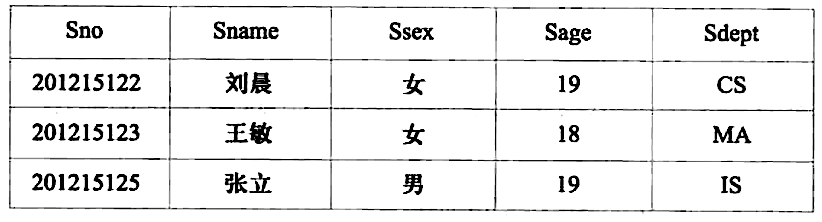
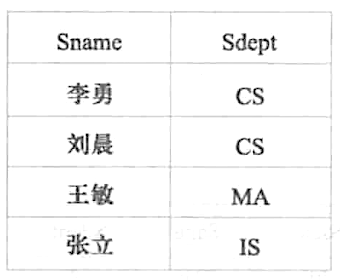
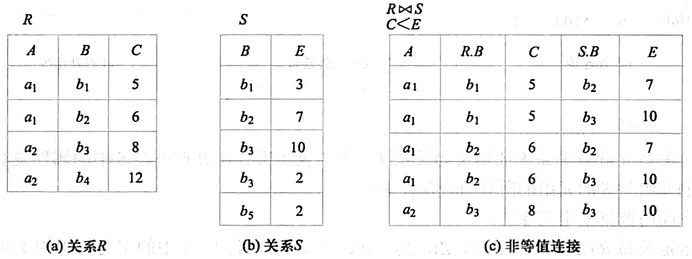
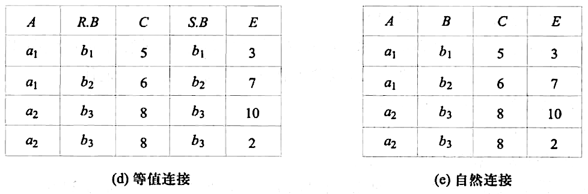
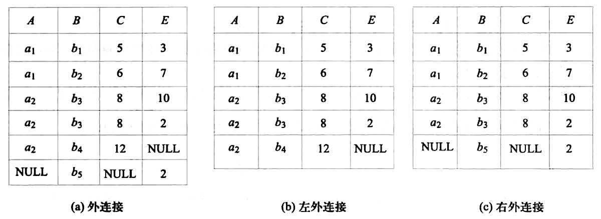
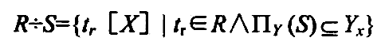
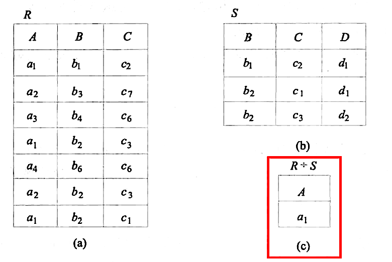

## 传统的集合运算

### 1. 并

   $R \cup S$

### 2. 交

   $R \cap S$

### 3. 差

   $R - S$

### 4. 笛卡尔积

   $R \times S$

## 专门的关系运算符

### 前置条件

* 关系模式：表示一张表的首行信息，是一个关系的抽象，例如：$关系模式：R(A_1, A_2,...,A_n)$，$A_1, A_2,...,A_n$ 是属性抽象
* 关系：一张表代表一个关系，n 目，表示 n 列，例如：$R_n$
* 元组：表内的一行叫关系的一个元组，例如：$t\in R$，$t[A_i]$表示 t 元组中的 $A_i$ 分量，也就是属性 A 的第 i 行
* 属性：表内的首行的每个元素叫属性，一个属性对应一列，从第二行开始，下面的都是属性的具体数值
  
  例如：$A=(A_i1, A_=i2,...,A_ik)，i\in[1,n]，k 是列数$，这表示第 i 行的每列的分量集合，叫做属性组（属性列）。
  
  属性具体值是 $t[A] = (t[A_{i1}], t[A_{i2}], ..., t[A_{ik}])$
  
  $\overline{A}$ 表示取反，也就是除去第 i 行的其他属性组

* 元组连接：$\overset{\LARGE{\frown}}{t_rt_s}, t_r\in R_n, t_s\in S_m$ 成为元组连接，形成一个 n+m 列的元组，前 n 个分量为 R 中的一个 n 元组，也就是 n 列，前 m 个分量为 S 中的一个 m 元组，也就是 m 列。
* 象集：关系 $R(X, Y)$, $X$ 和 $Y$ 为属性组。当 t[X]=x 时，$x$ 在 $R$ 中的象集（images set）为：$Y_x=\{t[Y]|t\in R, t[X]=x\}$，这是一个 元组在 分量（属性）Y 下 的集合，条件为 $t\in R, t[X]=x$，下图是 $t[Y]=2$，$y$ 在 $R$ 中的象集：
  
  

  如果你看了后面的计算，那么象集你可以直接用选择加投影来计算象集，比如图中的就是先选择 Y=2 再做 x 的投影

### 1. 选择

   $\sigma _F\left(R\right)$ 表示在 R 中选出符合条件 F 的元组(也就是行)

   

   查询所在系为 IS 的学生，则 $\sigma _{Sdept=CS} \left(Student\right)$ 结果如图所示

   

   查询年龄小于 20 的学生，则  $\sigma _{Sage<20} \left(Student\right)$ 结果如图所示

   

### 2. 投影

   $\Pi _A \left(R\right)$ 表示关系 R 上的投影，是从 R 中选择出若干属性列组成新的关系（A 是属性列）。

   在 Student 中查询姓名与所在系的关系，$\Pi _{Sname,Sdept} \left(Student\right)$ 结果如图所示

   

### 3. 连接

   $R \substack{\Join \\\\ A\theta B} S$ 表示从两个关系的笛卡尔积中选取属性间满足一定条件的元组

   $A\theta B$ 就是条件

#### 3.1 等值连接

$\theta$ 为 `=` 的连接运算称为等值连接

#### 3.2 非等值连接、等值连接、自然连接

自然连接是一种特殊的等值连接。它要求两个关系中进行比较的分量必须是同名的属性组，并且在结果中把重复的属性列去掉。

如图就是非等值连接，等值连接，自然连接的对比

可以看到，

* 非等值连接是符合 $C<E$ 的笛卡尔积元组，

* $R\substack{\Join \\\\ R.B=S.b}S$ 是符合 $R.B=S.B$ 的等值连接，

* 自然连接是将相等的两列合并成一列

#### 3.3 外连接



做自然连接的时候，会有一些不满足条件的元组被舍弃，叫 悬浮元组。



* $R⟗S$，外连接是保留（不舍弃）悬浮元组的连接
* $R⟕S$，左外连接是保留左边关系的悬浮元组的连接
* $R⟖S$，右外连接是保留右边关系的悬浮元组的连接

在下图可以看到，

$R$ 中 $a_2$ $b_4$ $12$ 没有对应的 $E$ 值，所以填 $NULL$

同样，$S$ 中 $b_5$ 也没有对应的 $A$ 和 $E$ 值，也填 $NULL$

### 4. 除运算

$T=R\div S$ 表示 关系T 是 关系R 除以 关系S 的结果（商）

T 包含所有在 R 但不在 S 中的属性及其值， 且 T 的元组与 S 的元组的所有组合都在 R 中。（所以这个有排除的意思）

我们看这个式子，给定关系 $R(X, Y)$ 和 $S(Y, Z)$\

* $R\div S$ 的结果是一个集合
* 集合里的元素是 $t_r[X]$ 也就是 属性X 的元组
* $t_r\in R$ 表示元组属于 关系R
* $\Pi _Y(S)$ 表示 关系S 中 属性Y 的投影
* $Y_x$ 表示象集 $Y_x=\{t[Y]|t\in R, t[X]=x\}$ 也就是 R 中 Y 那一列，其实也就是关系 R 中 Y 的投影
* $\Pi _Y(S) \subseteq Y_x$ 表示 关系S 中的 Y 的值，得包含在 R 内

总的下来，就是 关系R 中的 X属性 的元组，

下图可以看到，只有 $R$ 中的 $a_1$ $b_1$ $c_2$，$a_1$ $b_2$ $c_3$，$a_1$ $b_2$ $c_1$

* 首先看，包含在 R 但是不包含在 S 的属性显然是属性 A，所以我们求解的答案肯定是一个 A分量 的列
* 其次，球出 A 的所有象集，也就是 $a_1, a_2,a_3,a_4$ 的象集
* 然后确定包含关系，发现只有 $a_1$ 包含 S 中的 BC 所有组合
* 答案就是 $a_1$

所以除运算就是一个确定包含关系的过程

