> 斐波那契数列在算法中占有很高的地位，
>
> 主要是很多题目背后的根源都是斐波那契数列

## 递归法

1. 算法思路

   递归

2. 代码

   ```kotlin
   private fun fibonacci(n: Int): Int {
     if (n < 0) {
       return -1
     }
     if (n == 0) {
       return 0
     }
     if (n == 1) {
       return 1
     }
   
     return fibonacci(n - 1) + fibonacci(n - 2)
   }
   ```

3. 复杂度分析

   时间复杂度O($2^n$) , 空间复杂度 O(n)

   > 时间复杂度怎么算呢？
   >
   > 首先这个斐波那契数列 递归求解 的数据结构是二叉树，并且一次只访问一个结点
   >
   > 怎么回事呢？
   >
   > 因为 `fibonacci` 这个函数一次值返回一个数值，也就是每一次调用这个函数，就相当于访问一个节点，而 `return` 说明了这是二叉树，也就是两个分支

## 迭代法

1. 算法思路

   迭代，打表法

2. 代码

   ```kotlin
   private fun fibonacci2(n: Int): Long {
     if (n < 0) {
       return -1
     }
     if (n == 0) {
       return 0
     }
     if (n == 1) {
       return 1
     }
   
     val intArray = LongArray(n + 1) { 0 }
     intArray[0] = 0
     intArray[1] = 1
     for (i in 2..n) {
       intArray[i] = intArray[i - 1] + intArray[i - 2]
     }
     return intArray[n]
   }
   ```

   可以通过滚动数组节省空间

   ```kotlin
   private fun fibonacci2(n: Int): Long {
     if (n < 0) {
       return -1
     }
     if (n == 0) {
       return 0
     }
     if (n == 1) {
       return 1
     }
   
     val longArray = LongArray(2) { 0 }
     longArray[0] = 0
     longArray[1] = 1
     var result: Long = -1
     for (i in 2..n) {
       result = longArray[0] + longArray[1]
       longArray[0] = longArray[1]
       longArray[1] = result
     }
     return result
   }
   ```

2. 复杂度分析

   第一个时间复杂度是 O(n)，空间复杂度是 O(n)

   第一个时间复杂度是 O(n)，空间复杂度是 O(1)

## 通项公式法

1. 算法思路

   首先我们看 斐波那契数列的递推公式：

   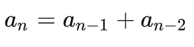

   我们假设两个常数 A、B 他们能组成下面形式，这是数学的惯用手法，递推公式求解通项公式的很多时候可以用这个方法，为的就是将递推公式变成等比数列的形式：

   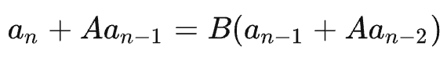

   也就是这样的形式：

   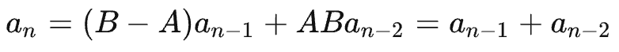
   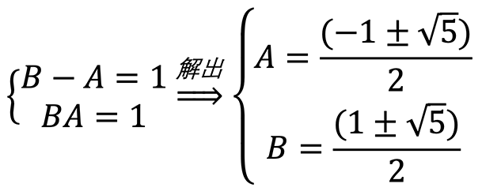

   既然 A、B 可以有确定值，剩下的就是等比数列求解了：

   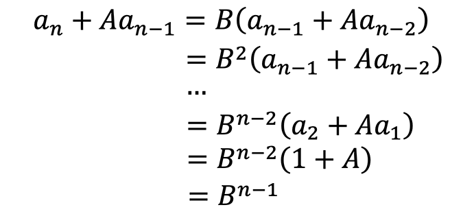
   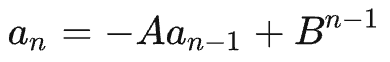
   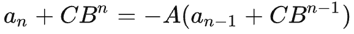

   这里我们用同样的方法，假设一个常数 C，然后等比数列求解：

   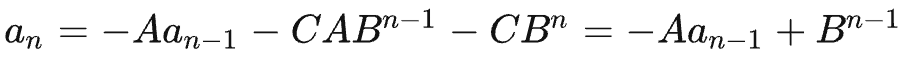
   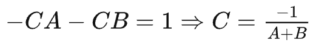
   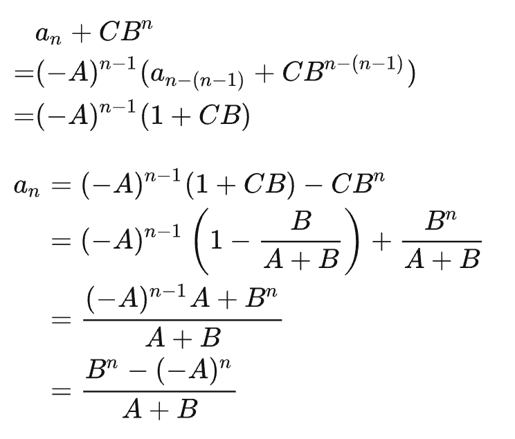

   最后代数进去，就是我们的通项公式了:

   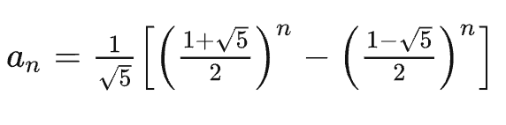

2. 代码

   然后我们就能可以使用通项公式来写这个函数了

   ```kotlin
   fun fibonacci3(n: Int): Double {
     val v1 = (1 + sqrt(5.0)) / 2
     val v2 = (1 - sqrt(5.0)) / 2
     val v3 = sqrt(5.0)
     return (pow(v1, n) - pow(v2, n)) / v3
   }
   ```

3. 复杂度分析

   > 很多文章写这种方式时间复杂度为 O(1)，这是明显错误的，因为计算 pow 的时间复杂度本就不是 O(1)，总不能因为你调用了某个方法，就默认他方法的复杂度是 O(1) 吧

   无论是官方的还是第三方的次幂运算（pow），最低也就能将复杂度降到 `O(logn)`

   而对于根号运算（sqrt），这个通常都是在操作系统底层，这种运算都是高度优化的，复杂度绝对不会高于 O(logn)

   下面我展示一下我自己写的一个 pow 运算

   ```kotlin
   fun pow(x: Int, n: Int): Int {
     var m = n
     var r = 1
     var v = x
     while (m > 0) {
       
       // 如果 m 是奇数，那么 r 先乘以 v ,消耗 m 一次
       if (m % 2 == 1) {
         // 此处计算的是平奇操作，也就是将奇数的次幂先乘到 r 上，
         // 再让底数相乘，次幂减半，最后当 m=1 时，将 底数再与 人相乘，得到最终结果
         r *= v
         m -= 1
       }
       // 此时 m 一定是偶数，让底数平方，次数除以 2
       v *= v
       m /= 2
       
       // 一次循环结束，此时结果进行了平奇处理，底数平方了，次数变为了一半
     }
     return r
   }
   ```

   所以时间复杂度是 O(logn)，空间复杂度是 O(1)
