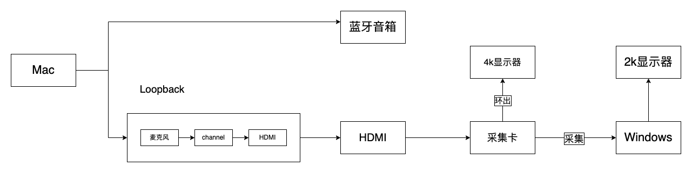
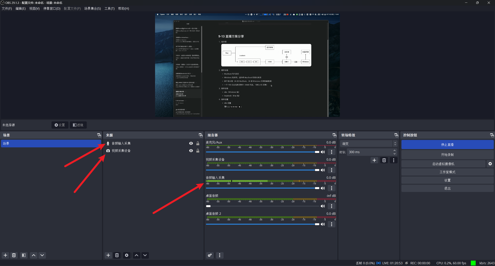
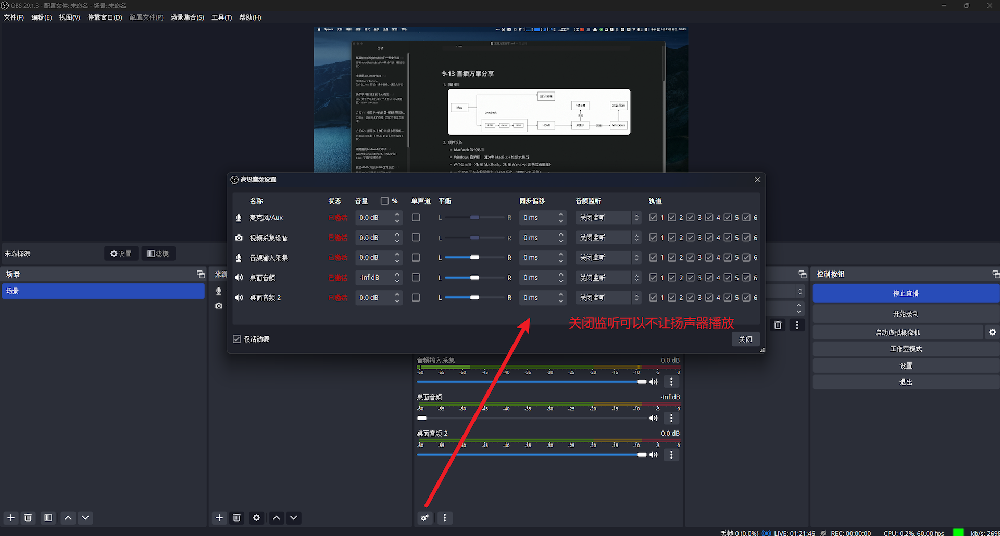
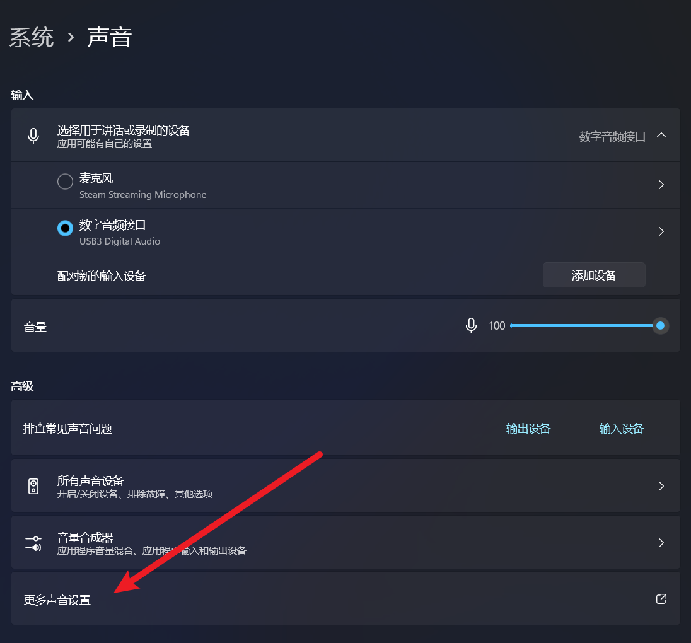
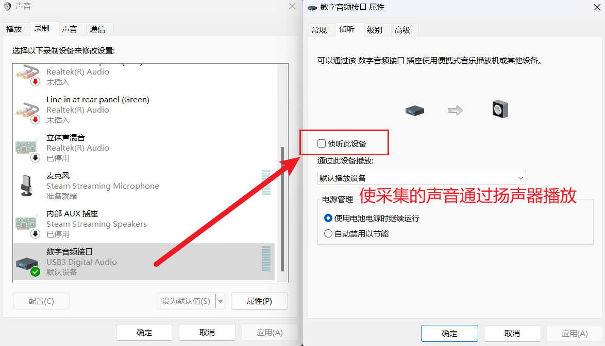
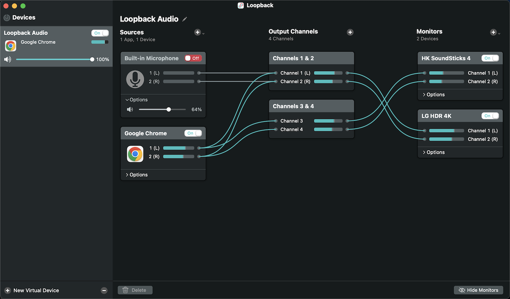

### 9-13 直播方案分享

#### 拓扑图

#### 硬件设备

- MacBook 写代码用
- Windows 推流用，因为老 MacBook 性能太羸弱
- 两个显示器（4k 接 MacBook，2k 接 Windows 用来监看推流）
- 一个 150 元左右的采集卡（4k60 环出，1080p 60 采集）

#### 软件设备

- obs（Windows 端）
- loopback（Mac 端）

#### 软件设置

- obs 设置

  

  

  

  

- loopback 设置

  

  这样将 `Chrome` 和 `MacBook` 麦克风分开传输，可以准确控制音源的输入输出

  将 `Chrome` 输出给 `蓝牙音响` 和 `HDMI`

  将 `麦克风` 输出给 `HDMI`

  还可以添加其他应用
