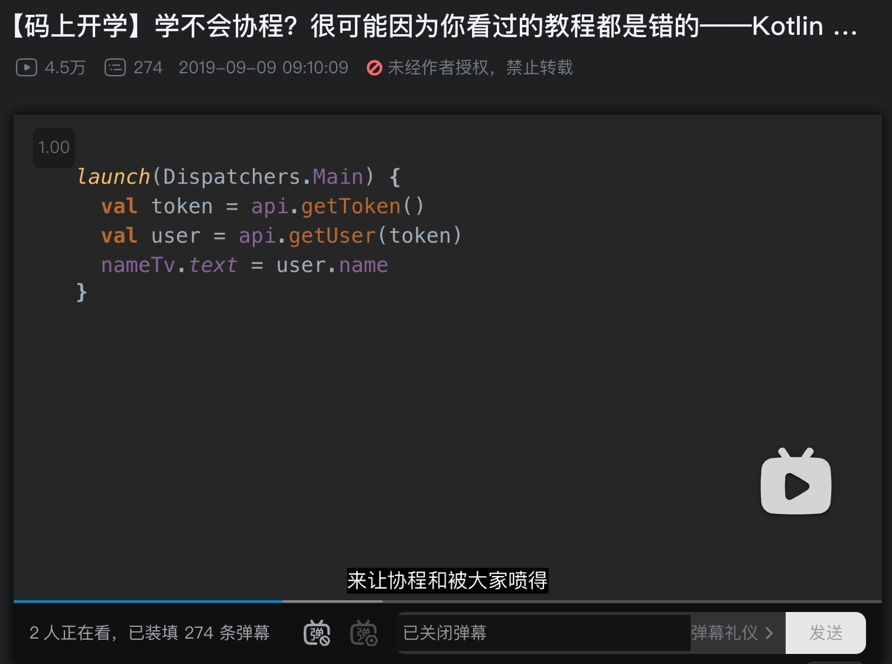
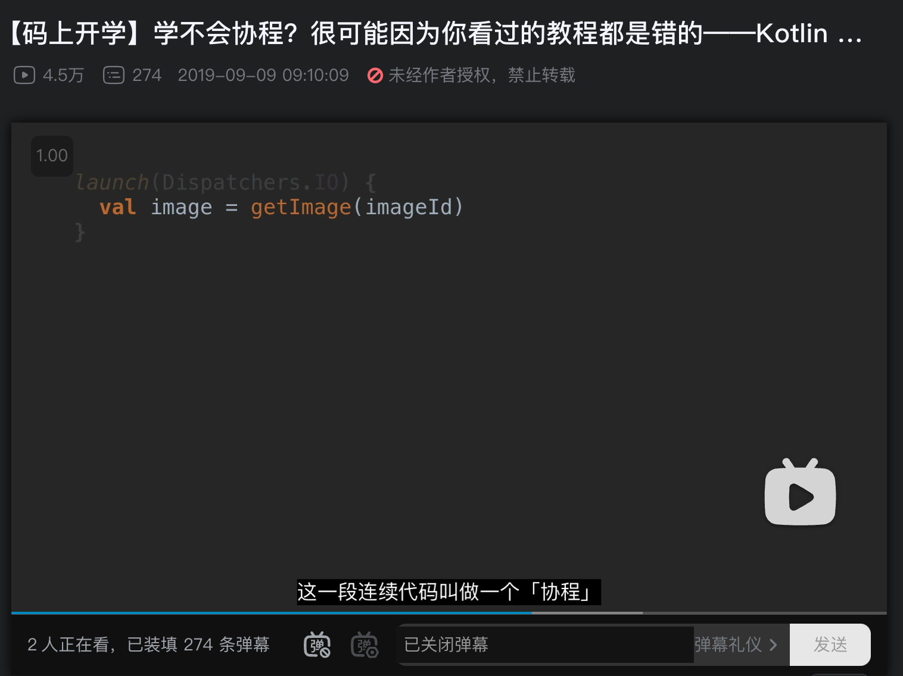
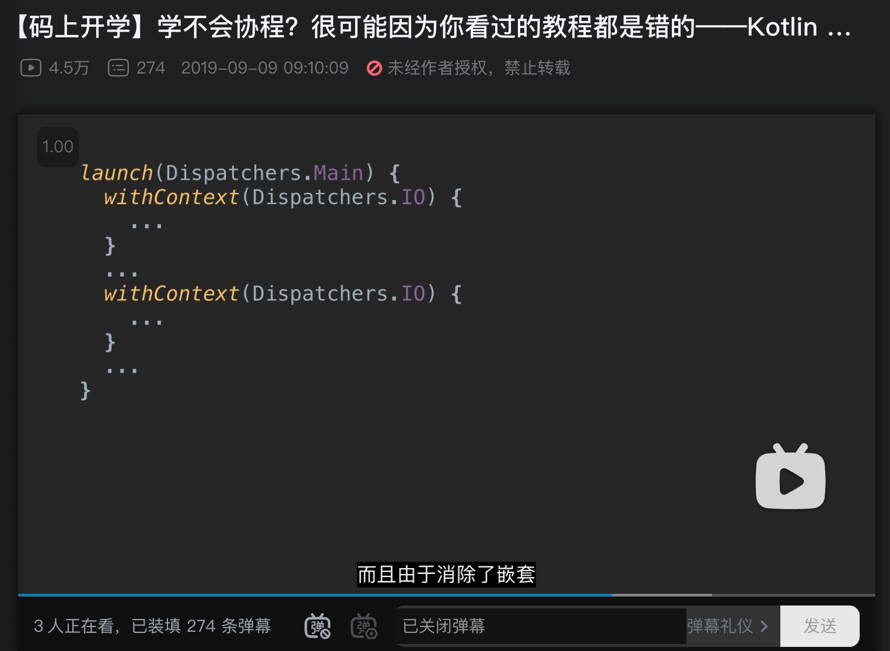
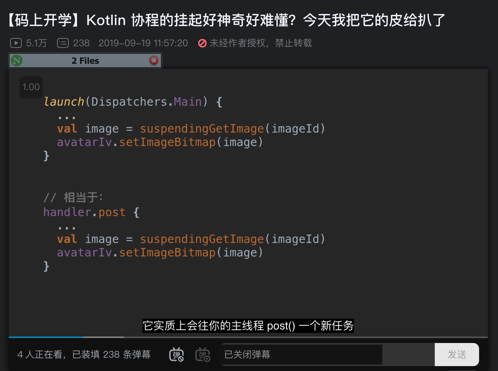
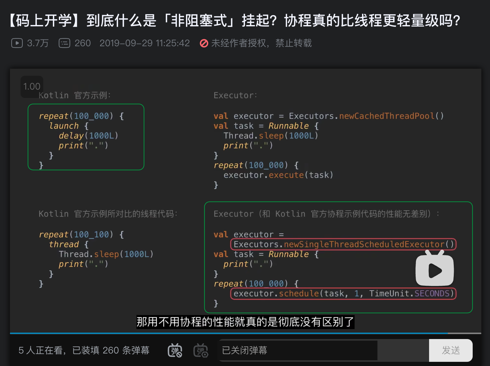

## 第一个视频（学不会协程？很可能因为你看过的教程都是错的）

[学不会协程？很可能因为你看过的教程都是错的](https://www.bilibili.com/video/BV164411C7FK)

### 协程的概念

开头就说了，我们没有必要关注协程是什么！因为协程并没有一个官方的或者统一的定义，包括维基百科（作者一直在说 kotlin 协程，而不是只说协程，应该也是在表示，视频里只是讲解 kotlin 协程，而不是所有协程）

而对于 kotlin 协程，明确给出了，就是一套线程 API

### 协程的好处

#### 基本的好处

协程和其他的线程框架类似，比如 Handler、Executor、AsyncTask。都是是方便调度线程，但是由于 kotlin 的语言特性，协程会更方便。

#### 最有用的好处：非阻塞式挂起

最重要的是，协程可以通过同步方式，写出异步代码

同样，这里作者说了很多教程并没有正确理解和使用这种非阻塞式挂起，写出的教程都是错的

### 协程长什么样？

如图所示，我们可以用同步方式写异步代码

这样就不用写回调了，大大减少了并发开发的难度，减少了回调地域

这是对于我们的开发工作带来了质变，减小开发难度，就可以让开发者写出了更优质高效的代码

### 协程怎么用？

我们写在大括号里的那部分代码就是写成本身（看到这里，就基本猜到 kotlin 协程将 kotlin 的高阶函数 lambda 联系到一起）

这个 launch 函数的意思是，我要创建一个协程，并在指定线程上运行协程

#### 切线程

我们可以方便地通过协程来切线程

withContext 可以让我们把协程切回去再切回来，这样就可以方便地把异步代码写成同步代码了

#### suspend 关键字

suspend 函数需要在协程里调用，或者 suspend 函数里调用（其实也就是最终会在协程里调用，毕竟 suspend 函数也在协程调用）

## 第二个视频（Kotlin 协程的挂起好神奇好难懂？今天我把它的皮给扒了）

[Kotlin 协程的挂起好神奇好难懂？今天我把它的皮给扒了](https://www.bilibili.com/video/BV1KJ41137E9)

### suspend 挂起的是什么

挂起的是协程，不是函数，也不是线程

挂起就是：协程脱离当前线程，不是停下来了，而是跑到另一个线程了

#### 例子：主线程启动一个协程

当你的协程挂起的时候，实际上就是 post 这个任务提前结束了，主线程就会继续刷新界面了

那协程被挂起到哪里了？其实就是你调用的挂起函数指定的线程。

并且如果你使用了 WithContext ，协程可以在执行结束后，将线程再切回来。

这个切回来的实现，是 Dispatcher 来实现的，当然你也可以自定义一个 Dispatcher ，然后决定它的实现细节，切回来还是什么其他操作

所谓挂起，其实就是一个可以被切回来的线程切换

而切回来这个在协程里叫 resume



suspend 函数之所以必须在协程里，就是有很多功能，就比如 “切回来”（resume）必须在协程里面才能实现



#### suspend 并没有起到挂起的作用

suspend 只是一个关键字，并没有起到挂起作用，起到挂起作用的是 WithContext 之类的函数，或者某个 suspend 函数里的某一行代码

也就是需要直接或者间接地调用那个 切换线程或者挂起协程 的代码，才能实现所谓的 挂起或者切线程



suspend 是 给开发者的提醒，提醒开发者这个函数是一个耗时操作，有更多的可读性。

对于调用者，只需要放到协程里，不需要关心其他的。

并且，当你自己写一个 suspend 函数的时候，如果里面没调用 suspend 函数，那 IDE 就会提醒你，这个 suspend 关键字是没必要的，也能防止给其他调用者进行错误的“提醒”。



#### 怎么自定义 suspend

##### 什么时候定义成 suspend

原则是，如果这个是耗时操作，就可以给他添加 suspend

##### 怎么写 suspend

直接写一个 suspend 关键字，然后在实现里，调用 suspend 函数就行了

## 第三个视频（到底什么是「非阻塞式」挂起？协程真的比线程更轻量级吗？）

[到底什么是「非阻塞式」挂起？协程真的比线程更轻量级吗？](https://www.bilibili.com/video/BV1JE411R7hp/)

### 非阻塞式是协程独有的吗？

其实，主线程里新启动一个子线程，然后将耗时操作放进子线程里，这也是耗时操作



包括 nio 的非阻塞式，其实都是一个道理，都是在说明当前线程（也有可能是进程、协程）是不会把耗时操作放在当前位置，然后让后续的操作一直等着，就是这个意思

并没有任何其他暗示，只是说在这里位置不会执行耗时操作（其实所有的代码其实都是阻塞的，毕竟你再牛逼计算机的计算耗时以及各种 IO 耗时又不会凭空消失，所以非阻塞就是把耗时操作丢到别的地方）

对于协程自然也就是，在当前 “协程” ，不会阻塞，因为非阻塞式挂起，就是将进行耗时操作的协程（协程就是代码块）切到子线程了



### kotlin官方的错误

kotlin 官方用下图的左边两段代码对比，来证明协程更更高效，这是偷换概念

只有使用绿色框框里的才是正确的对比方式，而且就没有性能差异了
