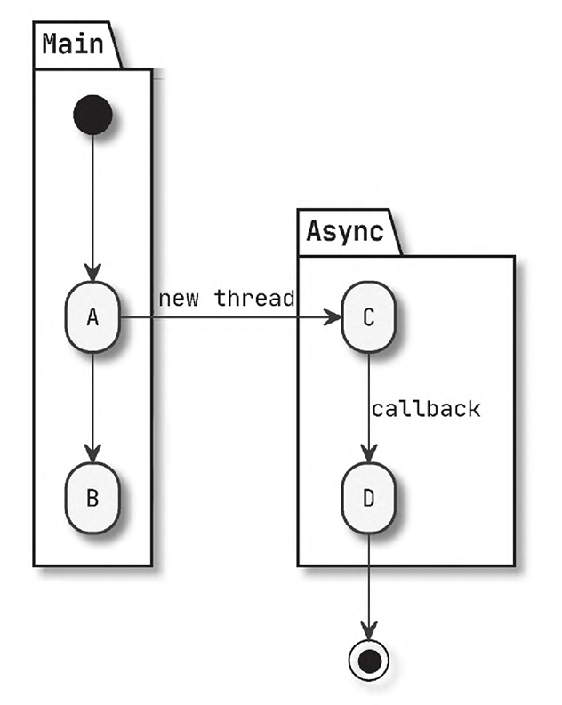
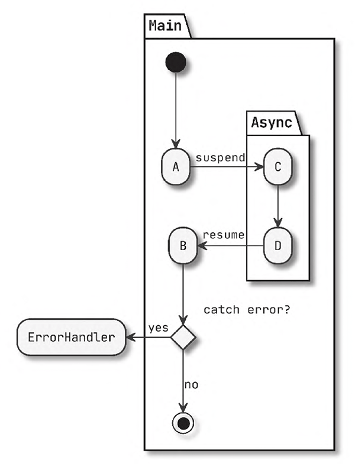
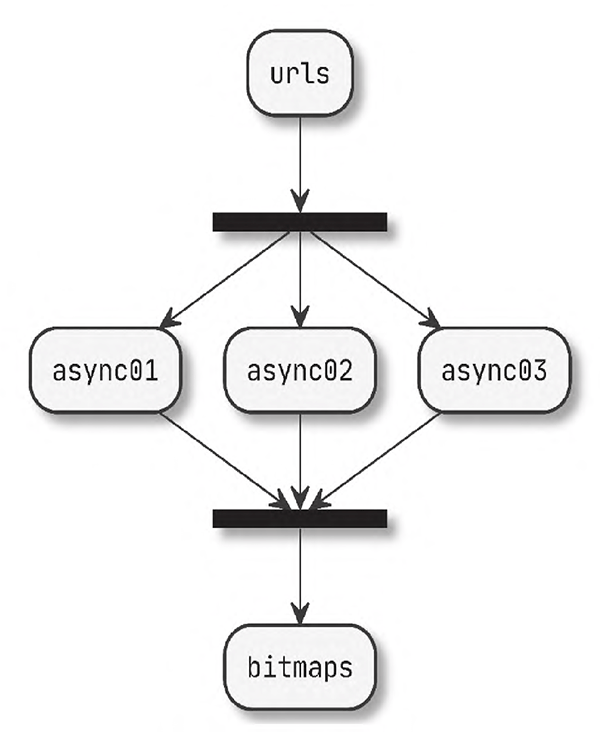



如果可以，购买《深入理解 kotlin 协程》支持作者 bennyhuo 霍丙乾！！！



## 异步和同步

异步和同步主要说的是代码执行的逻辑顺序

### 异步的概念

```kotlin
fun main() {

  // 同步代码
  print("A")
  print("B")
  print("C")
  print("D")

  // 异步代码
  print("A")
  thread {
    print("C")
    print("D")
  }
  print("B")
}
```

对于同步代码，输出的肯定是 `ABCD`

而对于异步代码，最早输出的是 `A`，但是 `B` 会在 `CD` 之前、之间还是之后，可就不一定了

如图：



## 异步设计的关键问题

### 结果传递

```kotlin
fun asyncBitmap(
    url: String,
    callback: (Bitmap) -> Unit
): Bitmap? {
    return when (val bitmap = Cache.get(url)) {
        null -> {
            thread {
                download(url)
                    .also { Cache.put(url, it) }
                    .also(callback)
            }
            null
        }
        else -> bitmap
    }
}
```

当 `Cache` 有 `bitmap` 的时候，就直接返回，否则就起一个线程来下载，并返回 `null`

```kotlin
fun main() {
  callAsync {
    println("End 0")

    callAsync {
      println("End 1")
    }
  }
}

fun callAsync(callback: (Bitmap) -> Unit) {
  val bitmap = asyncBitmap(
    "https://www.bennyhuo.com/assets/avatar.jpg"
  ) { bitmap ->
    println("Async: $bitmap")
    callback(bitmap)
  }
  println("Main $bitmap")
  if (bitmap != null) {
    callback(bitmap)
  }
}
```

> 这里异步调用略微有点多，我们一点点看
>
> 首先我们先不看第二个 `callAsync` ，只假设 `main` 函数里 `callAsync ` 只调用了 `println("End 0")` ，并没有调用第二个 `callAsync` ，这样会容易一些

我们先看`callAsync` 的定义，里面只有 3 个操作

- 调用 `asyncBitmap` 去获取 `bitmap` 
- 打印 `Main $bitmap`
- 在 `bitmap` 非空的时候，调用 `callback` 这个 callback 就是 `println("End 0")` 

然后再看 `asyncBitmap` ，发现 `Cache` 里没有 `bitmap` ，就会起一个线程下载图片并返回 `null`

在下载成功的时候调用 `callback` ，这个 `callback` 就是比 `println("End 0")` 多打印了一个 `println("Async: $bitmap")`

```kotlin
println("Async: $bitmap")
println("End 0")
```

所以应该很清楚了

它去缓存里看是否有 `bitmap` ，如果有就返回，然后在 `同步代码` 调用 `println("End 0")` 

如果缓存没有 `bitmap` ，就下载，在 `异步代码` 里调用 `println("End 0")`

所以这个 `println("End 0")` 是在获取到 `bitmap` 之后，再调用的

然后我们再回过头来看我们忽略的第二个 `callAsync` ，是不是就是在上一段 `callAsync` 之后，再进行一次 `callAsync` 啊！

而这次我们 `Cache` 里面就有 `bitmap` 了，就不用再下载了，所以直接返回就行了

根据我们的猜测他的输出结果应该是什么呢？

```shell
Main null
Async: [B@4bd36c21
End 0
Main [B@4bd36c21
End 1
```

前三行就是第一个 `callAsync` 

后两行就是第二个 `callAsync`

> 当然，通常我们不会如此设计回调API，因为这样反而让程序写起 来更复杂了。更为常见的做法是，在结果就绪的情况下仍然立即以回 调的形式传递给调用方，以保证结果传递方式的透明性。
>
> `Kotlin`协程的挂起函数（`suspend function`）本质上就采取 了这个异步返回值的设计思路

### 异常处理

我们改写一下 `asyncBitmap` ，去掉返回值，加上异常处理

```c++
fun asyncBitmap(
  url: String, onSuccess: (Bitmap) -> Unit,
  onError: (Throwable) -> Unit
) {
  thread {
    try {
      download(url).also(onSuccess)
    } catch (e: Exception) {
      onError(e)
    }
  }
}

fun callAsync2() {
  try {
    val url = "https://www.bennyhuo.com/assets/avatar.jpg"
    checkUrl(url)
    asyncBitmap(url, onSuccess = ::show, onError = ::showError)
  } catch (e: Exception) {
    showError(e)
  }
}
```

可以看到，我们不仅仅对 `download` 进行了异常捕获，而对于 `url` 也进行了异常捕获（毕竟一个不合法的 `url` 你怎么都没法处理，只能抛异常了）

通常情况下，我们需要在同步代码和异步代码都进行异常捕获，为什么呢？

你们看 `callAsync2` ，如果只在这个函数里进行异常捕获，那么还能捕获到 `download` 的异常吗？

很显然不能，因为它起了另一个线程，已经不是同一个栈了

> 而协程他就是想解决将异步逻辑同步化，让异步的异常处理可以向同步处理一样
>
> 就像这样：
>
> 

### 取消响应

稍微了解过 `Java` 多线程的肯定都知道，取消或者中断一个线程并不是一件容易的事

现在往往是调用 `interrupt()` 函数，然后等待线程判断到 `interrupted()`，再自我执行中断逻辑

也就是需要被中断的线程配合才能中断，但线程如果不配合，你也没办法，这时的异步任务颇有断线风筝的意思，能否回来只能看风筝自己的“心情”了。

```kotlin
fun asyncBitmapCancellable(
  url: String, onSuccess: (Bitmap) -> Unit,
  onError: (Throwable) -> Unit
) = thread {
  try {
    downloadCancellable(url).also(onSuccess)
  } catch (e: Exception) {
    onError(e)
  }
}

fun downloadCancellable(url: String): Bitmap {
  return getAsStream(url).use { inputStream ->
    val bos = ByteArrayOutputStream()
    val buffer = ByteArray(1024)
    while (true) {
      val length = inputStream.read(buffer, 0, 1024)

      ......

      if (Thread.interrupted())
        throw InterruptedException("Task is cancelled.")
    }
    bos.toByteArray()
  }
}
```

> `JDK` 最初提供了停止线程的 `API`，但它很快就被废弃 了，因为强行停止一个线程会导致该线程中持有的资源无法正常释 放，进而出现不安全的程序状态。

### 添加分支

我们可以为同步的逻辑添加分支甚至循环操作，这非常容易，但对于异步的逻辑而言，想要做到这一点就相对困难了。

> 当然这里同步逻辑的分支肯定也是同步的，异步逻辑的分支肯定也是异步的

```kotlin
val urls = arrayOf(
  "https://www.bennyhuo.com/assets/avatar.jpg",
  "https://www.bennyhuo.com/assets/avatar.jpg",
  "https://www.bennyhuo.com/assets/avatar.jpg"
)

fun loopOnAsyncCalls() {
  val countDownLatch = CountDownLatch(urls.size)
  val map = urls.associateWithTo(ConcurrentHashMap<String, Bitmap>()) { EMPTY_BITMAP }
  urls.map { url ->
    asyncBitmap(url, onSuccess = {
      map[url] = it
      countDownLatch.countDown()
    }, onError = {
      showError(it)
      countDownLatch.countDown()
    })
  }
  countDownLatch.await()
  val bitmaps = map.values
}

fun asyncBitmap(
  url: String, onSuccess: (Bitmap) -> Unit,
  onError: (Throwable) -> Unit
) {
  thread {
    try {
      download(url).also(onSuccess)
    } catch (e: Exception) {
      onError(e)
    }
  }
}
```

> `countDownLatch` 是一个计数器，我们这里让系统下载3个图片，就初始化为 `3` 
>
> 每下载完成或者下载失败就调用 `countDownLatch.countDown()` 让数值减 `1`
>
> 然后调用 `countDownLatch.await()` 在这里阻塞，等待数值降到 `0`



我们再写一个同步流程，同样下载三个图片

```kotlin
val urls = arrayOf(
  "https://www.bennyhuo.com/assets/avatar.jpg",
  "https://www.bennyhuo.com/assets/avatar.jpg",
  "https://www.bennyhuo.com/assets/avatar.jpg"
)

fun loopOnSyncCalls() {
  val bitmaps = urls.map { download(url) }
}
```

然后再测量这两次的耗时

```kotlin
fun main() {
  download("https://www.bennyhuo.com/assets/avatar.jpg")
  measureTimeMillis {
    loopOnAsyncCalls()
  }.let(::println)

  measureTimeMillis {
    loopOnSyncCalls()
  }.let(::println)
}
```

`download` 是为了先握手，这样后续就可以直接下载，无需握手，让对比更公平

```kotlin
181
279
```

可以看到，确实有一些差距，异步分支确实可以节省一些时间，更充分地利用性能

> 想想，如果你需要在异步逻辑里写循环，你还希望回收这些个线程，还有可能中断线程，这可就复杂了，因为在循环里，异步逻辑有多少个，还不清楚。

## 常见异步程序的设计思路

### Java Future

```kotlin
val urls = arrayOf(
  "https://www.bennyhuo.com/assets/avatar.jpg",
  "https://www.bennyhuo.com/assets/avatar.jpg",
  "https://www.bennyhuo.com/assets/avatar.jpg"
)

fun bitmapFuture(url: String): Future<Bitmap> {
  return ioExecutor.submit(Callable {
    download(url)
  })
}

val ioExecutor =
  Executors.newFixedThreadPool(Runtime.getRuntime().availableProcessors())

fun main() {
  val bitmaps = urls.map {
    bitmapFuture(it)
  }.map {
    it.get()
  }
}
```

在这里，我们创建了一个线程池，通过 `submit` 获取一个 `Future`

> `kotlin` `map` 函数，翻译过来是映射函数，没错这个 `map` 是个动词，就是映射
>
> ```kotlin
> public inline fun <T, R> Array<out T>.map(transform: (T) -> R): List<R> {
>     return mapTo(ArrayList<R>(size), transform)
> }
> 
> public inline fun <T, R, C : MutableCollection<in R>> Array<out T>.mapTo(destination: C, transform: (T) -> R): C {
>     for (item in this)
>         destination.add(transform(item))
>     return destination
> }
> ```
>
> 两个都是 `inline` ，我直接第二个合并到第一个
>
> ```kotlin
> public inline fun <T, R> Array<out T>.map(transform: (T) -> R): List<R> {
>     val arrayList = ArrayList<R>(size)
>     for (item in this)
>         arrayList.add(transform(item))
>     return arrayList
> }
> ```
>
> 可以看到，返回值是 `List<R>` ，仅仅只调用 `transform(item)` 并添加到这个 `List` 里面

第一个 `map` 返回一个 `List<Future>` 

第二个 `map` 返回一个 `List<Bitmap>`

第一个 `map` 肯定很快就返回了，但是第二个 `map` 相当于在 `for` 循环里调用 `get` 函数，而 `get` 是一个阻塞函数。所以第二个 `map` 代码逻辑大概就是这样：

```kotlin
for (item in this)
	arrayList.add(future.get())
```

所以，单纯使用 `get` 并不好用

我们往往会搭配 `isDone` 来使用

比如：

```kotlin
fun main() {
  val bitmapLists = urls.map {
    bitmapFuture(it)
  }
  val bitmaps = bitmapLists.map {
    while(true){
      if(it.isDone()){
        it.get()
        break
      }
      // 执行额外逻辑
    }
  }
}
```

你看，`Future` 的 `get` 的阻塞性质，导致我们写出的代码都不太像异步了

### Java CompletableFuture

`JDK 1.8` 又新增了一个 `CompletableFuture` 类，它实现了 `Future` 接口， 通过它我们可以拿到异步任务的结果，此外，它还有很多更好用的方 法。

```kotlin
fun bitmapCompletableFuture(url: String): CompletableFuture<Bitmap> =
  CompletableFuture.supplyAsync {
    download(url)
  }

fun callCompletableFuture() {
  urls.map {
    bitmapCompletableFuture(it)
  }.let { futureList ->
    CompletableFuture.allOf(*futureList.toTypedArray())
      .thenApply {
        futureList.map { it.get() }
      }
  }.thenAccept { bitmaps ->
    println(bitmaps.size)
  }.join()
}
```

这里 `allof` 是用于等待所有 `CompletableFuture` 。

`thenApply` 用于在所有 `CompletableFuture` 完成后，将结果映射为一个包含所有 `Bitmap` 的列表

`thenAccept` 用于在所有图片都下载完成后执行指定的操作，这里只是输出图片的数量。

> 虽然 `CompletableFuture` 解决了异步结果不阻塞主调用流程的问题，但却让结果的获取脱离了主调用流程。
>
> 就类似 `retrofit` 默认回调那样

### JavaScript Promise 与 async/await

`CompletableFuture` 还实现了另一个接口—— `CompletionStage`， 前面我们用到的 `thenAccept` 类似的方法也都是这个接口的 `API`。从定义 和功能来看，`CompletionStage` 是一个 `Promise`。

那么 `Promise` 又是什么呢?按照 [ Promises/A+]( https://promisesaplus.com/) ，`Promise` 是一个异步任务，它存在挂起、完成、拒绝三个状态，当它处在完成状态时，结果 通过调用 `then` 方法的参数进行回调；出现异常拒绝时，通过 `catch` 方法 传入的参数来捕获拒绝的原因。

从 `ECMAScript 6` 开始，`JavaScript` 就已经支持 `Promise` 了，我们先 来看之前的例子怎么用 `Promise` 来实现

```javascript
const urls = [
    "https://www.bennyhuo.com/assets/avatar.jpg",
    "https://www.bennyhuo.com/assets/avatar.jpg",
    "https://www.bennyhuo.com/assets/avatar.jpg"
];

function main() {
    Promise.all(urls.map(url => bitmapPromise(url)))
        .then(bitmaps => console.log(bitmaps.length))
        .catch(e => console.error(e));
}

function bitmapPromise(url) {
    return new Promise((resolve, reject) => {
        try {
            download(url, resolve)
        } catch (e) {
            reject(e)
        }
    })
}

function download(url, callback) {
    https.get(url, (res) => {
            let data = '';
            res.on('data', chunk => {
                data += chunk;
            });
            res.on('end', () => {
                callback(data)
            });
        }
    );
}
```

第 `8` 行，`Promise.all` 会将多个 `Promise` 整合到一起，这与我们前面为整合 `CompletableFuture` 而定义的 `List<CompletableFuture<T>>.allOf` 如出 一辙。

最终我们得到一个新的 `Promise`，它的结果是整合了前面所有 `bitmapPromise` 函数返回的结果的 `bitmaps`，因此我们在 `then` 当中传入 的 `Lambda` 表达式就是用来处理消费这个 `bitmaps` 的。

这样看起来很不错，达到了与 `CompletableFuture` 同样的效果，不 过还可以更简洁。

我们可以通过 `async/await` 将上面的代码进一步简化

```javascript
async function asyncMain() {
    try {
        const bitmaps = await Promise.all(urls.map(url => bitmapPromise(url)));
        console.log(bitmaps);
    } catch (e) {
        console.error(e);
    }
}
```

给整个逻辑的外部函数加上了 `async` 关键字，这样就可以在异 步调用返回 `Promise` 的位置加上 `await`，这个语法糖可以把前面的 `then` 和 `catch` 调用转换成我们熟悉的同步调用语法。

这样就非常像样了，我们通过同步代码执行了异步流程

### 响应式编程

写过 `rxJava` 、 `liveData` 、 观察者模式之类的代码坑你定对响应式编程比较熟悉

```kotlin
fun main() {
  Single.just("https://www.bennyhuo.com/assets/avatar.jpg")
    .map { download(it) }
    .subscribeOn(Schedulers.io())
    .subscribe({ bitmap ->
      show(bitmap)
    }, { throwable ->
      showError(throwable)
    })

  Thread.sleep(10000)
}
```

`Single` 是`RxJava` 提供的一个像 `Promise` 的 `API`

不过，`Observable` 跟前面提到的 `Future` 和 `Promise` 有一个很大的不 同，它的逻辑执行取决于订阅，而不是立即执行。

此外，它还提供了 任意变换之间可以切换线程调度器的能力，这一能力让复杂的数据变 换和流转可以轻易实现异步。

当然，这也曾一度让它被滥用为线程切换的工具。

### kotlin 协程

```kotlin
suspend fun bitmapSuspendable(url: String): Bitmap =
  suspendCoroutine { continuation ->
    thread {
      try {
        continuation.resume(download(url))
      } catch (e: Exception) {
        continuation.resumeWithException(e)
      }
    }
  }

suspend fun main() {
  try {
    val bitmap = bitmapSuspendable("https://www.bennyhuo.com/assets/avatar.jpg")
    show(bitmap)
  } catch (e: Exception) {
    println("下载失败")
    e.printStackTrace()
  }
  println("hello world!")
}
```

我们使用标准库API `suspendCoroutine<T>` 函数的返回值类型作为 挂起函数 `bitmap-Suspendable` 的返回值类型，也就是泛型参数T的实参 `Bitmap`。

这个函数除了确定返回值类型外，还能够帮我们拿到一个 `Continuation` 的实例，负责保存和恢复挂起状态，逻辑效果上类似于 `Promise` ，其中几个函数意义如下。

- `resume` : 类似于 `Promise` 的 `resolve` ，将正常的结果返回，它的参数实际上就是 `bitmapSuspendable` 的返回值 `Bitmap` 。

- `resumeWithException` : 类似于 `Promise` 的 `reject` ，将异常返回，它的参数实际上就是 `bitmapSuspendable` 调用时会抛出的异常。

看我们调用的时候，直接 `try-catch` 

现在我们关掉网络，跑一遍

```shell
下载失败
hello world!
java.net.UnknownHostException: www.bennyhuo.com: nodename nor servname provided, or not known
	at java.base/java.net.Inet6AddressImpl.lookupAllHostAddr(Native Method)
	at java.base/java.net.InetAddress$PlatformNameService.lookupAllHostAddr(InetAddress.java:930)
	at java.base/java.net.InetAddress.getAddressesFromNameService(InetAddress.java:1543)
	at java.base/java.net.InetAddress$NameServiceAddresses.get(InetAddress.java:848)
	at java.base/java.net.InetAddress.getAllByName0(InetAddress.java:1533)
	at java.base/java.net.InetAddress.getAllByName(InetAddress.java:1386)
	at java.base/java.net.InetAddress.getAllByName(InetAddress.java:1307)
	at okhttp3.Dns.lambda$static$0(Dns.java:39)
	at okhttp3.internal.connection.RouteSelector.resetNextInetSocketAddress(RouteSelector.java:171)
	at okhttp3.internal.connection.RouteSelector.nextProxy(RouteSelector.java:135)
	at okhttp3.internal.connection.RouteSelector.next(RouteSelector.java:84)
	at okhttp3.internal.connection.ExchangeFinder.findConnection(ExchangeFinder.java:187)
	at okhttp3.internal.connection.ExchangeFinder.findHealthyConnection(ExchangeFinder.java:108)
	at okhttp3.internal.connection.ExchangeFinder.find(ExchangeFinder.java:88)
	at okhttp3.internal.connection.Transmitter.newExchange(Transmitter.java:169)
	at okhttp3.internal.connection.ConnectInterceptor.intercept(ConnectInterceptor.java:41)
	at okhttp3.internal.http.RealInterceptorChain.proceed(RealInterceptorChain.java:142)
	at okhttp3.internal.http.RealInterceptorChain.proceed(RealInterceptorChain.java:117)
	at okhttp3.internal.cache.CacheInterceptor.intercept(CacheInterceptor.java:94)
	at okhttp3.internal.http.RealInterceptorChain.proceed(RealInterceptorChain.java:142)
	at okhttp3.internal.http.RealInterceptorChain.proceed(RealInterceptorChain.java:117)
	at okhttp3.internal.http.BridgeInterceptor.intercept(BridgeInterceptor.java:93)
	at okhttp3.internal.http.RealInterceptorChain.proceed(RealInterceptorChain.java:142)
	at okhttp3.internal.http.RetryAndFollowUpInterceptor.intercept(RetryAndFollowUpInterceptor.java:88)
	at okhttp3.internal.http.RealInterceptorChain.proceed(RealInterceptorChain.java:142)
	at okhttp3.internal.http.RealInterceptorChain.proceed(RealInterceptorChain.java:117)
	at common.api.ApiKt$httpClient$2.invoke$lambda$1(Api.kt:12)
	at okhttp3.internal.http.RealInterceptorChain.proceed(RealInterceptorChain.java:142)
	at okhttp3.internal.http.RealInterceptorChain.proceed(RealInterceptorChain.java:117)
	at okhttp3.RealCall.getResponseWithInterceptorChain(RealCall.java:229)
	at okhttp3.RealCall.execute(RealCall.java:81)
	at ch01.Listing05_06Kt.getAsStream(Listing05_06.kt:61)
	at ch01.Listing05_06Kt.download(Listing05_06.kt:51)
	at ch01.Listing23_24Kt$bitmapSuspendable$2$1.invoke(Listing23_24.kt:12)
	at ch01.Listing23_24Kt$bitmapSuspendable$2$1.invoke(Listing23_24.kt:10)
	at kotlin.concurrent.ThreadsKt$thread$thread$1.run(Thread.kt:30)
```

这里看到，信息都清楚地打印出来了

## 总结

- 本质上，异步和同步这两个概念探讨的是程序的控制流程，异步的同时也经常伴随着并发，但这不是必然的。

- `Kotlin` 协程是用来简化异步程序设计的，可以在实现任务的异步调用的同时，降低代码的设计复杂度，进而提升代码可读性。


