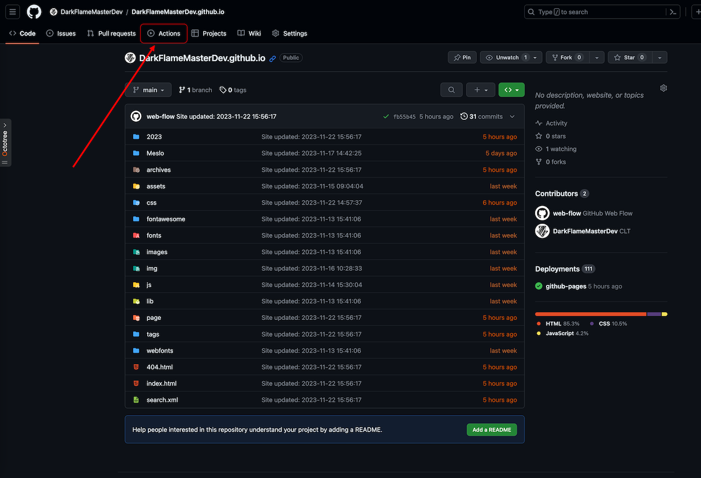
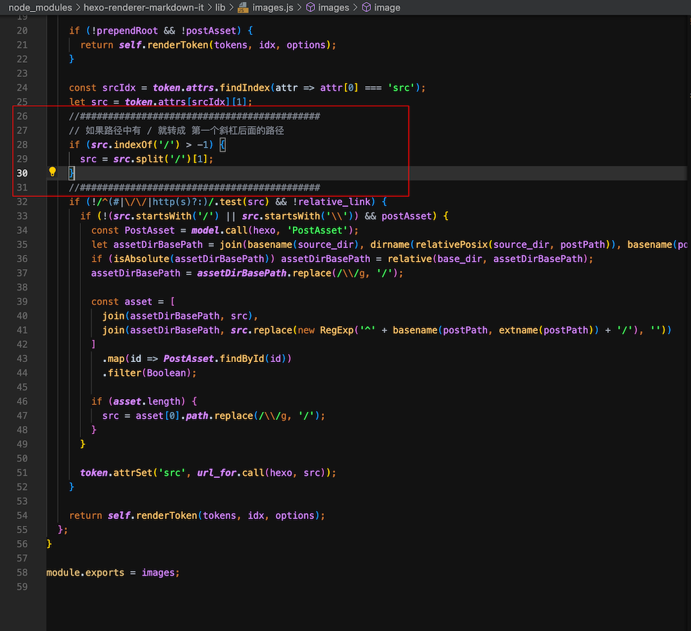
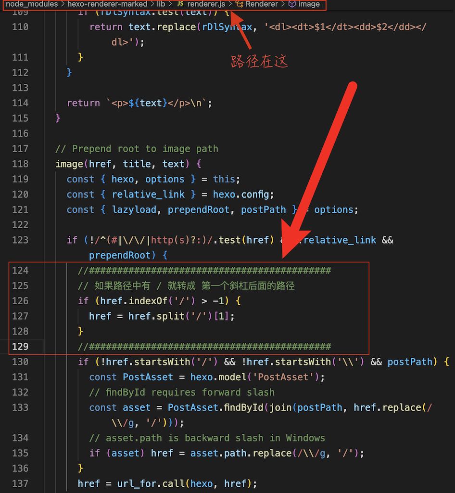

## 1. 操作没问题，但就是部署失败

   hexo 在部署主题到 github.io 的时候，会有不小的延迟，如果确信你的操作没问题，但就是主题没有生效，那很有可能是 `github-Pages` 正在处理( github-pages 会显示一个 Queued ，意思就是在队列里面，还没处理)

   

## 2. 加载图片

   加载图片是一个稍微复杂一点的操作

   官方文档推荐了两种方法

- 自己设置文件夹：应该将图片文件放进 `source/img` 里面（文件夹名字可以自定义），然后这样写``

     但是我在使用这种方法的时候，会出现本地编写的时候，无法识别图片导致实时预览效果很差
     所以我尝试将路径前面加了两个点 -> `` 发现没有问题，预览和 `hexo g` 都没有出现差错。

- 自动创建 `asset_folder` ：还有就是将 `config.yml` 里的 `post_asset_folder` 设置为 `true` ，他就会在你 `new` 一篇文章的时候，自动在 _post 文件夹下创建一个和文章同名的文件夹，来存放你所有的资源文件，然后你引用图片就可以 -> `` 这样做的好处就是可以自动创建文件夹，并按不同文章分类，当然，你可以可以创建一个经常在各个文章调用资源的公共文件夹

- 相对路径引用的标签插件：这个是一个新功能，但是在本地编写的时候没法预览还是不太方便，详细可以看官方文档，我把链接贴在这里 [hexo官方文档](https://hexo.io/zh-cn/docs/asset-folders)

- 最后也是我在用的，[使用 Markdown 嵌入图片](https://hexo.io/zh-cn/docs/asset-folders#%E4%BD%BF%E7%94%A8-Markdown-%E5%B5%8C%E5%85%A5%E5%9B%BE%E7%89%87)，这个也是会在你 new 一篇文章的时候，自动在 _post 文件夹下创建一个和文章同名的文件夹，来存放你所有的资源文件，但是你写地址的时候，会直接将 `` 解析为 `` ，但是如果你在本地编辑，``则无法显示预览，填写``则无法在 `html` 上正确显示链接，所以我们可以在 `hexo` 转化的过程中，做一下改动，直接改代码！！！

  - 先看你使用的是哪个渲染器，直接在你博客主目录执行

      ```shell
      npm list
      ```

      ```shell
      $ npm list
      hexo-site@0.0.0 /Users/darkFlameMaster/BlogSpace
      ├── hexo-deployer-git@4.0.0
      ├── hexo-filter-mathjax@0.9.0
      ├── hexo-generator-archive@2.0.0
      ├── hexo-generator-category@2.0.0
      ├── hexo-generator-index@3.0.0
      ├── hexo-generator-searchdb@1.4.1
      ├── hexo-generator-tag@2.0.0
      ├── hexo-renderer-ejs@2.0.0
      ├── hexo-renderer-markdown-it@7.1.0
      ├── hexo-renderer-stylus@3.0.0
      ├── hexo-server@3.0.0
      ├── hexo-theme-landscape@1.0.0
      ├── hexo-theme-redefine@2.5.0
      ├── hexo@6.3.0
      ├── markdown-it-deflist@2.1.0
      ├── markdown-it-imsize@2.0.1
      ├── markdown-it-mark@3.0.1
      ├── markdown-it-regexp@0.4.0
      ├── markdown-it-sub@1.0.0
      ├── markdown-it-sup@1.0.0
      └── markdown-it-task-checkbox@1.0.6
      ```

      看到第 11 行 就是渲染器

  - `hexo-renderer-markdown-it` 渲染器

      如果你用的就是这个 `hexo-renderer-markdown-it` 渲染器

      那需要在 `_config.yml` 修改

      ```yaml
      markdown:
        ...
        images:
          ...
          prepend_root: true
          post_asset: true
      ```

      如果没有，那就在底下自己添加一下

      然后修改代码 `node_modules/hexo-renderer-markdown-it/lib/images.js`

      ```js
      //###########################################
      // 如果路径中有 / 就转成 第一个斜杠后面的路径
      if (href.indexOf('/') > -1) {
        href = href.split('/')[1];
      }
      //###########################################
      ```

      

  - `hexo-renderer-marked` 渲染器

      如果你的渲染器是 `hexo-renderer-marked`

      搜索 `post_asset_folder` ，改成 `true`

      然后添加

      ```yaml
      marked:
        prependRoot: true
        postAsset: true
      ```

      然后打开这个文件 `node_modules/hexo-renderer-marked/lib/renderer.js` 并添加如下代码  

      ```js
      //###########################################
      // 如果路径中有 / 就转成 第一个斜杠后面的路径
      if (href.indexOf('/') > -1) {
        href = href.split('/')[1];
      }
      //###########################################
      ```

      

      这样他就可以帮我们把链接转成正确显示的了，本地显示， github 显示都没有问题了

      > ps: 有的文章写的是将处理链接的代码放到了
      >
      > `if (!/^(#|\/\/|http(s)?:)/.test(href) && !relative_link && prependRoot)`（123行）
      >
      > 这行代码之前，这完全是错误的，因为这样会导致你无法引入网络连接的图片

    这里有一个小小的缺陷，那就是 本地的图片 只能引入固定位置的资源了，也就是前面所说的自动创建的与文章同名的文件夹

    如果我们想要引用其他位置的资源文件，除了将文件拷贝过来，就只能将文件上传到指定的云端来引入了

    当前大部分情况下我们 **本地文件夹+网络连接** 已经可以覆盖90%的情况了，如果我们有一些公共的资源文件，可以将文件放在 `source/img` 没有就自己新建一个， `hexo d` 提交到 `github` 后，可以直接引用 `博客地址/img/文件名` 来引用了非常好用！！！

    就像这样：

    ``

## 3. 上传 `github` 报权限问题

如果你感觉自己配置完全没问题，那你可以试着把代理关掉

```log {.line-numbers}
Please make sure you have the correct access rights
and the repository exists.
FATAL Something's wrong. Maybe you can find the solution here: https://hexo.io/docs/troubleshooting.html
Error: Spawn failed
    at ChildProcess.<anonymous> (/Users/DarkFlameMaster/BlogSpace/node_modules/hexo-util/lib/spawn.js:51:21)
    at ChildProcess.emit (node:events:513:28)
    at ChildProcess._handle.onexit (node:internal/child_process:291:12)
```

同样我在这里也提到过类似的问题 [git 的奇怪问题 kex_exchange_identification: Connection closed by remote host](https://darkflamemasterdev.github.io/2023/07/27/git-%E7%9A%84%E5%A5%87%E6%80%AA%E9%97%AE%E9%A2%98/#1)
